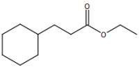
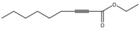
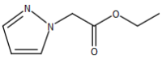
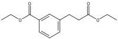
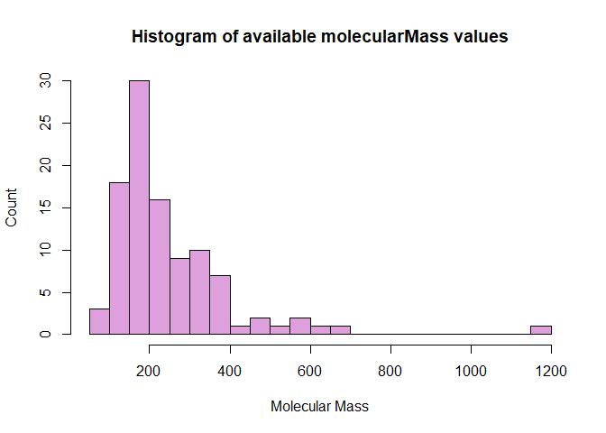
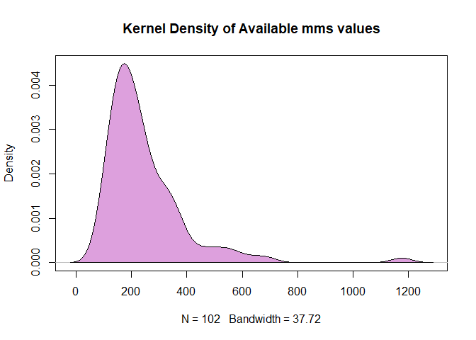

# CAS Common Chemistry API in R

by Adam Miramontes Nguyen

The recipe examples were tested on March 24, 2023.

**CAS Common Chemistry API Documentation (requires registration):**

https://www.cas.org/services/commonchemistry-api

See the bottom of the document for information on R and package versions.

**Attribution:** This tutorial uses the [CAS Common Chemistry](https://commonchemistry.cas.org/) API. Example Data shown is licensed under the [CC BY-NC 4.0 license](https://creativecommons.org/licenses/by-nc/4.0/).

## Import libraries
Run the following lines of code to load the libraries 'httr' and 'jsonlite'. If you have not done so already, additionally, before the 'library()' functions, run 'install.packages(c('httr','jsonlite'))'.

```r
#install.packages(c('httr','jsonlite'))
library(httr)
library(jsonlite)
```

## 1. Common Chemistry Record Detail Retrieval

Common Chemistry is an extremely useful open community resource for accessing chemical information for nearly 500,000 chemical chemistry from the CAS registry. In this example we are going to detail the steps in which a user can query and access a simple example chemical substance, ethyl cyclohexanepropionate.

### Setup API parameters   

First let's setup the API parameters for Common Chemistry. Below we are going to provide a variable 'detail_base_url' to query Common Chemistry for details and more specifically, in this example, using a registry number, or as we abbreviate it an 'rn'.

```r
detail_base_url <- "https://commonchemistry.cas.org/api/detail?"
casrn1 <- "10094-36-7" # ethyl cyclohexanepropionate
```
### Request data from CAS Common Chemistry Detail API

Using the 'httr' and 'JSONlite' libraries, we will query and convert the data into a usable format.


```r
# Using httr's 'GET()' function, retrieve raw data from link
raw_casrn1_data <-GET(paste0(detail_base_url, "cas_rn=", casrn1)) #paste0 concatenates inputs with no spaces
raw_casrn1_data
```

```
## Response [https://commonchemistry.cas.org/api/detail?cas_rn=10094-36-7]
##   Date: 2023-03-24 19:29
##   Status: 200
##   Content-Type: application/json
##   Size: 3.16 kB
```
The 'GET()' function returns Response, Date & Time, Status: 200 indicating a successful request, Size, and most importantly Content-Type. In most cases when accessing APIs, the Content-Type will return json, which is why we need JSONlite.

```r
# Access content using the library jsonlite
json_casrn1_data <- rawToChar(raw_casrn1_data$content) #returns JSON structure in character format

json_casrn1_data
```

```
## [1] "{\"uri\":\"substance/pt/10094367\",\"rn\":\"10094-36-7\",\"name\":\"Ethyl cyclohexanepropionate\",\"image\":\"<svg width=\\\"228.6\\\" viewBox=\\\"0 0 7620 3716\\\" text-rendering=\\\"auto\\\" stroke-width=\\\"1\\\" stroke-opacity=\\\"1\\\" stroke-miterlimit=\\\"10\\\" stroke-linejoin=\\\"miter\\\" stroke-linecap=\\\"square\\\" stroke-dashoffset=\\\"0\\\" stroke-dasharray=\\\"none\\\" stroke=\\\"black\\\" shape-rendering=\\\"auto\\\" image-rendering=\\\"auto\\\" height=\\\"111.48\\\" font-weight=\\\"normal\\\" font-style=\\\"normal\\\" font-size=\\\"12\\\" font-family=\\\"'Dialog'\\\" fill-opacity=\\\"1\\\" fill=\\\"black\\\" color-rendering=\\\"auto\\\" color-interpolation=\\\"auto\\\" xmlns=\\\"http://www.w3.org/2000/svg\\\"><g><g stroke=\\\"white\\\" fill=\\\"white\\\"><rect y=\\\"0\\\" x=\\\"0\\\" width=\\\"7620\\\" stroke=\\\"none\\\" height=\\\"3716\\\"/></g><g transform=\\\"translate(32866,32758)\\\" text-rendering=\\\"geometricPrecision\\\" stroke-width=\\\"44\\\" stroke-linejoin=\\\"round\\\" stroke-linecap=\\\"round\\\"><line y2=\\\"-30850\\\" y1=\\\"-31419\\\" x2=\\\"-30792\\\" x1=\\\"-31777\\\" fill=\\\"none\\\"/><line y2=\\\"-29715\\\" y1=\\\"-30850\\\" x2=\\\"-30792\\\" x1=\\\"-30792\\\" fill=\\\"none\\\"/><line y2=\\\"-31419\\\" y1=\\\"-30850\\\" x2=\\\"-31777\\\" x1=\\\"-32762\\\" fill=\\\"none\\\"/><line y2=\\\"-29146\\\" y1=\\\"-29715\\\" x2=\\\"-31777\\\" x1=\\\"-30792\\\" fill=\\\"none\\\"/><line y2=\\\"-30850\\\" y1=\\\"-29715\\\" x2=\\\"-32762\\\" x1=\\\"-32762\\\" fill=\\\"none\\\"/><line y2=\\\"-29715\\\" y1=\\\"-29146\\\" x2=\\\"-32762\\\" x1=\\\"-31777\\\" fill=\\\"none\\\"/><line y2=\\\"-31376\\\" y1=\\\"-30850\\\" x2=\\\"-29885\\\" x1=\\\"-30792\\\" fill=\\\"none\\\"/><line y2=\\\"-30850\\\" y1=\\\"-31376\\\" x2=\\\"-28978\\\" x1=\\\"-29885\\\" fill=\\\"none\\\"/><line y2=\\\"-31376\\\" y1=\\\"-30850\\\" x2=\\\"-28071\\\" x1=\\\"-28978\\\" fill=\\\"none\\\"/><line y2=\\\"-30960\\\" y1=\\\"-31376\\\" x2=\\\"-27352\\\" x1=\\\"-28071\\\" fill=\\\"none\\\"/><line y2=\\\"-31376\\\" y1=\\\"-30960\\\" x2=\\\"-26257\\\" x1=\\\"-26976\\\" fill=\\\"none\\\"/><line y2=\\\"-30850\\\" y1=\\\"-31376\\\" x2=\\\"-25350\\\" x1=\\\"-26257\\\" fill=\\\"none\\\"/><line y2=\\\"-32202\\\" y1=\\\"-31376\\\" x2=\\\"-28140\\\" x1=\\\"-28140\\\" fill=\\\"none\\\"/><line y2=\\\"-32202\\\" y1=\\\"-31376\\\" x2=\\\"-28002\\\" x1=\\\"-28002\\\" fill=\\\"none\\\"/><text y=\\\"-30671\\\" xml:space=\\\"preserve\\\" x=\\\"-27317\\\" stroke=\\\"none\\\" font-size=\\\"433.3333\\\" font-family=\\\"sans-serif\\\">O</text><text y=\\\"-32242\\\" xml:space=\\\"preserve\\\" x=\\\"-28224\\\" stroke=\\\"none\\\" font-size=\\\"433.3333\\\" font-family=\\\"sans-serif\\\">O</text></g></g></svg>\",\"inchi\":\"InChI=1S/C11H20O2/c1-2-13-11(12)9-8-10-6-4-3-5-7-10/h10H,2-9H2,1H3\",\"inchiKey\":\"InChIKey=NRVPMFHPHGBQLP-UHFFFAOYSA-N\",\"smile\":\"C(CC(OCC)=O)C1CCCCC1\",\"canonicalSmile\":\"O=C(OCC)CCC1CCCCC1\",\"molecularFormula\":\"C<sub>11</sub>H<sub>20</sub>O<sub>2</sub>\",\"molecularMass\":\"184.28\",\"experimentalProperties\":[{\"name\":\"Boiling Point\",\"property\":\"105-113 °C @ Press: 17 Torr\",\"sourceNumber\":1}],\"propertyCitations\":[{\"docUri\":\"document/pt/document/22252593\",\"sourceNumber\":1,\"source\":\"De Benneville, Peter L.; Journal of the American Chemical Society, (1940), 62, 283-7, CAplus\"}],\"synonyms\":[\"Cyclohexanepropanoic acid, ethyl ester\",\"Cyclohexanepropionic acid, ethyl ester\",\"Ethyl cyclohexanepropionate\",\"Ethyl cyclohexylpropanoate\",\"Ethyl 3-cyclohexylpropionate\",\"Ethyl 3-cyclohexylpropanoate\",\"3-Cyclohexylpropionic acid ethyl ester\",\"NSC 71463\",\"Ethyl 3-cyclohexanepropionate\"],\"replacedRns\":[],\"hasMolfile\":true}"
```

```r
# Using fromJSON() we can convert the JSON format to a list
casrn1_data <- fromJSON(json_casrn1_data)

casrn1_data
```

```
## $uri
## [1] "substance/pt/10094367"
## 
## $rn
## [1] "10094-36-7"
## 
## $name
## [1] "Ethyl cyclohexanepropionate"
## 
## $image
## [1] "<svg width=\"228.6\" viewBox=\"0 0 7620 3716\" text-rendering=\"auto\" stroke-width=\"1\" stroke-opacity=\"1\" stroke-miterlimit=\"10\" stroke-linejoin=\"miter\" stroke-linecap=\"square\" stroke-dashoffset=\"0\" stroke-dasharray=\"none\" stroke=\"black\" shape-rendering=\"auto\" image-rendering=\"auto\" height=\"111.48\" font-weight=\"normal\" font-style=\"normal\" font-size=\"12\" font-family=\"'Dialog'\" fill-opacity=\"1\" fill=\"black\" color-rendering=\"auto\" color-interpolation=\"auto\" xmlns=\"http://www.w3.org/2000/svg\"><g><g stroke=\"white\" fill=\"white\"><rect y=\"0\" x=\"0\" width=\"7620\" stroke=\"none\" height=\"3716\"/></g><g transform=\"translate(32866,32758)\" text-rendering=\"geometricPrecision\" stroke-width=\"44\" stroke-linejoin=\"round\" stroke-linecap=\"round\"><line y2=\"-30850\" y1=\"-31419\" x2=\"-30792\" x1=\"-31777\" fill=\"none\"/><line y2=\"-29715\" y1=\"-30850\" x2=\"-30792\" x1=\"-30792\" fill=\"none\"/><line y2=\"-31419\" y1=\"-30850\" x2=\"-31777\" x1=\"-32762\" fill=\"none\"/><line y2=\"-29146\" y1=\"-29715\" x2=\"-31777\" x1=\"-30792\" fill=\"none\"/><line y2=\"-30850\" y1=\"-29715\" x2=\"-32762\" x1=\"-32762\" fill=\"none\"/><line y2=\"-29715\" y1=\"-29146\" x2=\"-32762\" x1=\"-31777\" fill=\"none\"/><line y2=\"-31376\" y1=\"-30850\" x2=\"-29885\" x1=\"-30792\" fill=\"none\"/><line y2=\"-30850\" y1=\"-31376\" x2=\"-28978\" x1=\"-29885\" fill=\"none\"/><line y2=\"-31376\" y1=\"-30850\" x2=\"-28071\" x1=\"-28978\" fill=\"none\"/><line y2=\"-30960\" y1=\"-31376\" x2=\"-27352\" x1=\"-28071\" fill=\"none\"/><line y2=\"-31376\" y1=\"-30960\" x2=\"-26257\" x1=\"-26976\" fill=\"none\"/><line y2=\"-30850\" y1=\"-31376\" x2=\"-25350\" x1=\"-26257\" fill=\"none\"/><line y2=\"-32202\" y1=\"-31376\" x2=\"-28140\" x1=\"-28140\" fill=\"none\"/><line y2=\"-32202\" y1=\"-31376\" x2=\"-28002\" x1=\"-28002\" fill=\"none\"/><text y=\"-30671\" xml:space=\"preserve\" x=\"-27317\" stroke=\"none\" font-size=\"433.3333\" font-family=\"sans-serif\">O</text><text y=\"-32242\" xml:space=\"preserve\" x=\"-28224\" stroke=\"none\" font-size=\"433.3333\" font-family=\"sans-serif\">O</text></g></g></svg>"
## 
## $inchi
## [1] "InChI=1S/C11H20O2/c1-2-13-11(12)9-8-10-6-4-3-5-7-10/h10H,2-9H2,1H3"
## 
## $inchiKey
## [1] "InChIKey=NRVPMFHPHGBQLP-UHFFFAOYSA-N"
## 
## $smile
## [1] "C(CC(OCC)=O)C1CCCCC1"
## 
## $canonicalSmile
## [1] "O=C(OCC)CCC1CCCCC1"
## 
## $molecularFormula
## [1] "C<sub>11</sub>H<sub>20</sub>O<sub>2</sub>"
## 
## $molecularMass
## [1] "184.28"
## 
## $experimentalProperties
##            name                    property sourceNumber
## 1 Boiling Point 105-113 °C @ Press: 17 Torr            1
## 
## $propertyCitations
##                          docUri sourceNumber
## 1 document/pt/document/22252593            1
##                                                                                         source
## 1 De Benneville, Peter L.; Journal of the American Chemical Society, (1940), 62, 283-7, CAplus
## 
## $synonyms
## [1] "Cyclohexanepropanoic acid, ethyl ester"
## [2] "Cyclohexanepropionic acid, ethyl ester"
## [3] "Ethyl cyclohexanepropionate"           
## [4] "Ethyl cyclohexylpropanoate"            
## [5] "Ethyl 3-cyclohexylpropionate"          
## [6] "Ethyl 3-cyclohexylpropanoate"          
## [7] "3-Cyclohexylpropionic acid ethyl ester"
## [8] "NSC 71463"                             
## [9] "Ethyl 3-cyclohexanepropionate"         
## 
## $replacedRns
## list()
## 
## $hasMolfile
## [1] TRUE
```
### Accessing specific data

To access specifc data of the list we can use the '$' operator to extract the specific part of the data object.   

For example:

```r
# Accessing the SMILE
smile_casrn1_data <- casrn1_data$smile

smile_casrn1_data
```

```
## [1] "C(CC(OCC)=O)C1CCCCC1"
```

```r
# Another example may be finding synonyms for Ethyl cyclohexanepropionate

syn_casrn1_data <- casrn1_data$synonyms

syn_casrn1_data
```

```
## [1] "Cyclohexanepropanoic acid, ethyl ester"
## [2] "Cyclohexanepropionic acid, ethyl ester"
## [3] "Ethyl cyclohexanepropionate"           
## [4] "Ethyl cyclohexylpropanoate"            
## [5] "Ethyl 3-cyclohexylpropionate"          
## [6] "Ethyl 3-cyclohexylpropanoate"          
## [7] "3-Cyclohexylpropionic acid ethyl ester"
## [8] "NSC 71463"                             
## [9] "Ethyl 3-cyclohexanepropionate"
```


The methods above work for any parts of the data object, to find a list of the data objects, you can use the 'ls()' function.

```r
ls(casrn1_data)
```

```
##  [1] "canonicalSmile"         "experimentalProperties" "hasMolfile"            
##  [4] "image"                  "inchi"                  "inchiKey"              
##  [7] "molecularFormula"       "molecularMass"          "name"                  
## [10] "propertyCitations"      "replacedRns"            "rn"                    
## [13] "smile"                  "synonyms"               "uri"
```

Given this list we can select different data as seen in previous examples, i.e. 'casrn1_data$(example)'.


### Display the molecule drawing   

#### Using SVG       

According to Wikipedia, Scalable Vector Graphics, or SVG, is an XML based vector format for defining two-dimensional graphics and has been an open standard since 1999. Using the SVG data provided by the API, we will display the molecule drawing using the package 'magick', a useful toolkit for image processing in R.

```r
# Import magick library
# NOTE: Run 'install.packages('magick') if you haven't already.
library(magick)
str <- charToRaw(casrn1_data$image)
image_read(str,200)
```


## 2. Common Chemistry API record detail retrieval in a loop   

Similar to the previous example, we will show how to query Common Chemistry for details given some registry number, but in this case show how this would be achievable through a list of registry numbers. This is extremely useful for researchers and users interested in large lists of chemical substances.


```r
detail_base_url <- "https://commonchemistry.cas.org/api/detail?"

# Create a list of casrn
casrn_list <- as.list(c("10094-36-7", "10031-92-2", "10199-61-8", "10036-21-2", "1019020-13-3")) 

n<-length(casrn_list) # To be used for future use

# Iterate through list of casrn and append to list
list <- lapply(casrn_list, function(i) {
  raw_casrn_data <- GET(paste0(detail_base_url, "cas_rn=", i))
  json_casrn_data <- rawToChar(raw_casrn_data$content)
  casrn_data <- fromJSON(json_casrn_data)
  Sys.sleep(1)
  return(casrn_data)
})

head(list,n=1) # We now have a list of sublists of data corresponding to the casrn.
```

```
## [[1]]
## [[1]]$uri
## [1] "substance/pt/10094367"
## 
## [[1]]$rn
## [1] "10094-36-7"
## 
## [[1]]$name
## [1] "Ethyl cyclohexanepropionate"
## 
## [[1]]$image
## [1] "<svg width=\"228.6\" viewBox=\"0 0 7620 3716\" text-rendering=\"auto\" stroke-width=\"1\" stroke-opacity=\"1\" stroke-miterlimit=\"10\" stroke-linejoin=\"miter\" stroke-linecap=\"square\" stroke-dashoffset=\"0\" stroke-dasharray=\"none\" stroke=\"black\" shape-rendering=\"auto\" image-rendering=\"auto\" height=\"111.48\" font-weight=\"normal\" font-style=\"normal\" font-size=\"12\" font-family=\"'Dialog'\" fill-opacity=\"1\" fill=\"black\" color-rendering=\"auto\" color-interpolation=\"auto\" xmlns=\"http://www.w3.org/2000/svg\"><g><g stroke=\"white\" fill=\"white\"><rect y=\"0\" x=\"0\" width=\"7620\" stroke=\"none\" height=\"3716\"/></g><g transform=\"translate(32866,32758)\" text-rendering=\"geometricPrecision\" stroke-width=\"44\" stroke-linejoin=\"round\" stroke-linecap=\"round\"><line y2=\"-30850\" y1=\"-31419\" x2=\"-30792\" x1=\"-31777\" fill=\"none\"/><line y2=\"-29715\" y1=\"-30850\" x2=\"-30792\" x1=\"-30792\" fill=\"none\"/><line y2=\"-31419\" y1=\"-30850\" x2=\"-31777\" x1=\"-32762\" fill=\"none\"/><line y2=\"-29146\" y1=\"-29715\" x2=\"-31777\" x1=\"-30792\" fill=\"none\"/><line y2=\"-30850\" y1=\"-29715\" x2=\"-32762\" x1=\"-32762\" fill=\"none\"/><line y2=\"-29715\" y1=\"-29146\" x2=\"-32762\" x1=\"-31777\" fill=\"none\"/><line y2=\"-31376\" y1=\"-30850\" x2=\"-29885\" x1=\"-30792\" fill=\"none\"/><line y2=\"-30850\" y1=\"-31376\" x2=\"-28978\" x1=\"-29885\" fill=\"none\"/><line y2=\"-31376\" y1=\"-30850\" x2=\"-28071\" x1=\"-28978\" fill=\"none\"/><line y2=\"-30960\" y1=\"-31376\" x2=\"-27352\" x1=\"-28071\" fill=\"none\"/><line y2=\"-31376\" y1=\"-30960\" x2=\"-26257\" x1=\"-26976\" fill=\"none\"/><line y2=\"-30850\" y1=\"-31376\" x2=\"-25350\" x1=\"-26257\" fill=\"none\"/><line y2=\"-32202\" y1=\"-31376\" x2=\"-28140\" x1=\"-28140\" fill=\"none\"/><line y2=\"-32202\" y1=\"-31376\" x2=\"-28002\" x1=\"-28002\" fill=\"none\"/><text y=\"-30671\" xml:space=\"preserve\" x=\"-27317\" stroke=\"none\" font-size=\"433.3333\" font-family=\"sans-serif\">O</text><text y=\"-32242\" xml:space=\"preserve\" x=\"-28224\" stroke=\"none\" font-size=\"433.3333\" font-family=\"sans-serif\">O</text></g></g></svg>"
## 
## [[1]]$inchi
## [1] "InChI=1S/C11H20O2/c1-2-13-11(12)9-8-10-6-4-3-5-7-10/h10H,2-9H2,1H3"
## 
## [[1]]$inchiKey
## [1] "InChIKey=NRVPMFHPHGBQLP-UHFFFAOYSA-N"
## 
## [[1]]$smile
## [1] "C(CC(OCC)=O)C1CCCCC1"
## 
## [[1]]$canonicalSmile
## [1] "O=C(OCC)CCC1CCCCC1"
## 
## [[1]]$molecularFormula
## [1] "C<sub>11</sub>H<sub>20</sub>O<sub>2</sub>"
## 
## [[1]]$molecularMass
## [1] "184.28"
## 
## [[1]]$experimentalProperties
##            name                    property sourceNumber
## 1 Boiling Point 105-113 °C @ Press: 17 Torr            1
## 
## [[1]]$propertyCitations
##                          docUri sourceNumber
## 1 document/pt/document/22252593            1
##                                                                                         source
## 1 De Benneville, Peter L.; Journal of the American Chemical Society, (1940), 62, 283-7, CAplus
## 
## [[1]]$synonyms
## [1] "Cyclohexanepropanoic acid, ethyl ester"
## [2] "Cyclohexanepropionic acid, ethyl ester"
## [3] "Ethyl cyclohexanepropionate"           
## [4] "Ethyl cyclohexylpropanoate"            
## [5] "Ethyl 3-cyclohexylpropionate"          
## [6] "Ethyl 3-cyclohexylpropanoate"          
## [7] "3-Cyclohexylpropionic acid ethyl ester"
## [8] "NSC 71463"                             
## [9] "Ethyl 3-cyclohexanepropionate"         
## 
## [[1]]$replacedRns
## list()
## 
## [[1]]$hasMolfile
## [1] TRUE
```

### Display Images

```r
# First using 'lapply', we iterate through list and apply 'function(x)' that converts our image into a readable format
imgs<-lapply(list, function(x) {(charToRaw(x$image))})
# Using 'image_read()' read SVGs

# "Ethyl cyclohexanepropionate"
image_scale(image_read(imgs[[1]]),200)
```



```r
# "Ethyl 2-nonynoate"
image_scale(image_read(imgs[[2]]),200)
```



```r
# "Ethyl 1<em>H</em>-pyrazole-1-acetate"
image_scale(image_read(imgs[[3]]),200)
```



```r
# "Ethyl 3-(ethoxycarbonyl)benzenepropanoate"
image_scale(image_read(imgs[[4]]),200)
```



```r
# "Ethyl 1-cyclohexene-1-carboximidate"
image_scale(image_read(imgs[[5]]),200)
```


### Select some specific data    

Using 'lapply()', we iterate through the list and grab each sub-list's canonicalSmile.

```r
cansmiles<-lapply(list, function(i) {i$canonicalSmile}) #Apply function(i), receiving canonicalSmiles, to every instance in the list
unlist(cansmiles) #flatten list
```

```
## [1] "O=C(OCC)CCC1CCCCC1"              "O=C(C#CCCCCCC)OCC"              
## [3] "O=C(OCC)CN1N=CC=C1"              "O=C(OCC)C1=CC=CC(=C1)CCC(=O)OCC"
## [5] "N=C(OCC)C1=CCCCC1"
```
Through similar means, we can also iterate through the list and grab each sub-list's synonyms.

```r
synonyms_list <- lapply(list, function(j){j$synonyms})
synonyms_list
```

```
## [[1]]
## [1] "Cyclohexanepropanoic acid, ethyl ester"
## [2] "Cyclohexanepropionic acid, ethyl ester"
## [3] "Ethyl cyclohexanepropionate"           
## [4] "Ethyl cyclohexylpropanoate"            
## [5] "Ethyl 3-cyclohexylpropionate"          
## [6] "Ethyl 3-cyclohexylpropanoate"          
## [7] "3-Cyclohexylpropionic acid ethyl ester"
## [8] "NSC 71463"                             
## [9] "Ethyl 3-cyclohexanepropionate"         
## 
## [[2]]
## [1] "2-Nonynoic acid, ethyl ester" "Ethyl 2-nonynoate"           
## [3] "NSC 190985"                  
## 
## [[3]]
## [1] "1<em>H</em>-Pyrazole-1-acetic acid, ethyl ester"
## [2] "Pyrazole-1-acetic acid, ethyl ester"            
## [3] "Ethyl 1<em>H</em>-pyrazole-1-acetate"           
## [4] "Ethyl 1-pyrazoleacetate"                        
## [5] "Ethyl 2-(1<em>H</em>-pyrazol-1-yl)acetate"      
## 
## [[4]]
## [1] "Benzenepropanoic acid, 3-(ethoxycarbonyl)-, ethyl ester"
## [2] "Hydrocinnamic acid, <em>m</em>-carboxy-, diethyl ester" 
## [3] "Ethyl 3-(ethoxycarbonyl)benzenepropanoate"              
## 
## [[5]]
## [1] "1-Cyclohexene-1-carboximidic acid, ethyl ester"
## [2] "Ethyl 1-cyclohexene-1-carboximidate"
```

```r
# Using the 'unlist()' function we flatten our list of synonyms
flatsyns <- unlist(synonyms_list)
flatsyns
```

```
##  [1] "Cyclohexanepropanoic acid, ethyl ester"                 
##  [2] "Cyclohexanepropionic acid, ethyl ester"                 
##  [3] "Ethyl cyclohexanepropionate"                            
##  [4] "Ethyl cyclohexylpropanoate"                             
##  [5] "Ethyl 3-cyclohexylpropionate"                           
##  [6] "Ethyl 3-cyclohexylpropanoate"                           
##  [7] "3-Cyclohexylpropionic acid ethyl ester"                 
##  [8] "NSC 71463"                                              
##  [9] "Ethyl 3-cyclohexanepropionate"                          
## [10] "2-Nonynoic acid, ethyl ester"                           
## [11] "Ethyl 2-nonynoate"                                      
## [12] "NSC 190985"                                             
## [13] "1<em>H</em>-Pyrazole-1-acetic acid, ethyl ester"        
## [14] "Pyrazole-1-acetic acid, ethyl ester"                    
## [15] "Ethyl 1<em>H</em>-pyrazole-1-acetate"                   
## [16] "Ethyl 1-pyrazoleacetate"                                
## [17] "Ethyl 2-(1<em>H</em>-pyrazol-1-yl)acetate"              
## [18] "Benzenepropanoic acid, 3-(ethoxycarbonyl)-, ethyl ester"
## [19] "Hydrocinnamic acid, <em>m</em>-carboxy-, diethyl ester" 
## [20] "Ethyl 3-(ethoxycarbonyl)benzenepropanoate"              
## [21] "1-Cyclohexene-1-carboximidic acid, ethyl ester"         
## [22] "Ethyl 1-cyclohexene-1-carboximidate"
```
### Create Dataframe   

Let's create a dataframe from 'list' with the variables: 'uri', 'rn', 'name', 'inchiKey', 'canonicalSmile', and 'molecularMass'.


```r
df<-setNames(data.frame # Let R know we're creating a df
             (do.call 
               (rbind,lapply(1:length(list),function(i) # Iterate through list of chemicals with function(i) and append to df
                 cbind(list[[i]][1],list[[i]][2],list[[i]][3],list[[i]][6],list[[i]][8],list[[i]][10])))), # Grab indices
             c("uri","rn", "name", "inchiKey", "canonicalSmile", "molecularMass")) # Rename grabbed

# Display df
df
```

```
##                           uri           rn
## uri     substance/pt/10094367   10094-36-7
## uri.1   substance/pt/10031922   10031-92-2
## uri.2   substance/pt/10199618   10199-61-8
## uri.3   substance/pt/10036212   10036-21-2
## uri.4 substance/pt/1019020133 1019020-13-3
##                                            name
## uri                 Ethyl cyclohexanepropionate
## uri.1                         Ethyl 2-nonynoate
## uri.2      Ethyl 1<em>H</em>-pyrazole-1-acetate
## uri.3 Ethyl 3-(ethoxycarbonyl)benzenepropanoate
## uri.4       Ethyl 1-cyclohexene-1-carboximidate
##                                   inchiKey                  canonicalSmile
## uri   InChIKey=NRVPMFHPHGBQLP-UHFFFAOYSA-N              O=C(OCC)CCC1CCCCC1
## uri.1 InChIKey=BFZNMUGAZYAMTG-UHFFFAOYSA-N               O=C(C#CCCCCCC)OCC
## uri.2 InChIKey=SEHJVNBWAGPXSM-UHFFFAOYSA-N              O=C(OCC)CN1N=CC=C1
## uri.3 InChIKey=HDGSRVUQMHJTDH-UHFFFAOYSA-N O=C(OCC)C1=CC=CC(=C1)CCC(=O)OCC
## uri.4 InChIKey=OYGZRJWLVOOMBM-UHFFFAOYSA-N               N=C(OCC)C1=CCCCC1
##       molecularMass
## uri          184.28
## uri.1        182.26
## uri.2        154.17
## uri.3        250.29
## uri.4        153.22
```

## 3. Common Chemistry 

In addition to the /detail API, the CAS Common Chemistry API has a /search method that allows searching by CAS RN, SMILES, InChI/InChIKey, and name.

## Request data form CAS Common Chemistry Search API


```r
search_base_url <- "https://commonchemistry.cas.org/api/search?q="

# InChIKey for Quinine
IK <- "InChIKey=LOUPRKONTZGTKE-WZBLMQSHSA-N"
quinine_search_data <- GET(paste0(search_base_url,IK))
quinine_search_data
```

```
## Response [https://commonchemistry.cas.org/api/search?q=InChIKey=LOUPRKONTZGTKE-WZBLMQSHSA-N]
##   Date: 2023-03-24 19:29
##   Status: 200
##   Content-Type: application/json
##   Size: 6.24 kB
```

Similar to before we have received only some information on the response, so we must convert this response into some usable data.


```r
# Access content using the library jsonlite
quinine_rn_json <- rawToChar(quinine_search_data$content) #returns JSON structure in character format

# Using fromJSON() we can convert the JSON format to a list
quinine_rn <- fromJSON(quinine_rn_json)

quinine_rn
```

```
## $count
## [1] 1
## 
## $results
##         rn    name
## 1 130-95-0 Quinine
##                                                                                                                                                                                                                                                                                                                                                                                                                                                                                                                                                                                                                                                                                                                                                                                                                                                                                                                                                                                                                                                                                                                                                                                                                                                                                                                                                                                                                                                                                                                                                                                                                                                                                                                                                                                                                                                                                                                                                                                                                                                                                                                                                                                                                                                                                                                                                                                                                                                                                                                                                                                                                                                                                                                                                                                                                                                                                                                                                                                                                                                                                                                                                                                                                                                                                                                                                                                                                                                                                                                                                                                                                                                                                                                                                                                                                                                                                                                                                                                                                                                                                                                                                                                                                                                                                                                                                                                                                                                                                                                                                                                                                                                                                                                                                                                                                                                                                                                                                                                                                                                                                                                                                                                                                                                                                                                                                                                                                                                                                                                                                                                                                                                                                                                       image
## 1 <svg width="309.3" viewBox="0 0 10310 5592" text-rendering="auto" stroke-width="1" stroke-opacity="1" stroke-miterlimit="10" stroke-linejoin="miter" stroke-linecap="square" stroke-dashoffset="0" stroke-dasharray="none" stroke="black" shape-rendering="auto" image-rendering="auto" height="167.76" font-weight="normal" font-style="normal" font-size="12" font-family="'Dialog'" fill-opacity="1" fill="black" color-rendering="auto" color-interpolation="auto" xmlns="http://www.w3.org/2000/svg"><g><g stroke="white" fill="white"><rect y="0" x="0" width="10310" stroke="none" height="5592"/></g><g transform="translate(32866,32758)" text-rendering="geometricPrecision" stroke-width="44" stroke-linejoin="round" stroke-linecap="round"><line y2="-28559" y1="-28036" x2="-26635" x1="-25742" fill="none"/><line y2="-29819" y1="-28559" x2="-26635" x1="-26635" fill="none"/><line y2="-28036" y1="-28559" x2="-25367" x1="-24474" fill="none"/><line y2="-30451" y1="-29819" x2="-25555" x1="-26635" fill="none"/><line y2="-28559" y1="-29819" x2="-24474" x1="-24474" fill="none"/><line y2="-29504" y1="-28828" x2="-25194" x1="-26005" fill="none"/><line y2="-29819" y1="-30451" x2="-24474" x1="-25555" fill="none"/><line y2="-29082" y1="-28559" x2="-27542" x1="-26635" fill="none"/><line y2="-29819" y1="-30344" x2="-22660" x1="-23567" fill="none"/><line y2="-29700" y1="-30223" x2="-22729" x1="-23636" fill="none"/><line y2="-28779" y1="-29082" x2="-28071" x1="-27542" fill="none"/><line y2="-30703" y1="-30131" x2="-28524" x1="-27542" fill="none"/><line y2="-31850" y1="-30703" x2="-28524" x1="-28524" fill="none"/><line y2="-31705" y1="-30847" x2="-28354" x1="-28354" fill="none"/><line y2="-30131" y1="-30703" x2="-29507" x1="-28524" fill="none"/><line y2="-30131" y1="-30703" x2="-27542" x1="-26560" fill="none"/><line y2="-30347" y1="-30778" x2="-27505" x1="-26768" fill="none"/><line y2="-31850" y1="-32422" x2="-28524" x1="-29507" fill="none"/><line y2="-32312" y1="-31850" x2="-27730" x1="-28524" fill="none"/><line y2="-30703" y1="-30131" x2="-30489" x1="-29507" fill="none"/><line y2="-30778" y1="-30347" x2="-30281" x1="-29544" fill="none"/><line y2="-30703" y1="-31850" x2="-26560" x1="-26560" fill="none"/><line y2="-32422" y1="-31850" x2="-29507" x1="-30489" fill="none"/><line y2="-32205" y1="-31774" x2="-29544" x1="-30281" fill="none"/><line y2="-31850" y1="-32312" x2="-26560" x1="-27354" fill="none"/><line y2="-31760" y1="-32107" x2="-26745" x1="-27340" fill="none"/><line y2="-31850" y1="-30703" x2="-30489" x1="-30489" fill="none"/><line y2="-30275" y1="-30703" x2="-31200" x1="-30489" fill="none"/><line y2="-30541" y1="-30272" x2="-32040" x1="-31575" fill="none"/><polygon stroke-width="1" stroke="none" points=" -24474 -29819 -23602 -30402 -23532 -30284"/><polygon stroke-width="1" points=" -24474 -29819 -23602 -30402 -23532 -30284" fill="none"/><polygon stroke-width="1" stroke="none" points=" -26635 -28559 -26973 -27837 -27092 -27903"/><polygon stroke-width="1" points=" -26635 -28559 -26973 -27837 -27092 -27903" fill="none"/><line y2="-28860" y1="-28796" x2="-25945" x1="-26066" fill="none"/><line y2="-28657" y1="-28611" x2="-25865" x1="-25952" fill="none"/><line y2="-28454" y1="-28427" x2="-25785" x1="-25838" fill="none"/><line y2="-28252" y1="-28242" x2="-25706" x1="-25723" fill="none"/><line y2="-29478" y1="-29530" x2="-25257" x1="-25130" fill="none"/><line y2="-29686" y1="-29727" x2="-25321" x1="-25221" fill="none"/><line y2="-29894" y1="-29924" x2="-25384" x1="-25312" fill="none"/><line y2="-30102" y1="-30121" x2="-25448" x1="-25403" fill="none"/><line y2="-30310" y1="-30317" x2="-25512" x1="-25493" fill="none"/><line y2="-30131" y1="-30128" x2="-27473" x1="-27612" fill="none"/><line y2="-29914" y1="-29912" x2="-27487" x1="-27598" fill="none"/><line y2="-29697" y1="-29695" x2="-27502" x1="-27583" fill="none"/><line y2="-29480" y1="-29479" x2="-27516" x1="-27569" fill="none"/><line y2="-29263" y1="-29263" x2="-27530" x1="-27554" fill="none"/><text y="-28380" xml:space="preserve" x="-28602" stroke="none" font-size="433.3333" font-family="sans-serif">OH</text><text y="-29983" xml:space="preserve" x="-31540" stroke="none" font-size="433.3333" font-family="sans-serif">O</text><text y="-30691" xml:space="preserve" x="-32762" stroke="none" font-size="433.3333" font-family="sans-serif">CH</text><text y="-30602" xml:space="preserve" x="-32185" stroke="none" font-size="313.3333" font-family="sans-serif">3</text><text y="-32242" xml:space="preserve" x="-27695" stroke="none" font-size="433.3333" font-family="sans-serif">N</text><text y="-27747" xml:space="preserve" x="-25708" stroke="none" font-size="433.3333" font-family="sans-serif">N</text><text y="-27473" xml:space="preserve" x="-27311" stroke="none" font-size="433.3333" font-family="sans-serif">H</text><text y="-28600" xml:space="preserve" x="-27695" stroke="none" font-style="italic" font-size="313.3333" font-family="sans-serif">R</text><text y="-28522" xml:space="preserve" x="-26540" stroke="none" font-style="italic" font-size="313.3333" font-family="sans-serif">S</text><text y="-27337" xml:space="preserve" x="-25818" stroke="none" font-style="italic" font-size="313.3333" font-family="sans-serif">S</text><text y="-30573" xml:space="preserve" x="-25708" stroke="none" font-style="italic" font-size="313.3333" font-family="sans-serif">S</text><text y="-29495" xml:space="preserve" x="-24876" stroke="none" font-style="italic" font-size="313.3333" font-family="sans-serif">R</text></g></g></svg>
```

Now we have the quinine's registry number, so we can query quinine based on this, similar to example 1.


```r
# get detailed record for quinine
detail_base_url <- "https://commonchemistry.cas.org/api/detail?"
quinine_detail_data <- GET(paste0(detail_base_url , "cas_rn=" , quinine_rn$results$rn))
quinine_detail_data
```

```
## Response [https://commonchemistry.cas.org/api/detail?cas_rn=130-95-0]
##   Date: 2023-03-24 19:29
##   Status: 200
##   Content-Type: application/json
##   Size: 7.92 kB
```

```r
# Similar to before, we are going to convert this into usable data
# Access content using the library jsonlite
quinine_json <- rawToChar(quinine_detail_data$content) #returns JSON structure in character format

# Using fromJSON() we can convert the JSON format to a list
quinine_data <- fromJSON(quinine_json)

quinine_data
```

```
## $uri
## [1] "substance/pt/130950"
## 
## $rn
## [1] "130-95-0"
## 
## $name
## [1] "Quinine"
## 
## $image
## [1] "<svg width=\"309.3\" viewBox=\"0 0 10310 5592\" text-rendering=\"auto\" stroke-width=\"1\" stroke-opacity=\"1\" stroke-miterlimit=\"10\" stroke-linejoin=\"miter\" stroke-linecap=\"square\" stroke-dashoffset=\"0\" stroke-dasharray=\"none\" stroke=\"black\" shape-rendering=\"auto\" image-rendering=\"auto\" height=\"167.76\" font-weight=\"normal\" font-style=\"normal\" font-size=\"12\" font-family=\"'Dialog'\" fill-opacity=\"1\" fill=\"black\" color-rendering=\"auto\" color-interpolation=\"auto\" xmlns=\"http://www.w3.org/2000/svg\"><g><g stroke=\"white\" fill=\"white\"><rect y=\"0\" x=\"0\" width=\"10310\" stroke=\"none\" height=\"5592\"/></g><g transform=\"translate(32866,32758)\" text-rendering=\"geometricPrecision\" stroke-width=\"44\" stroke-linejoin=\"round\" stroke-linecap=\"round\"><line y2=\"-28559\" y1=\"-28036\" x2=\"-26635\" x1=\"-25742\" fill=\"none\"/><line y2=\"-29819\" y1=\"-28559\" x2=\"-26635\" x1=\"-26635\" fill=\"none\"/><line y2=\"-28036\" y1=\"-28559\" x2=\"-25367\" x1=\"-24474\" fill=\"none\"/><line y2=\"-30451\" y1=\"-29819\" x2=\"-25555\" x1=\"-26635\" fill=\"none\"/><line y2=\"-28559\" y1=\"-29819\" x2=\"-24474\" x1=\"-24474\" fill=\"none\"/><line y2=\"-29504\" y1=\"-28828\" x2=\"-25194\" x1=\"-26005\" fill=\"none\"/><line y2=\"-29819\" y1=\"-30451\" x2=\"-24474\" x1=\"-25555\" fill=\"none\"/><line y2=\"-29082\" y1=\"-28559\" x2=\"-27542\" x1=\"-26635\" fill=\"none\"/><line y2=\"-29819\" y1=\"-30344\" x2=\"-22660\" x1=\"-23567\" fill=\"none\"/><line y2=\"-29700\" y1=\"-30223\" x2=\"-22729\" x1=\"-23636\" fill=\"none\"/><line y2=\"-28779\" y1=\"-29082\" x2=\"-28071\" x1=\"-27542\" fill=\"none\"/><line y2=\"-30703\" y1=\"-30131\" x2=\"-28524\" x1=\"-27542\" fill=\"none\"/><line y2=\"-31850\" y1=\"-30703\" x2=\"-28524\" x1=\"-28524\" fill=\"none\"/><line y2=\"-31705\" y1=\"-30847\" x2=\"-28354\" x1=\"-28354\" fill=\"none\"/><line y2=\"-30131\" y1=\"-30703\" x2=\"-29507\" x1=\"-28524\" fill=\"none\"/><line y2=\"-30131\" y1=\"-30703\" x2=\"-27542\" x1=\"-26560\" fill=\"none\"/><line y2=\"-30347\" y1=\"-30778\" x2=\"-27505\" x1=\"-26768\" fill=\"none\"/><line y2=\"-31850\" y1=\"-32422\" x2=\"-28524\" x1=\"-29507\" fill=\"none\"/><line y2=\"-32312\" y1=\"-31850\" x2=\"-27730\" x1=\"-28524\" fill=\"none\"/><line y2=\"-30703\" y1=\"-30131\" x2=\"-30489\" x1=\"-29507\" fill=\"none\"/><line y2=\"-30778\" y1=\"-30347\" x2=\"-30281\" x1=\"-29544\" fill=\"none\"/><line y2=\"-30703\" y1=\"-31850\" x2=\"-26560\" x1=\"-26560\" fill=\"none\"/><line y2=\"-32422\" y1=\"-31850\" x2=\"-29507\" x1=\"-30489\" fill=\"none\"/><line y2=\"-32205\" y1=\"-31774\" x2=\"-29544\" x1=\"-30281\" fill=\"none\"/><line y2=\"-31850\" y1=\"-32312\" x2=\"-26560\" x1=\"-27354\" fill=\"none\"/><line y2=\"-31760\" y1=\"-32107\" x2=\"-26745\" x1=\"-27340\" fill=\"none\"/><line y2=\"-31850\" y1=\"-30703\" x2=\"-30489\" x1=\"-30489\" fill=\"none\"/><line y2=\"-30275\" y1=\"-30703\" x2=\"-31200\" x1=\"-30489\" fill=\"none\"/><line y2=\"-30541\" y1=\"-30272\" x2=\"-32040\" x1=\"-31575\" fill=\"none\"/><polygon stroke-width=\"1\" stroke=\"none\" points=\" -24474 -29819 -23602 -30402 -23532 -30284\"/><polygon stroke-width=\"1\" points=\" -24474 -29819 -23602 -30402 -23532 -30284\" fill=\"none\"/><polygon stroke-width=\"1\" stroke=\"none\" points=\" -26635 -28559 -26973 -27837 -27092 -27903\"/><polygon stroke-width=\"1\" points=\" -26635 -28559 -26973 -27837 -27092 -27903\" fill=\"none\"/><line y2=\"-28860\" y1=\"-28796\" x2=\"-25945\" x1=\"-26066\" fill=\"none\"/><line y2=\"-28657\" y1=\"-28611\" x2=\"-25865\" x1=\"-25952\" fill=\"none\"/><line y2=\"-28454\" y1=\"-28427\" x2=\"-25785\" x1=\"-25838\" fill=\"none\"/><line y2=\"-28252\" y1=\"-28242\" x2=\"-25706\" x1=\"-25723\" fill=\"none\"/><line y2=\"-29478\" y1=\"-29530\" x2=\"-25257\" x1=\"-25130\" fill=\"none\"/><line y2=\"-29686\" y1=\"-29727\" x2=\"-25321\" x1=\"-25221\" fill=\"none\"/><line y2=\"-29894\" y1=\"-29924\" x2=\"-25384\" x1=\"-25312\" fill=\"none\"/><line y2=\"-30102\" y1=\"-30121\" x2=\"-25448\" x1=\"-25403\" fill=\"none\"/><line y2=\"-30310\" y1=\"-30317\" x2=\"-25512\" x1=\"-25493\" fill=\"none\"/><line y2=\"-30131\" y1=\"-30128\" x2=\"-27473\" x1=\"-27612\" fill=\"none\"/><line y2=\"-29914\" y1=\"-29912\" x2=\"-27487\" x1=\"-27598\" fill=\"none\"/><line y2=\"-29697\" y1=\"-29695\" x2=\"-27502\" x1=\"-27583\" fill=\"none\"/><line y2=\"-29480\" y1=\"-29479\" x2=\"-27516\" x1=\"-27569\" fill=\"none\"/><line y2=\"-29263\" y1=\"-29263\" x2=\"-27530\" x1=\"-27554\" fill=\"none\"/><text y=\"-28380\" xml:space=\"preserve\" x=\"-28602\" stroke=\"none\" font-size=\"433.3333\" font-family=\"sans-serif\">OH</text><text y=\"-29983\" xml:space=\"preserve\" x=\"-31540\" stroke=\"none\" font-size=\"433.3333\" font-family=\"sans-serif\">O</text><text y=\"-30691\" xml:space=\"preserve\" x=\"-32762\" stroke=\"none\" font-size=\"433.3333\" font-family=\"sans-serif\">CH</text><text y=\"-30602\" xml:space=\"preserve\" x=\"-32185\" stroke=\"none\" font-size=\"313.3333\" font-family=\"sans-serif\">3</text><text y=\"-32242\" xml:space=\"preserve\" x=\"-27695\" stroke=\"none\" font-size=\"433.3333\" font-family=\"sans-serif\">N</text><text y=\"-27747\" xml:space=\"preserve\" x=\"-25708\" stroke=\"none\" font-size=\"433.3333\" font-family=\"sans-serif\">N</text><text y=\"-27473\" xml:space=\"preserve\" x=\"-27311\" stroke=\"none\" font-size=\"433.3333\" font-family=\"sans-serif\">H</text><text y=\"-28600\" xml:space=\"preserve\" x=\"-27695\" stroke=\"none\" font-style=\"italic\" font-size=\"313.3333\" font-family=\"sans-serif\">R</text><text y=\"-28522\" xml:space=\"preserve\" x=\"-26540\" stroke=\"none\" font-style=\"italic\" font-size=\"313.3333\" font-family=\"sans-serif\">S</text><text y=\"-27337\" xml:space=\"preserve\" x=\"-25818\" stroke=\"none\" font-style=\"italic\" font-size=\"313.3333\" font-family=\"sans-serif\">S</text><text y=\"-30573\" xml:space=\"preserve\" x=\"-25708\" stroke=\"none\" font-style=\"italic\" font-size=\"313.3333\" font-family=\"sans-serif\">S</text><text y=\"-29495\" xml:space=\"preserve\" x=\"-24876\" stroke=\"none\" font-style=\"italic\" font-size=\"313.3333\" font-family=\"sans-serif\">R</text></g></g></svg>"
## 
## $inchi
## [1] "InChI=1S/C20H24N2O2/c1-3-13-12-22-9-7-14(13)10-19(22)20(23)16-6-8-21-18-5-4-15(24-2)11-17(16)18/h3-6,8,11,13-14,19-20,23H,1,7,9-10,12H2,2H3/t13-,14-,19-,20+/m0/s1"
## 
## $inchiKey
## [1] "InChIKey=LOUPRKONTZGTKE-WZBLMQSHSA-N"
## 
## $smile
## [1] "[C@@H](O)(C=1C2=C(C=CC(OC)=C2)N=CC1)[C@]3([N@@]4C[C@H](C=C)[C@H](C3)CC4)[H]"
## 
## $canonicalSmile
## [1] "OC(C=1C=CN=C2C=CC(OC)=CC21)C3N4CCC(C3)C(C=C)C4"
## 
## $molecularFormula
## [1] "C<sub>20</sub>H<sub>24</sub>N<sub>2</sub>O<sub>2</sub>"
## 
## $molecularMass
## [1] "324.42"
## 
## $experimentalProperties
##            name property sourceNumber
## 1 Melting Point    57 °C            1
## 
## $propertyCitations
##   docUri sourceNumber
## 1                   1
##                                                                                      source
## 1 PhysProp data were obtained from Syracuse Research Corporation of Syracuse, New York (US)
## 
## $synonyms
##  [1] "Cinchonan-9-ol, 6′-methoxy-, (8α,9<em>R</em>)-"                                    
##  [2] "Quinine"                                                                           
##  [3] "(8α,9<em>R</em>)-6′-Methoxycinchonan-9-ol"                                         
##  [4] "6′-Methoxycinchonidine"                                                            
##  [5] "(-)-Quinine"                                                                       
##  [6] "(8<em>S</em>,9<em>R</em>)-Quinine"                                                 
##  [7] "(<em>R</em>)-(-)-Quinine"                                                          
##  [8] "NSC 192949"                                                                        
##  [9] "WR297608"                                                                          
## [10] "Qualaquin"                                                                         
## [11] "Mosgard"                                                                           
## [12] "Quinlup"                                                                           
## [13] "Quine 9"                                                                           
## [14] "Cinkona"                                                                           
## [15] "Quinex"                                                                            
## [16] "Quinlex"                                                                           
## [17] "Rezquin"                                                                           
## [18] "QSM"                                                                               
## [19] "SW 85833"                                                                          
## [20] "(<em>R</em>)-(6-Methoxy-4-quinolyl)[(2<em>S</em>)-5-vinylquinuclidin-2-yl]methanol"
## 
## $replacedRns
##  [1] "6912-57-8"    "12239-42-8"   "21480-31-9"   "55980-20-6"   "72646-90-3"  
##  [6] "95650-40-1"   "128544-03-6"  "767303-40-2"  "840482-04-4"  "857212-53-4" 
## [11] "864908-93-0"  "875538-34-4"  "888714-03-2"  "890027-24-4"  "894767-09-0" 
## [16] "898813-59-7"  "898814-28-3"  "899813-83-3"  "900786-66-5"  "900789-95-9" 
## [21] "906550-97-8"  "909263-47-4"  "909767-48-2"  "909882-78-6"  "910878-25-0" 
## [26] "910880-97-6"  "911445-75-5"  "918778-04-8"  "1071756-51-8" "1267651-57-9"
## [31] "1628705-47-4" "2244812-93-7" "2244812-97-1" "2409557-51-1" "2566761-34-8"
## 
## $hasMolfile
## [1] TRUE
```

### Handle multiple results

```r
# setup search query parameters
search_base_url <- "https://commonchemistry.cas.org/api/search?q="
# SMILES for butadiene
smi_bd <- "C=CC=C"

# Request data from CAS Common Chemistry Search API
smi_search_data <- GET(paste0(search_base_url, smi_bd))

smi_search_json <- rawToChar(smi_search_data$content) #returns JSON structure in character format

# Using fromJSON() we can convert the JSON format to a list
smi_search_data <- fromJSON(smi_search_json)

# get results count

smi_search_data$count
```

```
## [1] 7
```

```r
#Display rn's

smi_search_data$results$rn
```

```
## [1] "106-99-0"   "16422-75-6" "26952-74-9" "29406-96-0" "29989-19-3"
## [6] "31567-90-5" "9003-17-2"
```

```r
names <- lapply(smi_search_data$results$rn, function(x){
  detail_base_url <- "https://commonchemistry.cas.org/api/detail?"
  detail_base_data <- GET(paste0(detail_base_url , "cas_rn=" , x))
  # Similar to before, we are going to convert this into usable data
  # Access content using the library jsonlite
  detail_base_json <- rawToChar(detail_base_data$content) #returns JSON structure in character format

  # Create detailed data of the current chemical in the iteration
  detail_data <<- fromJSON(detail_base_json)
  
  # Access name of chemical
  
  smi_names <- detail_data$name

return(smi_names)
Sys.sleep(1)
})
unlist(names) #Display names
```

```
## [1] "1,3-Butadiene"                                                                                                      
## [2] "Butadiene trimer"                                                                                                   
## [3] "Butadiene dimer"                                                                                                    
## [4] "1,3-Butadiene, homopolymer, isotactic"                                                                              
## [5] "1,3-Butadiene-<em>1</em>,<em>1</em>,<em>2</em>,<em>3</em>,<em>4</em>,<em>4</em>-<em>d</em><sub>6</sub>, homopolymer"
## [6] "Syndiotactic polybutadiene"                                                                                         
## [7] "Polybutadiene"
```


### Handle multiple page results   

The CAS Common Chemistry API returns 50 results per page, and only the first page is returned by default. If the search returns more than 50 results, the offset option can be added to page through and obtain all results:


```r
# setup search query parameters
search_base_url <- "https://commonchemistry.cas.org/api/search?q="
n <- "selen*"
# calculate number of pages needed
num_results <- 200  # total number of results to retrieve
page_size <- 50     # number of results to retrieve per page
num_pages <- ceiling(num_results / page_size)

# create empty list for results
n_search_data <- list()

# loop through the pages of data
for (page_idx in seq_len(num_pages)) {
  # calculate the starting offset for the current page
  offset <- (page_idx - 1) * page_size
  
  # construct the search URL for the current page
  search_url <- paste0(search_base_url, n, "&offset=", offset)
  
  # make the API request and append the response to the list of results
  response <- httr::GET(search_url)
  n_search_data[[page_idx]] <- httr::content(response)
  
  # pause for 1 second to avoid overloading the server
  Sys.sleep(1)
}
# Length of search data includes a top level list for each query
length(n_search_data)
```

```
## [1] 4
```

```r
# List within lists contain the results
length(n_search_data[[1]]$results)
```

```
## [1] 50
```

```r
length(n_search_data[[2]]$results)
```

```
## [1] 50
```

```r
length(n_search_data[[3]]$results)
```

```
## [1] 50
```

```r
length(n_search_data[[4]]$results)
```

```
## [1] 41
```

```r
# We can index and extract out the first CASRN as follows

n_search_data[[1]]$results[[1]]$rn
```

```
## [1] "10025-68-0"
```

```r
# Extract out all CAS RNs from the list of lists

n_casrn_list <- vector()
for (n_idx in seq_along(n_search_data)) { # top level list
  for (casrn_idx in seq_along(n_search_data[[n_idx]]$results)) { # lists within top level
    n_casrn_list <- c(n_casrn_list, n_search_data[[n_idx]]$results[[casrn_idx]]$rn)
  }
}
length(n_casrn_list)
```

```
## [1] 191
```

```r
n_casrn_list[1:20]
```

```
##  [1] "10025-68-0"   "10026-03-6"   "10026-23-0"   "10101-96-9"   "10102-18-8"  
##  [6] "10102-23-5"   "10112-94-4"   "10161-84-9"   "10214-40-1"   "10236-58-5"  
## [11] "10326-29-1"   "10431-47-7"   "1049-38-3"    "106325-35-3"  "1069-66-5"   
## [16] "109428-24-2"  "1187-56-0"    "1190006-10-0" "1197228-15-1" "12033-59-9"
```


We can now iterate through  the list of registry numbers to store data about the chemicals, in this example we will extract a list of 'molecularMass' values and visualize them.


```r
# now we can loop through each casrn and use the detail API to obtain the entire record
# this will query CAS Common Chem 191 times and take ~ 5 min.
detail_base_url <- "https://commonchemistry.cas.org/api/detail?"
n_detail_data <- list()
for (casrn in n_casrn_list) {
  response <- GET(paste0(detail_base_url, "cas_rn=", casrn))
  n_detail_data[[casrn]] <- content(response)
  Sys.sleep(1) # add a delay between API calls
}
```

```r
mms <- list()
for (mm_idx in seq_along(n_detail_data)) {
  mms <- c(mms, n_detail_data[[mm_idx]]$molecularMass)
}
head(mms, n=20)
```

```
## [[1]]
## [1] "228.83"
## 
## [[2]]
## [1] "220.77"
## 
## [[3]]
## [1] ""
## 
## [[4]]
## [1] ""
## 
## [[5]]
## [1] ""
## 
## [[6]]
## [1] ""
## 
## [[7]]
## [1] ""
## 
## [[8]]
## [1] "300.24"
## 
## [[9]]
## [1] ""
## 
## [[10]]
## [1] "168.05"
## 
## [[11]]
## [1] ""
## 
## [[12]]
## [1] ""
## 
## [[13]]
## [1] ""
## 
## [[14]]
## [1] ""
## 
## [[15]]
## [1] ""
## 
## [[16]]
## [1] "241.11"
## 
## [[17]]
## [1] ""
## 
## [[18]]
## [1] "368.25"
## 
## [[19]]
## [1] "265.00"
## 
## [[20]]
## [1] ""
```
#### Visualization   

Using the list of molecular mass values we collected in the previous example from the search query of 'selen*' we can create some neat visualizations in R using the 'hist()' and 'density()' functions.

```r
# Histogram
hist(as.numeric(mms), # Reformat mms type to numeric and call as x variable
     breaks = 20,
     main = "Histogram of available molecularMass values", # Set title
     xlab = "Molecular Mass", # X Label
     ylab = "Count", # Y Label
     col = "plum", ) # Color
```

<!-- -->

We can alternatively make a  kernel density plot, a graph that uses a continuous curve to depict the distribution of the data, in this case with respect to the molecular mass values. This offers a different way to visualize the data that is similar to what a histogram accomplishes.


```r
d <- density(na.omit(as.numeric(mms)))
plot(d, main="Kernel Density of Available mms values")
polygon(d, col="plum", border="black")
```

<!-- -->

## R Session Info


```r
sessionInfo()
```

```
## R version 4.2.1 (2022-06-23 ucrt)
## Platform: x86_64-w64-mingw32/x64 (64-bit)
## Running under: Windows 10 x64 (build 19042)
## 
## Matrix products: default
## 
## locale:
## [1] LC_COLLATE=English_United States.utf8 
## [2] LC_CTYPE=English_United States.utf8   
## [3] LC_MONETARY=English_United States.utf8
## [4] LC_NUMERIC=C                          
## [5] LC_TIME=English_United States.utf8    
## 
## attached base packages:
## [1] stats     graphics  grDevices utils     datasets  methods   base     
## 
## other attached packages:
## [1] magick_2.7.4   jsonlite_1.8.4 httr_1.4.5    
## 
## loaded via a namespace (and not attached):
##  [1] Rcpp_1.0.10     png_0.1-8       digest_0.6.31   R6_2.5.1       
##  [5] magrittr_2.0.3  evaluate_0.20   highr_0.10      cachem_1.0.7   
##  [9] rlang_1.0.6     cli_3.6.0       curl_5.0.0      rstudioapi_0.14
## [13] jquerylib_0.1.4 bslib_0.4.2     rmarkdown_2.20  tools_4.2.1    
## [17] xfun_0.37       yaml_2.3.7      fastmap_1.1.0   compiler_4.2.1 
## [21] htmltools_0.5.4 knitr_1.42      sass_0.4.5
```

