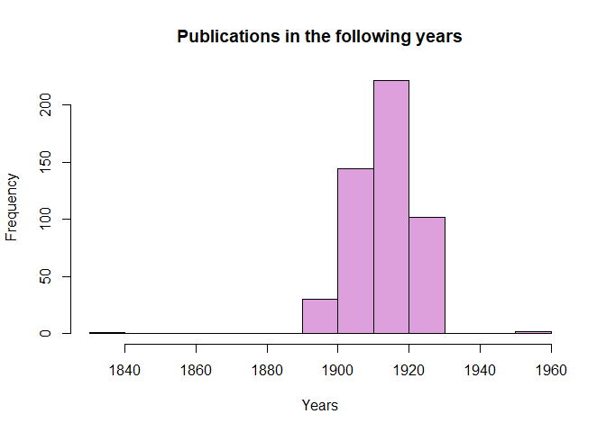
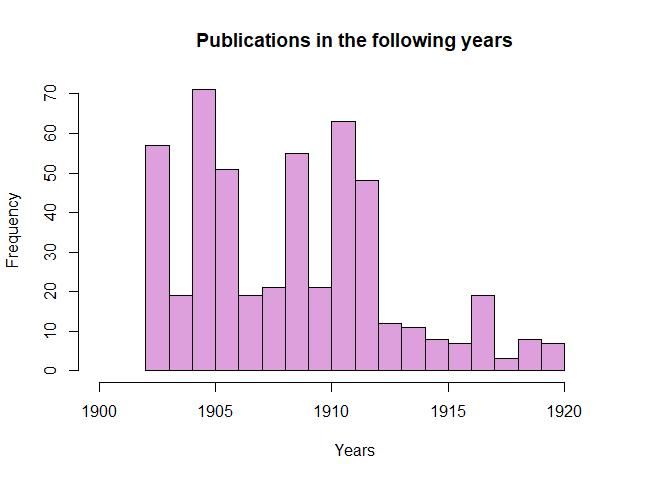

# ...in R

## Chronicling Ameria API in R

By Cyrus Gomes, Vincent Scalfani, and Adam M. Nguyen

These recipe examples were tested on March 24, 2023.

**Documentation:**

[LOC Chronicling America API Documentation](https://chroniclingamerica.loc.gov/about/api/)

See the bottom of the document for information on R and package versions.

**Attribution:** We thank Professor Jessica Kincaid (UA Libraries, Hoole Special Collections) for the use-cases. All data was collected from the Library of Congress, Chronicling America: Historic American Newspapers site, using the API.

Note that the data from the Alabama state intelligencer, The age-herald, and the Birmingham age-herald were contributed to Chronicling America by The University of Alabama Libraries: https://chroniclingamerica.loc.gov/awardees/au/


# Setup

First let us setup the required packages and base url for the Chronicling America API. If you have not already installed a package, run "install.packages('package name')", replacing 'package name' with the name of the package you require.


```r
library(tidyverse)  # ggplot2 & essential pacakges
library(dplyr)      # tibbles
library(purrr)      # turning into character
library(httr)       # GET()
library(jsonlite)   # converting to JSON
library(stringr)    # string removal
```

Setting the base url for the API:


```r
# First store string of the API's base url
base_url <- "https://chroniclingamerica.loc.gov/"
```

# 1. Basic API request

The Chronicling America API identifies newspapers and other records using LCCNs. We can query the API once we have the LCCN for the newspaper and even ask for particular issues and editions. For example, the following link lists newspapers published in the state of Alabama, from which the LCCN can be obtained: https://chroniclingamerica.loc.gov/newspapers/?state=Alabama

Here is an example with the Alabama State Intelligencer:


```r
# Below we will show a basic API call step by step
requested_url <- paste0(base_url, "lccn/sn84023600.json") # Concatenates stored api base url and the rest of our requested url
requested_url # Display requested_url
```

```
## [1] "https://chroniclingamerica.loc.gov/lccn/sn84023600.json"
```

```r
# Retrieve raw Data from requested_url
raw_data <- GET(requested_url) # Retrieve data from url and presents user with information on the response
raw_data # Display response
```

```
## Response [https://chroniclingamerica.loc.gov/lccn/sn84023600.json]
##   Date: 2023-03-24 19:26
##   Status: 200
##   Content-Type: application/json
##   Size: 334 B
```

```r
json_data <- rawToChar(raw_data$content) # Converts raw data to JSON format
json_data
```

```
## [1] "{\"place_of_publication\": \"Tuskaloosa [sic], Ala.\", \"lccn\": \"sn84023600\", \"start_year\": \"183?\", \"place\": [\"Alabama--Tuscaloosa--Tuscaloosa\"], \"name\": \"Alabama State intelligencer. [volume]\", \"publisher\": \"T.M. Bradford\", \"url\": \"https://chroniclingamerica.loc.gov/lccn/sn84023600.json\", \"end_year\": \"18??\", \"issues\": [], \"subject\": []}"
```

```r
data <- fromJSON(json_data) # Converts to usable format
          
data             
```

```
## $place_of_publication
## [1] "Tuskaloosa [sic], Ala."
## 
## $lccn
## [1] "sn84023600"
## 
## $start_year
## [1] "183?"
## 
## $place
## [1] "Alabama--Tuscaloosa--Tuscaloosa"
## 
## $name
## [1] "Alabama State intelligencer. [volume]"
## 
## $publisher
## [1] "T.M. Bradford"
## 
## $url
## [1] "https://chroniclingamerica.loc.gov/lccn/sn84023600.json"
## 
## $end_year
## [1] "18??"
## 
## $issues
## list()
## 
## $subject
## list()
```

Indexing into the json output allows data to be extracted using key names as demonstrated below:


```r
data$name                
```

```
## [1] "Alabama State intelligencer. [volume]"
```


```r
data$publisher                  
```

```
## [1] "T.M. Bradford"
```


Moving on to another publication, we can get the 182nd page (seq-182) of the Evening Star newspaper published on November 19, 1961.


```r
data <- fromJSON(rawToChar(GET(paste(base_url, "lccn/sn83045462/1961-11-19/ed-1/seq-182.json", sep=""))$content), flatten = TRUE)
# Outputs a list of links in various formats
data              
```

```
## $jp2
## [1] "https://chroniclingamerica.loc.gov/lccn/sn83045462/1961-11-19/ed-1/seq-182.jp2"
## 
## $sequence
## [1] 182
## 
## $text
## [1] "https://chroniclingamerica.loc.gov/lccn/sn83045462/1961-11-19/ed-1/seq-182/ocr.txt"
## 
## $title
## $title$url
## [1] "https://chroniclingamerica.loc.gov/lccn/sn83045462.json"
## 
## $title$name
## [1] "Evening star. [volume]"
## 
## 
## $pdf
## [1] "https://chroniclingamerica.loc.gov/lccn/sn83045462/1961-11-19/ed-1/seq-182.pdf"
## 
## $ocr
## [1] "https://chroniclingamerica.loc.gov/lccn/sn83045462/1961-11-19/ed-1/seq-182/ocr.xml"
## 
## $issue
## $issue$url
## [1] "https://chroniclingamerica.loc.gov/lccn/sn83045462/1961-11-19/ed-1.json"
## 
## $issue$date_issued
## [1] "1961-11-19"
```


```r
# Download and save the PDF
url <- data$pdf # Grabs the url of the pdf
url
```

```
## [1] "https://chroniclingamerica.loc.gov/lccn/sn83045462/1961-11-19/ed-1/seq-182.pdf"
```

```r
download.file(url, destfile = "file.pdf", mode = "wb") # Downloads the file and saves the pdf
```


# 2. Frequency of “University of Alabama” mentions

For this next example, querying the API is relatively the same process, therefore we will follow the same steps. Feel free to refer to example 1 for information on a step-by-step basis.


```r
# API Query
data <- fromJSON(
  rawToChar(
    GET(
      paste0(
        base_url, "search/pages/results/?state=Alabama&proxtext=(University%20of%20Alabama)&rows=500&format=json")
      )$content)
  , flatten = TRUE)

# Display the first item of data
data$items[1, ] 
```

```
##   sequence    county edition frequency                                       id
## 1       48 Jefferson    <NA>     Daily /lccn/sn85038485/1924-07-13/ed-1/seq-48/
##                                                                          subject
## 1 Alabama--Birmingham.--fast--(OCoLC)fst01204958, Birmingham (Ala.)--Newspapers.
##         city     date                               title end_year
## 1 Birmingham 19240713 The Birmingham age-herald. [volume]     1950
##                                                                                                                                                                                                                                                                                                                                                                                              note
## 1 Also issued on microfilm from Bell & Howell, Micro Photo Div.; the Library of Congress, Photoduplication Service., Also published in a weekly ed., Archived issues are available in digital format from the Library of Congress Chronicling America online collection., Publication suspended with July 12, 1945 issue due to a printers' strike; resumed publication with Aug. 17, 1945 issue.
##     state      section_label type place_of_publication start_year edition_label
## 1 Alabama Tuscaloosa Section page     Birmingham, Ala.       1902              
##        publisher language
## 1 Age-Herald Co.  English
##                                                alt_title       lccn country
## 1 Age-herald, Birmingham news, the Birmingham age-herald sn85038485 Alabama
##                                                                                                                                                                                                                                                           ocr_eng
## 1 canes at the University .of Alabama\nMORGAN HALL -\nSMITH HALL\n' hi i ..mil w i 1»..IIgylUjAiU. '. n\njjiIi\n(ARCHITECTS* MODEL)\nCOMER. HALli\nMINING\n••tSgSB?\n* i v' y -4\n■Si ' 3>\nA GLIMP9E OF FRATERNITY ROW\nTHE GYMNASIUM\nTuscaloosa, Alabama\nADV.
##             batch           title_normal
## 1 au_foster_ver01 birmingham age-herald.
##                                                                              url
## 1 https://chroniclingamerica.loc.gov/lccn/sn85038485/1924-07-13/ed-1/seq-48.json
##                            place page
## 1 Alabama--Jefferson--Birmingham    8
```


```r
# Display the length of the items in the data
nrow(data$items)
```

```
## [1] 500
```


```r
# create a list of dates from each item record
dates <- list() # Create empty list

# Iterate through the data to retrieve the dates of each item
for (items in 1:nrow(data$items)){
  dates <- append(x = dates, data$items[items, ]$date)
}

# Dispaly first 10
unlist(dates[1:10]) 
```

```
##  [1] "19240713" "19180818" "19240224" "19160806" "19130618" "19240217"
##  [7] "19140602" "19120714" "19220917" "19170513"
```

#### Converting the dates to years, so we can draw a histogram


```r
# Create empty list of years
years <- list()

# Iterate through dates to convert to Years
for (i in 1:length(dates)){
  input <- dates[[i]]
  years[[i]]<- as.numeric(format(as.Date(as.character(input), format = "%Y%m%d"), "%Y"))
}
```


```r
# We have to first unlist the elements to feed the values for the histogram
lst2 <- unlist(years, use.names = FALSE) 

# Produce histogram
hist(lst2, # Data
     main = "Publications in the following years", # Title
     xlab = "Years", # x-label
     ylab = "Frequency", # y-label
     col = "Plum" # Plum Color
)
```

<!-- -->

# 3. Sunday Comic Titles in the Age-herald

The Age - Herald published comics every Sunday, we will try to extract the titles of those published on page 15 of the 17th October 1897 edition.


```r
# API Query
request <- rawToChar(GET(paste(base_url, "lccn/sn86072192/1897-10-31/ed-1/seq-14/ocr.txt", sep=""))$content)
request
```

```
## [1] "SONGS AND THEIR SINGERS.\nV- —rm QBmAigb* ,-• ... *•** -j.\nih\n” 'Tis hard to give the hand where the heart can never be!”\n—Punch.\nA SIMILE FAR FETCHED. A CHANGE OF HEART.\nPriscilla is my Klondike girl, He—I think I shall have to preach\nAt least I call her so. a bicycle sermon tomorrow advis\nThere's gold in every straggling ing all my parishioners to ride a\n•i- curl, wheel.\nAlluring in its glow. She—Why, Joseph, it was only\nThe appellation's naught to do, three weeks ago that you denounc\nHowe'er, with aught of gold; ed the wheel most thoroughly.\n’Tis based on this: whene'er I woo He—Yes; but remember, my dear.\nShe’s distant and so cold. that was while I was learning to\n—Town Topics. ride.—Harper's Bazar.\nTHE PUG DOG PAPA’S LAMENT.\n\"My stars, nurse, I wouldn’t have minded if there’d been three, or even\nfour, but this is too much!”\n—New York Journal.\nTRUE UP TO A CERTAIN POINT. SURE TEST.\nH'When woman won't, she won’t,\" “I often wonder just what she\n£ they say, thinks of me,” said the young raar\nWhich means that she starts out rlhd man.\n. that way. \"It is easy to find out,” said the\n.■Rut later on, as you will find, elderly married man. “Just sit down\nShe’s pretty sure to change her on her hat, and she will tell you\nmind. ' what she thinks of you in less than\n—Chicago Record. a minute.”—Tit Bits.\nThe Chicken (singing): “Mister Johnson, tuhn me loose!\"\n—St. Louis Republic.\n' _Fui) For Today.*\n_ i ■- — . -- -\n• -----t .\n- ' SCORCHING AFTER NEW YORK’S BICYCLE VOTE.\nA HORSE SHOW SUGGESTION.\nI I! >i . ^\nVAN WYCK ON ONE WHEEL. GEORGE IN A BROWN STUDY.\nWhy bother with a fox hunt when a bicycle hunt would be more excit\ning and have more local color? i\n—Chicago Tnter Ocean. ^\nTHE DOCTOR’S MOTTO. SHREWDNESS NEEDED. fX\n\"I asked our doctor his motto the Jones—They say Skinner is a j\nother night.” shrewd lawyer.\n“What did he say'?” Brown—He has to be to keep out\n“ ‘Patience and long suffering.’ ” of jail.—Town Topics.\nPick Me Tn. -\nHER REPUTATIONS.\nDe Caverly—Has Hiss Liglithead\na good reputation as an actress?\nVan Clove—Splendid—as an ac\ntress.—Town Topics.\nTHE FINAL CALL.\nSister—Willie, your pa is calling\nyou. ^ k\nWillie—Yes, I know; but I don’t\ngo until he calls William.—Brooklyn\nLife. i\nTHE REPLY OF SPAIN.\n_ _ V ,\n///\nLOW RIDES ERECT. GEN. TRACY’S CLEVER DODGE.\n—New York World.\nWHY HE LIKED IT.\nVisitor—You don’t mean to tell\nme that you have lived in this out\nof the way place for 15 years?\nCitizen—I have, for a certainty.\nVisitor—I'm surprised. I can't see\nwhat you can find here to keep you\nbusy.\nCitizen—Neither can I. That's why\nI like it.—Richmond Despatch.\nPAPA KNOWS.\n“Aren't you afraid,\" asked the\ncaller of the fond mother, “that\nyour son will permanently impair\nhis health studying so diligently as\nhe does?\"\n\"1 was inclined to be uneasy, but\nhis papa says the dear boy will have\nnothing to do after he is admitted\nto the bar and will have ample time\nto recuperate.”—Detroit Free Press.\nAN EXCUSE.\n^ - m\n\"Don’t Interfere at present. Can't you see I'm pacifying these Cubans?” J\n—Chicago Record, j\nNOT FOR HIM.\nA poor man lay dying, and his\ngood wife was tending him with\nhomely but affectionate care.\n\"Don’t you think you could eat a\nbit of something, John? Now, what\ncan I get for you?\"\nWith a wan smile he answered\nfeebly:\n\"Well, I seem to smell a ham a\ncooking somewheres; I think I could\ndo with a little bit of that.”\n\"Oh, no, John, dear,\" she an\nswered promptly, \"you can’t have\nthat. Thai's for the funeral.”—\nLondon Telegraph.\nIN THE FIRELIGHT.\nBefore the blazing grate we sit, Tt]\nEstelle and I. 1 ' Ju\nThe leaping flames before us flit\nAnd dance and die.\nThe hour seems for trysting fit,\nNo one.is nigh.\n^ - *c\nEstelle reclines close at my feet\nUpon a mat, ''' \\\nSvelte, lissome, dainfy and petite,\nYet. 'spite of that,\nWe have no thought of passion\nsweet—\nEstelle’s a eat. H\n—Somerville Journal. \\\nL WHERE NIGHTS LAST SIX MONTHS.\nMother: \"Why did you do it?”\nBobby: \"I couldn’t help It, ma.”\nMother: \"Why didn't you say, 'Satan, get thee behind me?’ \"\nBobby: \"I did, but he went an pushed me.”\n—Up to Date.\nALACK! ALACK!\nLives of humorists remind us,\nWhile passing through this vale of\ntears,\nThat the jokes we leave behind us\nWill reappear in after years.\n—Chicago News.\n1.T SOUNDED QUEER.\nWillie—Ma, can people leave parts\nof themselves in different places?\nMa—No; don’t be ridiculous.\nWillie—Well, Mr. Jiggs said he\nwas going to Arizona for his lungs.\n—Philadelphia Record.\nMUCH THE SAME THING.\nHunter—Have you ever stalked\n■wild animals?\nRounder—No; but often at night\nI've tried to get In the house with\nout my wife hearing me.—New York\nEvening Journal.\nA KLONDIKER.\nBlocked on the ghastly Chilkat trail.\nThe would be miner walled, “Alas!\nWhen I set out I didn’t dream.\nThat things would come to such a\npass!”\n—Pick Me Up.\n\"Whoo-oo-oop! Letah not go home till mornin, old man!”\n\"Can’t do zhat, old feP, but I'll shtay out*wish you for a couple o’\nmonshs! Whoo-ooo-oop!”\n—New York Journal.\n----_\nTHE MAN WHO IS WEARING A DIAMOND RING FOR THE FIRST TIME.\ni \\ % ‘ \\ ^ \\ \\ V ' \"Well, ta-la. old char, il!I we meet '\n‘ i 1 again!’' _\n\"Thai’s a good Joke, bel Jove!” \"No; did It really happen, though?” \"How did you hear it?’’ \"That’s really very funny!” \"Ha, ha. ha! I’ll die with laughter!” —Comic Home Jtu*naJ."
```

```r
# Print the first 500 characters
substr(request,1,500) 
```

```
## [1] "SONGS AND THEIR SINGERS.\nV- —rm QBmAigb* ,-• ... *•** -j.\nih\n” 'Tis hard to give the hand where the heart can never be!”\n—Punch.\nA SIMILE FAR FETCHED. A CHANGE OF HEART.\nPriscilla is my Klondike girl, He—I think I shall have to preach\nAt least I call her so. a bicycle sermon tomorrow advis\nThere's gold in every straggling ing all my parishioners to ride a\n•i- curl, wheel.\nAlluring in its glow. She—Why, Joseph, it was only\nThe appellation's naught to do, three weeks ago that you denounc\nHowe'er, "
```

There are a lot of unreadable characters, and this text is hard to read. Let us simplify it. There is a lot of text here along with random characters and non-interpretable characters. Our approach here to get some of the titles will be to only keep uppercase letters and lines that are at least 75% letters 


```r
# We first remove all chars other than capital letters, newlines, and spaces
string_alpha<-gsub("[^A-Z\n ]", " ", request) 

# Display string_alpha
string_alpha
```

```
## [1] "SONGS AND THEIR SINGERS \nV      QB A                     \n  \n   T                                                       \n P     \nA SIMILE FAR FETCHED  A CHANGE OF HEART \nP               K              H  I       I                     \nA        I                                             \nT                                                                 \n                \nA                     S   W    J                  \nT                                                               \nH                                                         \n T                           I     H  Y                          \nS                                         I                \n T    T             H        B     \nTHE PUG DOG PAPA S LAMENT \n M                I                                                    \n                            \n N   Y    J       \nTRUE UP TO A CERTAIN POINT  SURE TEST \nH W                              I                           \n                                              \nW                                        \n             I                                \n  R                                                     J            \nS                                                                \n                                           \n C       R                  T   B    \nT   C                   M      J                       \n S   L     R        \n   F    F   T      \n               \n          \n    SCORCHING AFTER NEW YORK S BICYCLE VOTE \nA HORSE SHOW SUGGESTION \nI I        \nVAN WYCK ON ONE WHEEL  GEORGE IN A BROWN STUDY \nW                                                                 \n                                \n C       T     O       \nTHE DOCTOR S MOTTO  SHREWDNESS NEEDED   X\n I                                J     T        S             \n                            \n W                  B     H                       \n   P                                        T    T      \nP    M  T    \nHER REPUTATIONS \nD  C       H   H    L         \n                                \nV   C     S                \n       T    T      \nTHE FINAL CALL \nS      W                         \n        \nW      Y    I           I      \n                  W        B       \nL      \nTHE REPLY OF SPAIN \n    V  \n   \nLOW RIDES ERECT  GEN  TRACY S CLEVER DODGE \n N   Y    W     \nWHY HE LIKED IT \nV       Y                     \n                                  \n                              \nC       I                       \nV       I              I          \n                                  \n     \nC       N           I  T         \nI          R        D        \nPAPA KNOWS \n A                            \n                                \n                                \n                                    \n         \n                                 \n                                    \n                                  \n                                   \n                D       F    P     \nAN EXCUSE \n     \n D     I                     C             I                   C        J\n C       R        \nNOT FOR HIM \nA                            \n                              \n                             \n D                              \n                  J     N        \n    I              \nW                           \n       \n W     I                      \n                    I       I      \n                              \n O       J                  \n                                \n      T                        \nL      T         \nIN THE FIRELIGHT \nB                                T  \nE           I      J \nT                                \nA                 \nT                               \nN              \n      \nE                                \nU                \nS                                  \nY                   \nW                            \n      \nE                H\n S          J         \nL WHERE NIGHTS LAST SIX MONTHS \nM        W                  \nB       I               I       \nM        W                    S                            \nB       I                                \n U     D    \nALACK  ALACK \nL                            \nW                                 \n      \nT                                \nW                            \n C       N    \n  T SOUNDED QUEER \nW      M                         \n                                  \nM  N                       \nW      W     M   J            \n             A                     \n P            R      \nMUCH THE SAME THING \nH      H                    \n              \nR       N                     \nI                 I                \n                        N   Y   \nE       J       \nA KLONDIKER \nB                      C             \nT                           A    \nW    I         I              \nT                               \n      \n P    M  U  \n W            L                                       \n C                    P      I                                      \n        W             \n N   Y    J       \n     \nTHE MAN WHO IS WEARING A DIAMOND RING FOR THE FIRST TIME \n                V    W                         I          \n                \n T             J         J       N       I                           H                       T                           H           I                         C     H    J     J "
```


From what we see, we can still do better.

```r
# Iterate through split strings using function 'str_split()' as a means to split string_alpha by '\n'

for (k in str_split(string_alpha, "\n")){
  strings <- k # Number of Strings
  # We then store the number of spaces, size and actual letters we need in a list
  spaces <- lengths(regmatches(k, gregexpr(" ", k))) # Find number of spaces in each string
  head(spaces, n=5)
  size <- nchar(k) # Find overall number of characters in string
  letters <- size-spaces # Find number of  letters in string
}
```


```r
# Iterate through strings to produce strings we want to see
for (i in 1:length(strings)){
  if (is.na(letters[i]/size[i])){
  }
  else if((letters[i]/size[i])>=0.75){  #Set limitations and print the characters that we want to see
    cat(strings[i])
    cat("\n")
  }
}
```

```
## SONGS AND THEIR SINGERS 
## A SIMILE FAR FETCHED  A CHANGE OF HEART 
## THE PUG DOG PAPA S LAMENT 
## TRUE UP TO A CERTAIN POINT  SURE TEST 
##     SCORCHING AFTER NEW YORK S BICYCLE VOTE 
## A HORSE SHOW SUGGESTION 
## VAN WYCK ON ONE WHEEL  GEORGE IN A BROWN STUDY 
## THE DOCTOR S MOTTO  SHREWDNESS NEEDED   X
## HER REPUTATIONS 
## THE FINAL CALL 
## THE REPLY OF SPAIN 
## LOW RIDES ERECT  GEN  TRACY S CLEVER DODGE 
## WHY HE LIKED IT 
## PAPA KNOWS 
## AN EXCUSE 
## NOT FOR HIM 
## IN THE FIRELIGHT 
## L WHERE NIGHTS LAST SIX MONTHS 
## ALACK  ALACK 
## MUCH THE SAME THING 
## A KLONDIKER 
## THE MAN WHO IS WEARING A DIAMOND RING FOR THE FIRST TIME
```


# 4. Industrialization keywords frequency in the Birmingham Age-herald

We will try to obtain the frequency of “Iron” on the front pages of the Birmingham Age- herald newspapers from the year 1900 to 1920. (limited to first 500 rows for testing here)


```r
# Query API
requests <- fromJSON(rawToChar(GET(paste(base_url, "search/pages/results/?state=Alabama&lccn=sn85038485&dateFilterType=yearRange&date1=1900&date2=1920&sequence=1&andtext=Iron&rows=500&searchType=advanced&format=json", sep=""))$content), flatten = TRUE)
```


```r
# Create empty list of dates
dates <- list()

# Iterate through requests$items to detrieve dates
for (item in 1:length(requests$items)){
  dates <- append(dates, requests$items[item]$date)
}

# Display first 10 dates
unlist(dates[1:10])
```

```
##  [1] "19090113" "19120123" "19170310" "19060816" "19090626" "19050404"
##  [7] "19120215" "19080108" "19060412" "19110803"
```


```r
# Display length of dates
length(dates)
```

```
## [1] 500
```


```r
# Create empty list of years
years <- list()

# Convert dates to representative years for histogram

for (i in 1:length(dates)){
  input <- dates[[i]]
  years[[i]]<- as.numeric(format(as.Date(as.character(input), format = "%Y%m%d"), "%Y"))
}
```


```r
# Flatten years
hist2 <- unlist(years, use.names = FALSE)

# Produce histogram of publications in the 
hist(hist2,
     main = "Publications in the following years", # Title
     xlim = c(1900,1922), # Limits of x
     xlab = "Years", # x-Label
     ylab = "Frequency", # y-Label
     col = "Plum", # Set color to Plum
     breaks = 20) # 20 breaks/bins
```

<!-- -->

# R Session Info


```r
sessionInfo()
```

```
## R version 4.2.1 (2022-06-23 ucrt)
## Platform: x86_64-w64-mingw32/x64 (64-bit)
## Running under: Windows 10 x64 (build 19042)
## 
## Matrix products: default
## 
## locale:
## [1] LC_COLLATE=English_United States.utf8 
## [2] LC_CTYPE=English_United States.utf8   
## [3] LC_MONETARY=English_United States.utf8
## [4] LC_NUMERIC=C                          
## [5] LC_TIME=English_United States.utf8    
## 
## attached base packages:
## [1] stats     graphics  grDevices utils     datasets  methods   base     
## 
## other attached packages:
##  [1] jsonlite_1.8.4  httr_1.4.5      lubridate_1.9.2 forcats_1.0.0  
##  [5] stringr_1.5.0   dplyr_1.1.0     purrr_1.0.1     readr_2.1.4    
##  [9] tidyr_1.3.0     tibble_3.1.8    ggplot2_3.4.1   tidyverse_2.0.0
## 
## loaded via a namespace (and not attached):
##  [1] highr_0.10       bslib_0.4.2      compiler_4.2.1   pillar_1.8.1    
##  [5] jquerylib_0.1.4  tools_4.2.1      digest_0.6.31    timechange_0.2.0
##  [9] evaluate_0.20    lifecycle_1.0.3  gtable_0.3.1     pkgconfig_2.0.3 
## [13] rlang_1.0.6      cli_3.6.0        rstudioapi_0.14  curl_5.0.0      
## [17] yaml_2.3.7       xfun_0.37        fastmap_1.1.0    withr_2.5.0     
## [21] knitr_1.42       hms_1.1.2        generics_0.1.3   vctrs_0.5.2     
## [25] sass_0.4.5       grid_4.2.1       tidyselect_1.2.0 glue_1.6.2      
## [29] R6_2.5.1         fansi_1.0.4      rmarkdown_2.20   tzdb_0.3.0      
## [33] magrittr_2.0.3   ellipsis_0.3.2   scales_1.2.1     htmltools_0.5.4 
## [37] colorspace_2.1-0 utf8_1.2.3       stringi_1.7.12   munsell_0.5.0   
## [41] cachem_1.0.7
```
