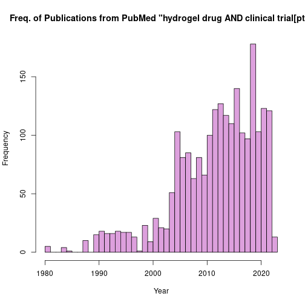

# ...in R

## PubMed API in R

by Adam Miramontes Nguyen    

The recipe examples were tested on Mar 24, 2023.

**R easyPubMed Documentation:**   

**Useful Getting Started with easyPubMed Article**: https://cran.r-project.org/web/packages/easyPubMed/vignettes/getting_started_with_easyPubMed.html    

**easyPubMed PDF Documentation**:
https://cran.r-project.org/web/packages/easyPubMed/easyPubMed.pdf

See the bottom of the document for information on R and package versions.

## Setup

First let's install the easyPubMed package as well as load the library.
If you do not already have the package installed, run the following command in your console: "install.packages("easyPubMed", repos = "http://cran.us.r-project.org")".

```r
# easyPubMed library for accessing PubMed API 
library(easyPubMed)
```


## 1. Querying PubMed API   

Below is an example query utilizing some valuable functions provided by the easyPubMed library as well as some important information for the API, if unfamiliar.   

These functions include:

* get_pubmed_ids()

* fetch_pubmed_data() 

**Note:** PubMed employs field tags to specify the nature of the associated string, for a comprehensive list of field tags visit: "https://pubmed.ncbi.nlm.nih.gov/help/#using-search-field-tags". Additionally, using PubMed tags will limit your search to the specified terms only. While querying PubMed, using the "get_pubmed_ids", it is allowable to provide no tags and the function will translate it for the user.

Let's try querying Pubmed! Check comments for additional, step-by-step detail.


```r
example_query <- 'Ancestral population genomics using coalescence hidden Markov models and heuristic optimisation algorithms.[Title]' #State query in the format 'query[query tag]', can include AND and OR statements and a query tag is not required
example_id <- get_pubmed_ids(example_query) #Stores a list of PMIDs(PubMed Identifications) satisfying the query

example_id$IdList$Id
```

```
## [1] "25819138"
```

```r
example_xml <-fetch_pubmed_data(example_id, format = "xml") # Create xml output
```
Now we have successfully queried and stored the data of 'Ancestral population genomics using coalescence hidden Markov models and heuristic optimisation algorithms.[Title]' into the xml output. We will find that working with the xml output is advantageous due to its hierarchical structure.   

Next we will show an example of how we can obtain a list of authors from this query using simple R functions and the 'custom_grep()' function from easyPubMed.   

* custom_grep() retrieves data between the tags given   


```r
last_name_authors <- custom_grep(example_xml, "LastName", "/LastName") # retrieve last name
forename_authors <- custom_grep(example_xml, "ForeName", "/ForeName") # retrieve forename

example_authors <- rbind('Last Name'=last_name_authors, 'Forename'=forename_authors) # output example_authors dataframe for PMID 27933103
example_authors
```

```
##           [,1]      [,2]     
## Last Name "Cheng"   "Mailund"
## Forename  "Jade Yu" "Thomas"
```


## 2. Querying for Multiple Sources

Another convenience of using easyPubMed is whether requesting data from one article or multiple, it is the same process. The only change that must be made is changing the query, whether that be multiple PMIDs or an Author's name, as seen in the example below.


```r
multi_example_query <- 'Vincent Scalfani[AU]' # All we need to change here is simply making more general query requests to PubMed.
multi_example_id <- get_pubmed_ids(multi_example_query) #Stores a list of PMIDs satisfying the query

multi_example_xml <-fetch_pubmed_data(multi_example_id, format = "xml") # XML format

# To understand the structure of the XML output, try running the following line without the pound sign, i.e. uncomment
# multi_example_xml

# In the XML format we find Journal Titles to be between "Title" and "/Title"
journals <- custom_grep(multi_example_xml, "Title", "/Title") #Retrieve Journal Titles
```

Similar to the previous example, now we have retrieved a list of Journal Titles Dr. Scalfani has published under from the articles available on PubMed.


```r
journals
```

```
## [1] "Journal of cheminformatics" "Journal of cheminformatics"
## [3] "Science (New York, N.Y.)"   "ACS macro letters"
```
## 3. Looping Through a List of PMIDs

In some use cases, a user may be interested in looping through a list of IDs to query data. Below we will show how one can do this.

First, create an example list of PubMed IDs:

```r
pmids = as.list(c(34813985, 34813932, 34813684, 34813661, 34813372, 34813140, 34813072))
```

Next, let's begin querying through a for loop. Essentially what is happening is similar to in previous examples, but we are using the for command to iterate over each element of our 'pmid' list and then appending the results to our 'Titles' list.


```r
# Creates empty list of titles
Titles <- c()
# Iterate through each listed pmid, retrieve XML formatted info, and retrieve list of Titles
for (i in pmids) {
  join <- paste(i, '[pmid]') #join each element with [pmid] to specify
  id <- get_pubmed_ids(join)
  xml <- fetch_pubmed_data(id, format = "xml")
  Titles<-append(Titles,custom_grep(xml, "ArticleTitle", "/ArticleTitle"))
  Sys.sleep(1)
}
# Display list of titles
Titles 
```

```
## [1] "Mutation in RyR2-FKBP Binding site alters Ca<sup>2+</sup> signaling modestly but increases \"arrhythmogenesis\" in human stem cells derived cardiomyocytes."
## [2] "M-CDC: Magnetic pull-down-assisted colorimetric method based on the CRISPR/Cas12a system."                                                                  
## [3] "Naturally occurring UBIAD1 mutations differentially affect menaquinone biosynthesis and vitamin K-dependent carboxylation."                                 
## [4] "Efficient visual screening of CRISPR/Cas9 genome editing in the nematode Pristionchus pacificus."                                                           
## [5] "Base Editing of Somatic Cells Using CRISPR-Cas9 in <i>Drosophila</i>."                                                                                      
## [6] "Mammalian Chemical Genomics towards Identifying Targets and Elucidating Modes-of-Action of Bioactive Compounds."                                            
## [7] "CRISPR-Cas9 Editing of the Synthesis of Biodegradable Polyesters Polyhydroxyalkanaotes (PHA) in Pseudomonas putida KT2440."
```
## 4. PubMed API Metadata Visualization

In this example we're going to show how a user can create a visualization using the PubMed API, specifically a histogram to visualize publishing frequency of the query 'hydrogel drug AND clinical trial[pt]'.


```r
# Libraries for creating network visual
visual_query <- 'hydrogel drug AND clinical trial[pt]' # Example Query

visual_id <- get_pubmed_ids(visual_query) #Stores a list of PMIDs satisfying the query

visual_xml <-fetch_pubmed_data(visual_id, format = "xml") # XML format

Year<- custom_grep(visual_xml, 'Year','/Year') #Retrieve Publication Years
head(Year, n=10) #Display first 10 instances of the Year list
```

```
##  [1] "2023" "2023" "2023" "2023" "2023" "2023" "2023" "2023" "2023" "2023"
```

```r
hist(as.numeric(Year),main= 'Freq. of Publications from PubMed "hydrogel drug AND clinical trial[pt]"',xlab='Year', breaks=40, col = 'plum') # Use base R function hist() to plot
```



## R Session Info


```r
sessionInfo()
```

```
## R version 4.2.3 (2023-03-15)
## Platform: x86_64-pc-linux-gnu (64-bit)
## Running under: Ubuntu 20.04.6 LTS
## 
## Matrix products: default
## BLAS:   /usr/lib/x86_64-linux-gnu/blas/libblas.so.3.9.0
## LAPACK: /usr/lib/x86_64-linux-gnu/lapack/liblapack.so.3.9.0
## 
## locale:
##  [1] LC_CTYPE=en_US.UTF-8       LC_NUMERIC=C              
##  [3] LC_TIME=en_US.UTF-8        LC_COLLATE=en_US.UTF-8    
##  [5] LC_MONETARY=en_US.UTF-8    LC_MESSAGES=en_US.UTF-8   
##  [7] LC_PAPER=en_US.UTF-8       LC_NAME=C                 
##  [9] LC_ADDRESS=C               LC_TELEPHONE=C            
## [11] LC_MEASUREMENT=en_US.UTF-8 LC_IDENTIFICATION=C       
## 
## attached base packages:
## [1] stats     graphics  grDevices utils     datasets  methods   base     
## 
## other attached packages:
## [1] easyPubMed_2.13
## 
## loaded via a namespace (and not attached):
## [1] compiler_4.2.3 tools_4.2.3    highr_0.10     knitr_1.42     xfun_0.38     
## [6] evaluate_0.20
```

