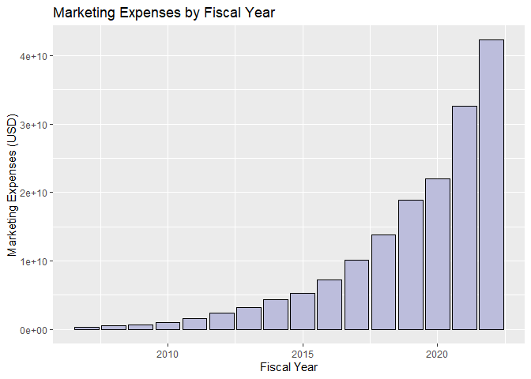

# ...in R

## SEC EDGAR API in R

by Adam Miramontes Nguyen

These recipe examples were tested on December 1, 2023.

**Documentation:** 

**SEC EDGAR API:** https://www.sec.gov/os/accessing-edgar-data

**SEC Website Policies:** https://www.sec.gov/privacy#security

**List of all CIKs:** https://www.sec.gov/Archives/edgar/cik-lookup-data.txt

***NOTE:*** Sending more than 10 requests per second will place a temporary IP ban.

See the bottom of the document for information on R and package versions.

### Setup

Run the following lines of code to load the libraries ‘httr’ and ‘jsonlite’. If you have not done so already, additionally, before the ‘library()’ functions, run ‘install.packages(c(‘httr’,’jsonlite’))’.

```r
# Load necessary libraries
library(httr)
library(jsonlite)
```

### User Info

The SEC EDGAR API requires you to provide your name and email when sending requests. Simply edit the following variables with your information.


```r
# Designate your user info
firstName <- "First"
lastName <- "Last"
email <- "Email@email.com"
```

Alternatively, you can also designate environment variables ([click here to see how](https://support.posit.co/hc/en-us/articles/360047157094-Managing-R-with-Rprofile-Renviron-Rprofile-site-Renviron-site-rsession-conf-and-repos-conf)) to access your user information.


```r
# Here we simply use the 'Sys.getenv()' function to grab the variables, first, last, and email
firstName <- Sys.getenv("first")
lastName <- Sys.getenv("last")
email <- Sys.getenv("email")
```


### SEC EDGAR Data Installation

In addition to the publicly available API, SEC EDGAR data can also be access via a bulk data download, which is compiled nightly. This approach is advantageous when working with large datasets, since it does not require making many individual API calls. However, it requires about 15 GB of storage to install and is more difficult to keep up to date.

To access this data, download the companyfacts.zip file under the ‘Bulk data’ heading at the bottom of [this page.](https://www.sec.gov/edgar/sec-api-documentation)

## 1. Obtaining Marketing Expenses for Amazon

To access the data from an individual company, we must first obtain its Central Index Key (CIK) value. These values can be obtained by searching for a company [here](https://www.sec.gov/edgar/search/#). Alternatively, you can find a list of all companies and their CIK value [here](https://www.sec.gov/Archives/edgar/cik-lookup-data.txt).

For this section of the guide, we’ll use Amazon (AMZN) as an example, which has a CIK of 0001018724.

With this CIK, we can now build a URL for the /companyfacts/ endpoint:


```r
# Define the Amazon CIK (Central Index Key) for the SEC EDGAR database
cik <- "0001018724"  # Amazon.com Inc.

# Define the URL for the SEC EDGAR API
base_url <- paste0("https://data.sec.gov/api/xbrl/companyfacts/CIK",cik,".json")

# Query SEC EDGAR API
amzn_data <- fromJSON(rawToChar(GET(url = base_url, add_headers("User-agent" = paste0(firstName,",",lastName,", ",email)))$content))

# Let's check the name of the company of the data retrieved
amzn_data$entityName
```

```
## [1] "AMAZON.COM, INC."
```

Now that we've retrieved the Amazon's data, let's examine their marketing expenses.


```r
# Retrieve marketing expenses in USD
marketing_expenses <- amzn_data$facts$`us-gaap`$MarketingExpense$units$USD

# Filter through marketing expenses to retrieve one cumulative value per Fiscal Year
marketing_expenses_FY <- marketing_expenses[marketing_expenses$fp=='FY',]
marketing_expenses_FY <- marketing_expenses_FY[!is.na(marketing_expenses_FY$frame),]

# Marketing Expenses per Fiscal Year
marketing_expenses_FY[c('frame', 'val')]
```

```
##      frame        val
## 1   CY2007 3.4400e+08
## 7   CY2008 4.8200e+08
## 19  CY2009 6.8000e+08
## 32  CY2010 1.0290e+09
## 45  CY2011 1.6300e+09
## 58  CY2012 2.4080e+09
## 71  CY2013 3.1330e+09
## 84  CY2014 4.3320e+09
## 97  CY2015 5.2540e+09
## 110 CY2016 7.2330e+09
## 123 CY2017 1.0069e+10
## 136 CY2018 1.3814e+10
## 149 CY2019 1.8878e+10
## 162 CY2020 2.2008e+10
## 174 CY2021 3.2551e+10
## 185 CY2022 4.2238e+10
```

One may be interested in the cumulative sum of the expenses over the years.


```r
# Cumulative sum of marketing expenses over the years
total_marketing_expenses <- sum(marketing_expenses_FY$val)

# Let's take a look
paste0("Amazon's Total Marketing Expenses: ", total_marketing_expenses, ' USD')
```

```
## [1] "Amazon's Total Marketing Expenses: 1.66083e+11 USD"
```

### Marketing Expenses Visualization

Rather than calculating the total marketing expenses documented in the API, let's visualize the marketing expenses by fiscal year using a box plot.

```r
# Plot marketing expenses by fiscal year
library(ggplot2)
ggplot(data = marketing_expenses_FY, aes(x = as.numeric(substr(marketing_expenses_FY$frame, 3,6)), y = val))+
  geom_bar(stat = "identity", fill = "#bcbddc", color = "black") +
  labs(x = "Fiscal Year", y = "Marketing Expenses (USD)", title = "Marketing Expenses by Fiscal Year")
```

<!-- -->

## 2. Number of Shares Outstanding for Tesla

For another use case, let’s look at the number of shares outstanding for Tesla, which the SEC defines as “Number of shares of common stock outstanding. Common stock represent the ownership interest in a corporation.” Much of the process is conveniently similar.


```r
# Define the Tesla CIK
cik <- "0001318605"  # Tesla Inc.

# Define the URL for the SEC EDGAR API
base_url <- paste0("https://data.sec.gov/api/xbrl/companyfacts/CIK",cik,".json")

# Query API
tesla_data <- fromJSON(rawToChar(GET(url = base_url, add_headers("User-agent" = paste0(firstName,",",lastName,", ",email)))$content))

# Check the name of the company of the data retrieved
tesla_data$entityName
```

```
## [1] "Tesla, Inc."
```

```r
# Retrieve Shares Outstanding
shares_outstanding <- tesla_data$facts$`us-gaap`$CommonStockSharesOutstanding$units$shares

# Filter through marketing expenses to retrieve one cumulative value per Fiscal Year
shares_outstanding_FY <- shares_outstanding[shares_outstanding$fp=='FY',]
shares_outstanding_FY <- shares_outstanding_FY[!is.na(shares_outstanding_FY$frame),]
```

Let's see the FY and the corresponding value of shares outstanding


```r
cbind(shares_outstanding_FY$fy,shares_outstanding_FY$val)
```

```
##       [,1]       [,2]
##  [1,] 2011   94908370
##  [2,] 2012  104530305
##  [3,] 2013  114214274
##  [4,] 2014  123090990
##  [5,] 2015  125688000
##  [6,] 2016  131425000
##  [7,] 2017  161561000
##  [8,] 2018  168797000
##  [9,] 2019  173000000
## [10,] 2020  905000000
## [11,] 2021  960000000
## [12,] 2022 3100000000
```
## 3. Comparing Total Assets of All Filing Companies

The SEC EDGAR API also has an endpoint called /frames/ that returns the data from all companies for a given category and filing period. In this example, we’ll look at the total assets of all companies reported for Q1 2023.


```r
# Specify query parameters
category <- "Assets/USD"
year <- "2023"
quarter <- "1"

# Define URL
base_url <- paste0('https://data.sec.gov/api/xbrl/frames/us-gaap/',category,'/CY',year,'Q',quarter,'I.json')

# Query API
asset_data <- fromJSON(rawToChar(GET(url = base_url, add_headers("User-agent" = paste0(firstName,",",lastName,", ",email)))$content))$data

# For this usecase we are only interested in the 'entityName' and 'val' columns so let's subset
asset_data <- as.data.frame(cbind(asset_data$entityName, asset_data$val))

# Rename columns
colnames(asset_data) <- c('Company', 'totalAssets')

# Coerce the 'totalAssets' column to numeric
asset_data$totalAssets <- as.numeric(asset_data$totalAssets)

# Let's see how many entries were retrieved
nrow(asset_data)
```

```
## [1] 6220
```

```r
# We can also see the structure of the data retrieved using the 'str()' function
str(asset_data)
```

```
## 'data.frame':	6220 obs. of  2 variables:
##  $ Company    : chr  "AAR CORP" "ABBOTT LABORATORIES" "WORLDS INC." "ACME UNITED CORP" ...
##  $ totalAssets: num  1.67e+09 7.38e+10 8.07e+04 1.57e+08 3.72e+08 ...
```

```r
# Finally, let's see the first few entries of asset_data
head(asset_data)
```

```
##                          Company totalAssets
## 1                       AAR CORP  1673300000
## 2            ABBOTT LABORATORIES 73794000000
## 3                    WORLDS INC.       80675
## 4               ACME UNITED CORP   157468000
## 5 ADAMS RESOURCES & ENERGY, INC.   371563000
## 6    BK TECHNOLOGIES CORPORATION    50758000
```

### Export to CSV

Commonly users may want to export data into a comma seperated file (.csv), this may be achieved as follows:


```r
# Export as a csv
write.csv(asset_data, file = paste0('companies_by_total_assets_q',quarter,'_',year,'.csv'))
```

### Total Assets of All Companies Histogram

Since the total assets of all companies is a dataset that ranges from values as low as zero to those as large as 4.3 trillion, these values must be graphed logarithmically. Below, we take the log10 of the 'totalAssets' column, luckily R makes this very easy for us.


```r
# Load the ggplot2 library
library(ggplot2)

# Plot Histogram of totalAssets with log10 transformation
ggplot(asset_data, aes(x = log10(totalAssets))) +
  geom_histogram(bins = (10%%max(asset_data$totalAssets) +3), fill = "#756bb1", color = "black") +
  labs(title = "Companies by Total Assets Reported for Q1 2023 (Logarithmic)",
       x = "Assets (in 10^n USD)",
       y = "Number of Companies")
```

```
## Warning: Removed 30 rows containing non-finite values (`stat_bin()`).
```

<!-- -->

## 4. Finding the Top 500 Companies by Revenue

The Fortune 500 is a ranking of the top 500 companies by revenue, according to the data filed in their 10-K or a comparable form. In this example, we’ll look at only the revenues reported in the 10-K forms to construct a similar ranking of U.S. companies by revenue.


```r
# Define query and parameters
category <- 'Revenues/USD'
year <- '2022'
url <- paste0('https://data.sec.gov/api/xbrl/frames/us-gaap/',category,'/CY',year,'.json')

# Query API
data_retrieved <- fromJSON(rawToChar(GET(url = url, add_headers("User-agent" = paste0(firstName,",",lastName,", ",email)))$content))$data

# Display number of results
nrow(data_retrieved)
```

```
## [1] 2433
```

```r
# Grab only first 500 highest revenues
top500_revenues <- head(data_retrieved[order(-data_retrieved$val), c('entityName', 'val')], n = 500)

# Let's see the first 10 entries in the top500_revenues
head(top500_revenues, n = 10)
```

```
##                           entityName         val
## 214                     WALMART INC. 6.11289e+11
## 72           Exxon Mobil Corporation 4.13680e+11
## 320  UnitedHealth Group Incorporated 3.24162e+11
## 128                  CVS HEALTH CORP 3.22467e+11
## 776           BERKSHIRE HATHAWAY INC 3.02089e+11
## 188                     Chevron Corp 2.46252e+11
## 909                    CENCORA, INC. 2.38587e+11
## 562       COSTCO WHOLESALE CORP /NEW 2.26954e+11
## 294            Cardinal Health, Inc. 1.81364e+11
## 1992                 The Cigna Group 1.80516e+11
```

### Export to CSV


```r
# Export to csv
write.csv(top500_revenues, file = paste0('top_500_companies_by_revenue_fy',year,'.csv'))
```


## R Session Info


```r
sessionInfo()
```

```
## R version 4.3.1 (2023-06-16 ucrt)
## Platform: x86_64-w64-mingw32/x64 (64-bit)
## Running under: Windows 10 x64 (build 19045)
## 
## Matrix products: default
## 
## 
## locale:
## [1] LC_COLLATE=English_United States.utf8 
## [2] LC_CTYPE=English_United States.utf8   
## [3] LC_MONETARY=English_United States.utf8
## [4] LC_NUMERIC=C                          
## [5] LC_TIME=English_United States.utf8    
## 
## time zone: America/Chicago
## tzcode source: internal
## 
## attached base packages:
## [1] stats     graphics  grDevices utils     datasets  methods   base     
## 
## other attached packages:
## [1] ggplot2_3.4.4  jsonlite_1.8.7 httr_1.4.7    
## 
## loaded via a namespace (and not attached):
##  [1] vctrs_0.6.3       cli_3.6.1         knitr_1.44        rlang_1.1.1      
##  [5] xfun_0.40         generics_0.1.3    labeling_0.4.2    glue_1.6.2       
##  [9] colorspace_2.1-0  htmltools_0.5.6.1 sass_0.4.7        fansi_1.0.4      
## [13] scales_1.2.1      rmarkdown_2.25    grid_4.3.1        evaluate_0.22    
## [17] munsell_0.5.0     jquerylib_0.1.4   tibble_3.2.1      fastmap_1.1.1    
## [21] yaml_2.3.7        lifecycle_1.0.3   compiler_4.3.1    dplyr_1.1.3      
## [25] pkgconfig_2.0.3   rstudioapi_0.15.0 farver_2.1.1      digest_0.6.33    
## [29] R6_2.5.1          tidyselect_1.2.0  utf8_1.2.3        pillar_1.9.0     
## [33] curl_5.1.0        magrittr_2.0.3    bslib_0.5.1       withr_2.5.0      
## [37] tools_4.3.1       gtable_0.3.4      cachem_1.0.8
```
