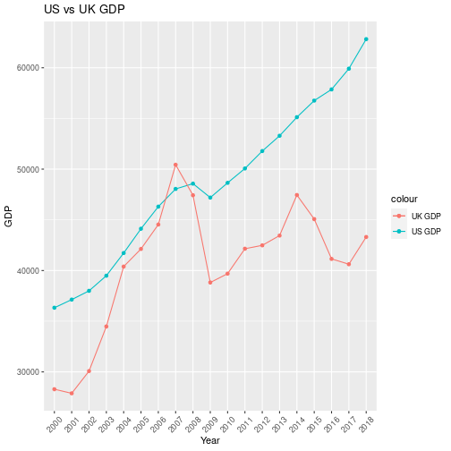
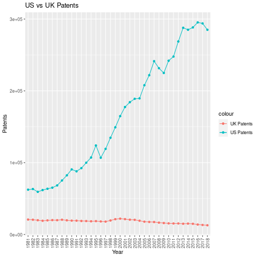

# ...in R

## World Bank Data API in R

#### By Vishank Patel

See the [World Bank API documentation](https://datahelpdesk.worldbank.org/knowledgebase/articles/889392-about-the-indicators-api-documentation)

These recipe examples were tested on February 8, 2022


```r
# setup

library(tidyverse)  #ggplot2
library(dplyr)      #tibbles
library(purrr)      #turning into character
library(httr)       #GET()
library(jsonlite)   #converting to JSON

urlRoot <- "https://api.worldbank.org/v2/"
```

### 1. Get list of country iso2Codes and names

For obtaining data from the World Bank API, it is helpful to first obtain a list of country codes and names.


```r
countryURL <- paste(urlRoot,"country?format=json&per_page=500",sep = "")

raw_country_data <- GET(countryURL)
prelim_country_data <- fromJSON(rawToChar(raw_country_data$content), flatten = TRUE)

country_data <- prelim_country_data[[2]]
country_data[1:5,1:5]
```

```
##    id iso2Code                        name capitalCity longitude
## 1 ABW       AW                       Aruba  Oranjestad  -70.0167
## 2 AFE       ZH Africa Eastern and Southern                      
## 3 AFG       AF                 Afghanistan       Kabul   69.1761
## 4 AFR       A9                      Africa                      
## 5 AFW       ZI  Africa Western and Central
```


```r
countryIso2Code <- as.list(country_data$iso2Code)
head(countryIso2Code)
```

```
## [[1]]
## [1] "AW"
## 
## [[2]]
## [1] "ZH"
## 
## [[3]]
## [1] "AF"
## 
## [[4]]
## [1] "A9"
## 
## [[5]]
## [1] "ZI"
## 
## [[6]]
## [1] "AO"
```

Extract country names:


```r
countryName <- as.list(country_data$name)
head(countryName)
```

```
## [[1]]
## [1] "Aruba"
## 
## [[2]]
## [1] "Africa Eastern and Southern"
## 
## [[3]]
## [1] "Afghanistan"
## 
## [[4]]
## [1] "Africa"
## 
## [[5]]
## [1] "Africa Western and Central"
## 
## [[6]]
## [1] "Angola"
```


```r
countryIso2CodeName <- transpose(list(countryIso2Code,countryName))
head(countryIso2CodeName)
```

```
## [[1]]
## [[1]][[1]]
## [1] "AW"
## 
## [[1]][[2]]
## [1] "Aruba"
## 
## 
## [[2]]
## [[2]][[1]]
## [1] "ZH"
## 
## [[2]][[2]]
## [1] "Africa Eastern and Southern"
## 
## 
## [[3]]
## [[3]][[1]]
## [1] "AF"
## 
## [[3]][[2]]
## [1] "Afghanistan"
## 
## 
## [[4]]
## [[4]][[1]]
## [1] "A9"
## 
## [[4]][[2]]
## [1] "Africa"
## 
## 
## [[5]]
## [[5]][[1]]
## [1] "ZI"
## 
## [[5]][[2]]
## [1] "Africa Western and Central"
## 
## 
## [[6]]
## [[6]][[1]]
## [1] "AO"
## 
## [[6]][[2]]
## [1] "Angola"
```

So now we know the country iso2codes, which we can use to pull specific indicator data for countries.

### 2. Compile a Custom Indicator Dataset

There are many availabe indicators: <https://data.worldbank.org/indicator>

We wll select three indicators for this example:

1.  Scientific and Technical Journal Article Data = [IP.JRN.ARTC.SC](https://data.worldbank.org/indicator/IP.JRN.ARTC.SC?view=chart)

2.  Patent Applications, residents = [IP.PAT.RESD](https://data.worldbank.org/indicator/IP.PAT.RESD?view=chart)

3.  GDP per capita (current US\$) Code = [NY.GDP.PCAP.CD](https://data.worldbank.org/indicator/NY.GDP.PCAP.CD?view=chart)

Note that these three selected indictaors have a [CC-BY 4.0 license](https://datacatalog.worldbank.org/public-licenses#cc-by). We will compile this indicator data for the United States (US) and United Kingdom (GB)


```r
indicators <- list("IP.JRN.ARTC.SC", "IP.PAT.RESD", "NY.GDP.PCAP.CD")
```

Generate the web API URLs we need for U.S.:


```r
us_api_url <- c()
for (indicator in indicators) {
  us_api_url <- append(x = us_api_url,
         values = paste(urlRoot,"country/US/indicator/",indicator,"?format=json&per_page=500",sep = ""))
}
us_api_url
```

```
## [1] "https://api.worldbank.org/v2/country/US/indicator/IP.JRN.ARTC.SC?format=json&per_page=500"
## [2] "https://api.worldbank.org/v2/country/US/indicator/IP.PAT.RESD?format=json&per_page=500"   
## [3] "https://api.worldbank.org/v2/country/US/indicator/NY.GDP.PCAP.CD?format=json&per_page=500"
```

Retrieving Data


```r
us_indicator_data <- list()
for (url in us_api_url) {
  temp_data <- tibble(fromJSON(rawToChar(GET(url)$content), flatten = TRUE)[[2]])
  us_indicator_data <- append(us_indicator_data,list(temp_data))  #making a list of tibbles 
}
```


```r
us_journal_data <- us_indicator_data[[1]][,c("date","value")] #the first element in us_indicator_data is regarding journal publications
head(us_journal_data)
```

```
## # A tibble: 6 × 2
##   date    value
##   <chr>   <dbl>
## 1 2021      NA 
## 2 2020      NA 
## 3 2019      NA 
## 4 2018  422808.
## 5 2017  432216.
## 6 2016  427265.
```


```r
us_patent_data <- us_indicator_data[[2]][,c("date","value")]    #takes all rows but only two columns
head(us_patent_data)
```

```
## # A tibble: 6 × 2
##   date   value
##   <chr>  <int>
## 1 2021      NA
## 2 2020  269586
## 3 2019  285113
## 4 2018  285095
## 5 2017  293904
## 6 2016  295327
```


```r
us_GDP_data <- us_indicator_data[[3]][,c("date","value")] 
head(us_GDP_data)
```

```
## # A tibble: 6 × 2
##   date   value
##   <chr>  <dbl>
## 1 2021  70249.
## 2 2020  63531.
## 3 2019  65120.
## 4 2018  62823.
## 5 2017  59908.
## 6 2016  57867.
```


```r
us_data <- list()
us_data <- append(us_data,values = c(us_journal_data,us_patent_data,us_GDP_data))
head(us_data)
```

```
## $date
##  [1] "2021" "2020" "2019" "2018" "2017" "2016" "2015" "2014" "2013" "2012"
## [11] "2011" "2010" "2009" "2008" "2007" "2006" "2005" "2004" "2003" "2002"
## [21] "2001" "2000" "1999" "1998" "1997" "1996" "1995" "1994" "1993" "1992"
## [31] "1991" "1990" "1989" "1988" "1987" "1986" "1985" "1984" "1983" "1982"
## [41] "1981" "1980" "1979" "1978" "1977" "1976" "1975" "1974" "1973" "1972"
## [51] "1971" "1970" "1969" "1968" "1967" "1966" "1965" "1964" "1963" "1962"
## [61] "1961" "1960"
## 
## $value
##  [1]       NA       NA       NA 422807.7 432216.5 427264.6 429988.9 433192.3
##  [9] 429570.0 427996.8 423958.8 408817.1 399350.3 393979.0 391909.6 385515.0
## [17] 384572.9 353853.5 329398.9 319307.6 305612.9 304781.6       NA       NA
## [25]       NA       NA       NA       NA       NA       NA       NA       NA
## [33]       NA       NA       NA       NA       NA       NA       NA       NA
## [41]       NA       NA       NA       NA       NA       NA       NA       NA
## [49]       NA       NA       NA       NA       NA       NA       NA       NA
## [57]       NA       NA       NA       NA       NA       NA
## 
## $date
##  [1] "2021" "2020" "2019" "2018" "2017" "2016" "2015" "2014" "2013" "2012"
## [11] "2011" "2010" "2009" "2008" "2007" "2006" "2005" "2004" "2003" "2002"
## [21] "2001" "2000" "1999" "1998" "1997" "1996" "1995" "1994" "1993" "1992"
## [31] "1991" "1990" "1989" "1988" "1987" "1986" "1985" "1984" "1983" "1982"
## [41] "1981" "1980" "1979" "1978" "1977" "1976" "1975" "1974" "1973" "1972"
## [51] "1971" "1970" "1969" "1968" "1967" "1966" "1965" "1964" "1963" "1962"
## [61] "1961" "1960"
## 
## $value
##  [1]     NA 269586 285113 285095 293904 295327 288335 285096 287831 268782
## [11] 247750 241977 224912 231588 241347 221784 207867 189536 188941 184245
## [21] 177513 164795 149251 134733 119214 106892 123962 107233  99955  92425
## [31]  87955  90643  82370  75192  68315  65195  63673  61841  59391  63316
## [41]  62404  62098     NA     NA     NA     NA     NA     NA     NA     NA
## [51]     NA     NA     NA     NA     NA     NA     NA     NA     NA     NA
## [61]     NA     NA
## 
## $date
##  [1] "2021" "2020" "2019" "2018" "2017" "2016" "2015" "2014" "2013" "2012"
## [11] "2011" "2010" "2009" "2008" "2007" "2006" "2005" "2004" "2003" "2002"
## [21] "2001" "2000" "1999" "1998" "1997" "1996" "1995" "1994" "1993" "1992"
## [31] "1991" "1990" "1989" "1988" "1987" "1986" "1985" "1984" "1983" "1982"
## [41] "1981" "1980" "1979" "1978" "1977" "1976" "1975" "1974" "1973" "1972"
## [51] "1971" "1970" "1969" "1968" "1967" "1966" "1965" "1964" "1963" "1962"
## [61] "1961" "1960"
## 
## $value
##  [1] 70248.629 63530.633 65120.395 62823.309 59907.754 57866.745 56762.729
##  [8] 55123.850 53291.128 51784.419 50065.967 48650.643 47194.943 48570.046
## [15] 48050.224 46302.001 44123.407 41724.632 39490.275 37997.760 37133.623
## [22] 36329.956 34515.390 32853.677 31459.139 29967.713 28690.876 27694.853
## [29] 26387.294 25418.991 24342.259 23888.600 22857.154 21417.012 20038.941
## [36] 19071.227 18236.828 17121.225 15543.894 14433.788 13976.105 12574.792
## [43] 11674.182 10564.948  9452.577  8592.254  7801.457  7225.691  6726.359
## [50]  6094.018  5609.383  5234.297  5032.145  4695.923  4336.427  4146.317
## [57]  3827.527  3573.941  3374.515  3243.843  3066.563  3007.123
```

For the United Kingdom:


```r
uk_api_url <- c()
for (indicator in indicators) {
  uk_api_url <- append(x = uk_api_url,
         values = paste(urlRoot,"country/GB/indicator/",indicator,"?format=json&per_page=500",sep = ""))
}
uk_api_url
```

```
## [1] "https://api.worldbank.org/v2/country/GB/indicator/IP.JRN.ARTC.SC?format=json&per_page=500"
## [2] "https://api.worldbank.org/v2/country/GB/indicator/IP.PAT.RESD?format=json&per_page=500"   
## [3] "https://api.worldbank.org/v2/country/GB/indicator/NY.GDP.PCAP.CD?format=json&per_page=500"
```

Retrieving Data


```r
uk_indicator_data <- list()
for (url in uk_api_url) {
  temp_data <- tibble(fromJSON(rawToChar(GET(url)$content), flatten = TRUE)[[2]])
  uk_indicator_data <- append(uk_indicator_data,list(temp_data))  #making a list of tibbles 
}
```


```r
uk_journal_data <- uk_indicator_data[[1]][,c("date","value")]  #takes all rows but only two columns
uk_patent_data <- uk_indicator_data[[2]][,c("date","value")]  
uk_GDP_data <- uk_indicator_data[[3]][,c("date","value")] 

uk_data <- list()
uk_data <- append(uk_data,values = c(uk_journal_data,uk_patent_data,uk_GDP_data))
head(uk_data)
```

```
## $date
##  [1] "2021" "2020" "2019" "2018" "2017" "2016" "2015" "2014" "2013" "2012"
## [11] "2011" "2010" "2009" "2008" "2007" "2006" "2005" "2004" "2003" "2002"
## [21] "2001" "2000" "1999" "1998" "1997" "1996" "1995" "1994" "1993" "1992"
## [31] "1991" "1990" "1989" "1988" "1987" "1986" "1985" "1984" "1983" "1982"
## [41] "1981" "1980" "1979" "1978" "1977" "1976" "1975" "1974" "1973" "1972"
## [51] "1971" "1970" "1969" "1968" "1967" "1966" "1965" "1964" "1963" "1962"
## [61] "1961" "1960"
## 
## $value
##  [1]       NA       NA       NA 97680.90 99128.72 99366.17 99616.02 99384.79
##  [9] 99228.41 98144.92 95820.10 93791.51 93803.37 91357.74 91212.76 88142.47
## [17] 84940.10 79249.97 75564.08 74814.46 73779.92 77244.90       NA       NA
## [25]       NA       NA       NA       NA       NA       NA       NA       NA
## [33]       NA       NA       NA       NA       NA       NA       NA       NA
## [41]       NA       NA       NA       NA       NA       NA       NA       NA
## [49]       NA       NA       NA       NA       NA       NA       NA       NA
## [57]       NA       NA       NA       NA       NA       NA
## 
## $date
##  [1] "2021" "2020" "2019" "2018" "2017" "2016" "2015" "2014" "2013" "2012"
## [11] "2011" "2010" "2009" "2008" "2007" "2006" "2005" "2004" "2003" "2002"
## [21] "2001" "2000" "1999" "1998" "1997" "1996" "1995" "1994" "1993" "1992"
## [31] "1991" "1990" "1989" "1988" "1987" "1986" "1985" "1984" "1983" "1982"
## [41] "1981" "1980" "1979" "1978" "1977" "1976" "1975" "1974" "1973" "1972"
## [51] "1971" "1970" "1969" "1968" "1967" "1966" "1965" "1964" "1963" "1962"
## [61] "1961" "1960"
## 
## $value
##  [1]    NA 11990 12061 12865 13301 13876 14867 15196 14972 15370 15343 15490
## [13] 15985 16523 17375 17484 17833 19178 20426 20624 21423 22050 21333 19530
## [25] 17938 18184 18630 18384 18727 18848 19230 19310 19732 20536 19945 20040
## [37] 19672 19093 19893 20530 20808 19612    NA    NA    NA    NA    NA    NA
## [49]    NA    NA    NA    NA    NA    NA    NA    NA    NA    NA    NA    NA
## [61]    NA    NA
## 
## $date
##  [1] "2021" "2020" "2019" "2018" "2017" "2016" "2015" "2014" "2013" "2012"
## [11] "2011" "2010" "2009" "2008" "2007" "2006" "2005" "2004" "2003" "2002"
## [21] "2001" "2000" "1999" "1998" "1997" "1996" "1995" "1994" "1993" "1992"
## [31] "1991" "1990" "1989" "1988" "1987" "1986" "1985" "1984" "1983" "1982"
## [41] "1981" "1980" "1979" "1978" "1977" "1976" "1975" "1974" "1973" "1972"
## [51] "1971" "1970" "1969" "1968" "1967" "1966" "1965" "1964" "1963" "1962"
## [61] "1961" "1960"
## 
## $value
##  [1] 46510.283 40318.558 42747.080 43306.308 40621.334 41146.077 45071.074
##  [8] 47447.589 43449.092 42485.586 42150.698 39693.194 38821.180 47429.936
## [15] 50435.370 44536.620 42131.699 40390.786 34479.393 30079.660 27886.799
## [22] 28290.973 28786.959 28297.866 26781.362 24440.328 23202.462 19709.238
## [29] 18389.020 20487.171 19900.727 19095.467 16239.282 15987.168 13118.587
## [36] 10611.112  8652.217  8179.194  8691.519  9146.077  9599.306 10032.062
## [43]  7804.762  5976.938  4681.440  4138.168  4299.746  3665.863  3426.276
## [50]  3030.433  2649.802  2347.544  2100.668  1951.759  2058.782  1986.747
## [57]  1873.568  1748.288  1613.457  1525.776  1472.386  1397.595
```

### 3. Plot Indicator Data

Create line plots of US/UK Number of Scientific and Technical Journal Articles and Patents by year. Upon inspecting the dataset, there are no values before the year 2000 and after 2018. Hence, we will slice our data for visualizations accordingly.


```r
#plotting the data

#Part [4:22] corresponds to years 2000-2018
journal_data <- tibble(dates= c(us_journal_data$date[4:22]),       
                       us_journals=c(us_journal_data$value[4:22]),
                       uk_journals=c(uk_journal_data$value[4:22]))

ggplot(journal_data, aes(x = dates))+
  geom_line(aes(y = us_journals, color = "US IP", group=1))+
  geom_point(aes(y = us_journals, color = "US IP"))+
  geom_line(aes(y = uk_journals, color = "UK IP"), group=1)+
  geom_point(aes(y = uk_journals, color = "UK IP"))+
  labs(title = "US vs UK Journal Publications",
      x="Year",
      y="Publications")+
  theme(axis.text.x = element_text(angle = 45, hjust = 0.5, vjust = 0.5))
```


Similarly for the GDP data,


```r
gdp_data <- tibble(dates= c(us_GDP_data$date[4:22]),
                       us_gdp=c(us_GDP_data$value[4:22]),
                       uk_gdp=c(uk_GDP_data$value[4:22]))

ggplot(gdp_data, aes(x = dates))+
  geom_line(aes(y = us_gdp, color = "US GDP", group=1))+
  geom_point(aes(y = us_gdp, color = "US GDP"))+
  geom_line(aes(y = uk_gdp, color = "UK GDP"), group=1)+
  geom_point(aes(y = uk_gdp, color = "UK GDP"))+
  labs(title = "US vs UK GDP",
      x="Year",
      y="GDP")+
  theme(axis.text.x = element_text(angle = 45, hjust = 0.5, vjust = 0.5))
```



Patents:


```r
patent_data <- tibble(dates= c(us_patent_data$date[4:41]),
                       us_patents=c(us_patent_data$value[4:41]),
                       uk_patents=c(uk_patent_data$value[4:41]))

ggplot(patent_data, aes(x = dates))+
  geom_line(aes(y = us_patents, color = "US Patents", group=1))+
  geom_point(aes(y = us_patents, color = "US Patents"))+
  geom_line(aes(y = uk_patents, color = "UK Patents"), group=1)+
  geom_point(aes(y = uk_patents, color = "UK Patents"))+
  labs(title = "US vs UK Patents",
      x="Year",
      y="Patents")+
  theme(axis.text.x = element_text(angle = 90, hjust = 0.5, vjust = 0.5))
```


