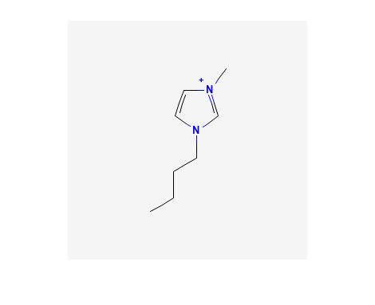
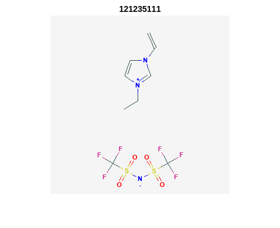
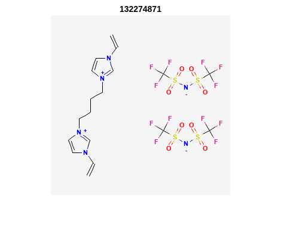

PubChem API in Matlab
%%%%%%%%%%%%%%%%%%%%%%%%%%%%%%%%%%

.. sectionauthor:: Vincent F. Scalfani <vfscalfani@ua.edu>

by Vincent Scalfani and Anastasia Ramig

These recipe examples were tested on November 23, 2022 using Matlab R2022b.

**PubChem API Documentation**: https://pubchemdocs.ncbi.nlm.nih.gov/programmatic-access

**Attribution:** This tutorial was adapted from supporting information in:

**Scalfani, V. F.**; Ralph, S. C. Alshaikh, A. A.; Bara, J. E. Programmatic Compilation of Chemical Data and Literature From PubChem Using Matlab. 
*Chemical Engineering Education*, **2020**, *54*, 230. https://doi.org/10.18260/2-1-370.660-115508 and https://github.com/vfscalfani/MATLAB-cheminformatics)

Setup
=====

Define the PubChem PUG-REST API base URL:

.. code-block:: matlab

   %% set API URL
   api = 'https://pubchem.ncbi.nlm.nih.gov/rest/pug/compound/';
 
   %% set MATLAB web options to a 30 second timeout
   options = weboptions('Timeout', 30);

1. PubChem Similarity
===========================

Get Compound Image
---------------------

We can search for a compound and display an image, for example: 1-Butyl-3-methyl-imidazolium; CID = 2734162.

.. code-block:: matlab

   %% Retrieve and display PNG Image of 1-Butyl-3-methyl-imidazolium; CID = 2734162
   CID_SS_query = '2734162';
 
   CID_url = [api 'cid/' CID_SS_query '/PNG'];
   [CID_img,map] = imread(CID_url);
   imshow(CID_img,map)

**Output:**

Replace the above CID value (CID_SS_query) with a different CID to customize.

Retrieve InChI and SMILES
----------------------------

.. code-block:: matlab

   %% Retrieve InChI
   inchi_url = [api 'cid/' CID_SS_query '/property/inchi/TXT'];
   inchi = webread(inchi_url, options);
   disp(inchi)

**Output:**

.. code-block:: matlab

   InChI=1S/C8H15N2/c1-3-4-5-10-7-6-9(2)8-10/h6-8H,3-5H2,1-2H3/q+1

.. code-block:: matlab

   %% Retrieve Isomeric SMILES
   IS_url = [api 'cid/' CID_SS_query '/property/IsomericSMILES/TXT'];
   IS = webread(IS_url, options);
   disp(IS)

**Output:**

.. code-block:: matlab

   CCCCN1C=C[N+](=C1)C

Perform a Similarity Search
-----------------------------

We can use the PubChem API to perform a Fingerprint Tanimoto Similarity Search (SS).

(2D Tanimoto threshold 95% to 1-Butyl-3-methyl-imidazolium; CID = 2734162)

.. code-block:: matlab

   %% Search for chemical structures by Similarity Search (SS), 
   %% (2D Tanimoto threshold 95% to 1-Butyl-3-methyl-imidazolium; CID = 2734162)
   api = 'https://pubchem.ncbi.nlm.nih.gov/rest/pug/compound/';
   SS_url = [api 'fastsimilarity_2d/cid/' CID_SS_query '/cids/JSON?Threshold=95'];
   request = webread(SS_url,options);
   SS_CIDs = num2cell(request.IdentifierList.CID);
   disp(SS_CIDs(1:10)) %% display first 10

**Output:**

.. code-block:: matlab

   {[ 2734161]}
   {[   61347]}
   {[  529334]}
   {[  304622]}
   {[  118785]}
   {[12971008]}
   {[11448496]}
   {[11424151]}
   {[11171745]}
   {[11160028]}

In the above request value, you can adjust to the desired Tanimoto threshold (i.e., 97, 90, etc.). 
The CID limit of 25 was added as an initial testing safety for time consideration. This limit can be increased.

.. code-block:: matlab

   number_SS_CIDs = length(SS_CIDs)

**Output:**

.. code-block:: matlab

   number_SS_CIDs = 284

.. code-block:: matlab

   %% set a CID limit to 25 max
   if number_SS_CIDs > 25
       SS_CIDs = SS_CIDs(1:25);
   else
       disp('Number of SS_CIDs not changed')    
   end

Retrieve Identifier and Property Data
-------------------------------------------

Get the following data for the retrieved CIDs (SS_CIDs): InChI, Isomeric SMILES, MW, Heavy Atom Count, Rotable Bond Count, and Charge.

.. code-block:: matlab

   %% Create an identifier/property dataset from Similarity Search results
   %% Retrieve the following data from CID hit results:
   %% InChI, Isomeric SMILES, MW, Heavy Atom Count, Rotable Bond Count, and
   %% Charge
   %% setup a for loop that processes each CID one-by-one
   for r = 1:length(SS_CIDs)
       CID = SS_CIDs{r};
       
       %% define api calls
       api = 'https://pubchem.ncbi.nlm.nih.gov/rest/pug/compound/';
       CID_InChI_url = [api 'cid/' num2str(CID) '/property/InChI/TXT'];
       CID_IsoSMI_url = [api 'cid/' num2str(CID) '/property/IsomericSMILES/TXT'];
       CID_MW_url = [api 'cid/' num2str(CID) '/property/MolecularWeight/TXT'];  
       CID_HeavyAtomCount_url = [api 'cid/' num2str(CID) '/property/HeavyAtomCount/TXT'];
       CID_RotatableBondCount_url = [api 'cid/' num2str(CID) '/property/RotatableBondCount/TXT'];
       CID_Charge_url = [api 'cid/' num2str(CID) '/property/Charge/TXT'];
       %% CID_TPSA_url = [api 'cid/' num2str(CID) '/property/TPSA/TXT'];
       %% retrieve identifer and property data
       try
           CID_InChI = webread(CID_InChI_url,options);      
       catch ME
           CID_InChI = 'not found'
       end
           % be polite to PubChem server
           n = 0.5;
           pause(n)
     
       try
           CID_IsoSMI = webread(CID_IsoSMI_url,options);     
       catch ME  
           CID_IsoSMI = 'not found'
       end
           n = 0.5;
           pause(n)
    
       try
           CID_MW = webread(CID_MW_url,options);
       catch ME
           CID_MW = 'not found'
       end    
           n = 0.5;
           pause(n)
               
       try
           CID_HeavyAtomCount = webread(CID_HeavyAtomCount_url,options);
       catch ME
           CID_HeavyAtomCount = 'not found'
       end
           n = 0.5;
           pause(n)
        
       try
           CID_RotatableBondCount = webread(CID_RotatableBondCount_url,options);
       catch ME
           CID_RotatableBondCount = 'not found'
       end
           n = 0.5;
           pause(n)
       
       try
           CID_Charge = webread(CID_Charge_url,options);
       catch ME
           CID_Charge = 'not found'
       end
           n = 0.5;
           pause(n)
           
         %% add property data to SS_CIDs data array
      
         %% column numbers indicate where the data will be stored.
         %% For example, the MW will be placed in column 4. r increases
         %% by 1 on each iteration, so the first CID_MW value gets stored in
         %% {1,4}, the second in {2,4}, the third in {3,4}, etc.
           SS_CIDs{r,2} = CID_InChI;
           SS_CIDs{r,3} = CID_IsoSMI;
           SS_CIDs{r,4} = CID_MW;
           SS_CIDs{r,5} = CID_HeavyAtomCount;
           SS_CIDs{r,6} = CID_RotatableBondCount;
           SS_CIDs{r,7} = CID_Charge;
        
           %% to add more data, simply index into the next column
           %% SS_CIDs{r,8} = CID_TPSA;
                                       
   end

Compile Data into a Table
-----------------------------

We can display the data as a table:

.. code-block:: matlab

   %% convert cell array to string and remove leading and trailing white space
   SS_CIDs_string = strtrim(string(SS_CIDs));
   %% convert to table
   SSq_table = array2table(SS_CIDs_string, 'VariableNames',{'CID', 'InChI','IsoSMI','MW',...
       'HeavyAtomCount','RotatableBondCount','Charge'});
   %% rearrange table
   SSq_table2 = SSq_table(:, {'IsoSMI' 'CID' 'InChI' 'MW' 'HeavyAtomCount' 'RotatableBondCount' 'Charge'});
   disp(SSq_table2(1:10,:)) %% display first 10

**Output:**

.. code-block:: matlab

                  IsoSMI                      CID                                               InChI                                               MW       HeavyAtomCount    RotatableBondCount    Charge
    ___________________________________    __________    ____________________________________________________________________________________    ________    ______________    __________________    ______

    "CCCCN1C=C[N+](=C1)C.[Cl-]"            "2734161"     "InChI=1S/C8H15N2.ClH/c1-3-4-5-10-7-6-9(2)8-10;/h6-8H,3-5H2,1-2H3;1H/q+1;/p-1"          "174.67"         "11"                "3"             "0"  
    "CCCCN1C=CN=C1"                        "61347"       "InChI=1S/C7H12N2/c1-2-3-5-9-6-4-8-7-9/h4,6-7H,2-3,5H2,1H3"                             "124.18"         "9"                 "3"             "0"  
    "CCCCCN1C=CN=C1"                       "529334"      "InChI=1S/C8H14N2/c1-2-3-4-6-10-7-5-9-8-10/h5,7-8H,2-4,6H2,1H3"                         "138.21"         "10"                "4"             "0"  
    "CCCCN1C=CN=C1C"                       "304622"      "InChI=1S/C8H14N2/c1-3-4-6-10-7-5-9-8(10)2/h5,7H,3-4,6H2,1-2H3"                         "138.21"         "10"                "3"             "0"  
    "CCCN1C=CN=C1"                         "118785"      "InChI=1S/C6H10N2/c1-2-4-8-5-3-7-6-8/h3,5-6H,2,4H2,1H3"                                 "110.16"         "8"                 "2"             "0"  
    "CCCN1C=C[N+](=C1)C.[I-]"              "12971008"    "InChI=1S/C7H13N2.HI/c1-3-4-9-6-5-8(2)7-9;/h5-7H,3-4H2,1-2H3;1H/q+1;/p-1"               "252.10"         "10"                "2"             "0"  
    "CCCCN1C=C[N+](=C1)C.[I-]"             "11448496"    "InChI=1S/C8H15N2.HI/c1-3-4-5-10-7-6-9(2)8-10;/h6-8H,3-5H2,1-2H3;1H/q+1;/p-1"           "266.12"         "11"                "3"             "0"  
    "CCCCN1C=C[N+](=C1)C.C(#N)[S-]"        "11424151"    "InChI=1S/C8H15N2.CHNS/c1-3-4-5-10-7-6-9(2)8-10;2-1-3/h6-8H,3-5H2,1-2H3;3H/q+1;/p-1"    "197.30"         "13"                "3"             "0"  
    "CCCCN1C=C[N+](=C1)C.C(=[N-])=NC#N"    "11171745"    "InChI=1S/C8H15N2.C2N3/c1-3-4-5-10-7-6-9(2)8-10;3-1-5-2-4/h6-8H,3-5H2,1-2H3;/q+1;-1"    "205.26"         "15"                "3"             "0"  
    "CCCN1C=C[N+](=C1)C.[Br-]"             "11160028"    "InChI=1S/C7H13N2.BrH/c1-3-4-9-6-5-8(2)7-9;/h5-7H,3-4H2,1-2H3;1H/q+1;/p-1"              "205.10"         "10"                "2"             "0

Retrieve Images of CID Compounds from Similarity Search
------------------------------------------------------------

.. code-block:: matlab

   %% loop through hit CIDs and show images
   for r = 1:length(SS_CIDs(1:3)) %% demo for first 3
       CID = SS_CIDs{r};
       api = 'https://pubchem.ncbi.nlm.nih.gov/rest/pug/compound/';
       CID_url = [api 'cid/' num2str(CID) '/PNG'];
    
       try
           %% retrieve CID PNG image and display
           [CID_img,map] = imread(CID_url);
           figure;
           imshow(CID_img,map)
           drawnow;
           title(num2str(CID));
        
           %% be polite to PubChem server
           n = 0.5;
           pause(n);
        
       catch
           disp('CID image not found')
           disp('Execution will continue')
       end
    
   end

**Output:**

.. image:: imgs/matlab_pc_im1.png

.. image:: imgs/matlab_pc_im2.png

.. image:: imgs/matlab_pc_im3.png

2. PubChem SMARTS Search
============================

Search for chemical structures from a SMARTS substructure query.

Define SMARTS Query
---------------------

View pattern syntax at: https://smartsview.zbh.uni-hamburg.de/. Note: These are vinyl imidazolium substructure searches.

.. code-block:: matlab

   SMARTSq = {'[CR0H2][n+]1[cH1][cH1]n([CR0H1]=[CR0H2])[cH1]1',...
       '[CR0H2][n+]1[cH1][cH1]n([CR0H2][CR0H1]=[CR0H2])[cH1]1',...
       '[CR0H2][n+]1[cH1][cH1]n([CR0H2][CR0H2][CR0H1]=[CR0H2])[cH1]1'};

Add your own SMARTS queries to customize. You can add as many as desired within a list.

Perform a SMARTS query search
-------------------------------

.. code-block:: matlab

   % generate URLs for SMARTS query searches
   for h = 1:length(SMARTSq)
       SMARTSq_url{h} = [api 'fastsubstructure/smarts/' char(SMARTSq(h)) '/cids/JSON'];
   end
   % perform substructure searches for each query link in SMARTSq_url
   for i = 1:length(SMARTSq_url)
    
       try
          hit_CIDs{i} = webread(char(SMARTSq_url(i)),options);
        
        % be nice to PubChem Server, add a 1 second pause
          n = 1;
          pause(n)
        
       catch ME
           disp('not found')
       end
    
   end
   % Transfer JSON data to a cell array with all CIDs
   % may need to adjust concatenation below depending on # of SMARTS queries
   hit_CIDsALL = [hit_CIDs{1,1}.IdentifierList.CID; hit_CIDs{1,2}.IdentifierList.CID;...
       hit_CIDs{1,3}.IdentifierList.CID];
   hit_CIDsALL = num2cell(hit_CIDsALL);
   disp(hit_CIDsALL(1:10)) %% show first 10

**Output:**

.. code-block:: matlab

    {[121235111]}
    {[132274871]}
    {[ 86657882]}
    {[ 46178576]}
    {[139254006]}
    {[129853306]}
    {[129853221]}
    {[129850195]}
    {[ 87560886]}
    {[ 87559770]}

.. code-block:: matlab

   number_hit_CIDsALL = length(hit_CIDsALL)

**Output:**

.. code-block:: matlab

   number_hit_CIDsALL = 845

.. code-block:: matlab

   %% set a CID limit to 25 max
   if number_hit_CIDsALL > 25
       hit_CIDsALL = hit_CIDsALL(1:25);
   else
       disp('Number of CIDs not changed')    
   end

Retrieve Identifier and Property Data
--------------------------------------------

.. code-block:: matlab

   %% Create an identifier/property dataset from the SMARTS substructure search results
   %% Retrieve the following data for each CID:
   %% InChI, Canonical SMILES, MW, IUPAC Name, Heavy Atom Count, Covalent Unit Count, Charge
   %% setup a for loop that processes each CID one-by-one
   for r = 1:length(hit_CIDsALL)
       CID = hit_CIDsALL{r};
    
       %% define api calls
       api = 'https://pubchem.ncbi.nlm.nih.gov/rest/pug/compound/';
       CID_InChI_url = [api 'cid/' num2str(CID) '/property/InChI/TXT'];
       CID_CanSMI_url = [api 'cid/' num2str(CID) '/property/CanonicalSMILES/TXT'];
       CID_MW_url = [api 'cid/' num2str(CID) '/property/MolecularWeight/TXT'];  
       CID_IUPACName_url = [api 'cid/' num2str(CID) '/property/IUPACName/TXT'];
       CID_HeavyAtomCount_url = [api 'cid/' num2str(CID) '/property/HeavyAtomCount/TXT'];
       CID_CovalentUnitCount_url = [api 'cid/' num2str(CID) '/property/CovalentUnitCount/TXT'];
       CID_Charge_url = [api 'cid/' num2str(CID) '/property/Charge/TXT'];
 
       %% CID_TPSA_url = [api 'cid/' num2str(CID) '/property/TPSA/TXT'];
       %% retrieve identifer and property data
       try
           CID_InChI = webread(CID_InChI_url,options);      
       catch ME
           CID_InChI = 'not found'
       end
           %% be polite to PubChem server
           n = 0.5;
           pause(n)
     
       try
           CID_CanSMI = webread(CID_CanSMI_url,options);     
       catch ME  
           CID_CanSMI = 'not found'
       end
           n = 0.5;
           pause(n)
    
       try
           CID_MW = webread(CID_MW_url,options);
       catch ME
           CID_MW = 'not found'
       end    
           n = 0.5;
           pause(n)
            
       try
           CID_IUPACName = webread(CID_IUPACName_url,options);
       catch ME
           CID_IUPACName = 'not found'
       end
           n = 0.5;
           pause(n)
        
       try
           CID_HeavyAtomCount = webread(CID_HeavyAtomCount_url,options);
       catch ME
           CID_HeavyAtomCount = 'not found'
       end
           n = 0.5;
           pause(n)
        
       try
           CID_CovalentUnitCount = webread(CID_CovalentUnitCount_url,options);
       catch ME
           CID_CovalentUnitCount = 'not found'
       end
           n = 0.5;
           pause(n)
        
       try
           CID_Charge = webread(CID_Charge_url,options);
       catch ME
           CID_Charge = 'not found'
       end
           n = 0.5;
           pause(n)  
        
         %% add property data to hit_CIDsALL data array
         %% column numbers indicate where the data will be stored.
         %% For example, the MW will be placed in column 4. r increases
         %% by 1 on each iteration, so the first CID_MW value gets stored in
         %% {1,4}, the second in {2,4}, the third in {3,4}, etc.
      
           hit_CIDsALL{r,2} = CID_InChI;
           hit_CIDsALL{r,3} = CID_CanSMI;
           hit_CIDsALL{r,4} = CID_MW;
           hit_CIDsALL{r,5} = CID_IUPACName;
           hit_CIDsALL{r,6} = CID_HeavyAtomCount;
           hit_CIDsALL{r,7} = CID_CovalentUnitCount;
           hit_CIDsALL{r,8} = CID_Charge;        
        
          %% to add more data, simply index into the next column
          %% hit_CIDsALL{r,9} = CID_TPSA;
                                       
   end

Compile Data into a Table
------------------------------

.. code-block:: matlab

   %% convert cell array to string and remove leading and trailing white space
   hit_CIDsALLstring = strtrim(string(hit_CIDsALL));
 
   %% convert to table
   SMARTSq_table = array2table(hit_CIDsALLstring, 'VariableNames',{'CID', 'InChI','CanSMI','MW',...
       'IUPACName','HeavyAtomCount','CovalentUnitCount', 'Charge'});
   %% rearrange table
   SMARTSq_table2 = SMARTSq_table(:, {'CanSMI' 'IUPACName' 'CID' 'InChI' 'MW',...
        'HeavyAtomCount' 'CovalentUnitCount' 'Charge'});
   disp(SMARTSq_table2(1:10,:))

**Output:**

.. code-block:: matlab

                                                              CanSMI                                                                                                             IUPACName                                                       CID                                                                                      InChI                                                                                      MW       HeavyAtomCount    CovalentUnitCount    Charge
    __________________________________________________________________________________________________________________________    _______________________________________________________________________________________________________    ___________    __________________________________________________________________________________________________________________________________________________________________    ________    ______________    _________________    ______

    "CC[N+]1=CN(C=C1)C=C.C(F)(F)(F)S(=O)(=O)[N-]S(=O)(=O)C(F)(F)F"                                                                "bis(trifluoromethylsulfonyl)azanide;1-ethenyl-3-ethylimidazol-3-ium"                                      "121235111"    "InChI=1S/C7H11N2.C2F6NO4S2/c1-3-8-5-6-9(4-2)7-8;3-1(4,5)14(10,11)9-15(12,13)2(6,7)8/h3,5-7H,1,4H2,2H3;/q+1;-1"                                                       "403.3"          "24"                "2"            "0"  
    "C=CN1C=C[N+](=C1)CCCC[N+]2=CN(C=C2)C=C.C(F)(F)(F)S(=O)(=O)[N-]S(=O)(=O)C(F)(F)F.C(F)(F)(F)S(=O)(=O)[N-]S(=O)(=O)C(F)(F)F"    "bis(trifluoromethylsulfonyl)azanide;1-ethenyl-3-[4-(3-ethenylimidazol-1-ium-1-yl)butyl]imidazol-3-ium"    "132274871"    "InChI=1S/C14H20N4.2C2F6NO4S2/c1-3-15-9-11-17(13-15)7-5-6-8-18-12-10-16(4-2)14-18;2*3-1(4,5)14(10,11)9-15(12,13)2(6,7)8/h3-4,9-14H,1-2,5-8H2;;/q+2;2*-1"              "804.6"          "48"                "3"            "0"  
    "CCCCCCCC[N+]1=CN(C=C1)C=C.[Br-]"                                                                                             "1-ethenyl-3-octylimidazol-3-ium;bromide"                                                                  "86657882"     "InChI=1S/C13H23N2.BrH/c1-3-5-6-7-8-9-10-15-12-11-14(4-2)13-15;/h4,11-13H,2-3,5-10H2,1H3;1H/q+1;/p-1"                                                                 "287.24"         "16"                "2"            "0"  
    "CCCCCCCCCCCCCCCC[N+]1=CN(C=C1)C=C.[Br-]"                                                                                     "1-ethenyl-3-hexadecylimidazol-3-ium;bromide"                                                              "46178576"     "InChI=1S/C21H39N2.BrH/c1-3-5-6-7-8-9-10-11-12-13-14-15-16-17-18-23-20-19-22(4-2)21-23;/h4,19-21H,2-3,5-18H2,1H3;1H/q+1;/p-1"                                         "399.5"          "24"                "2"            "0"  
    "CCCC[N+]1=CN(C=C1)C=C.[I-]"                                                                                                  "1-butyl-3-ethenylimidazol-1-ium;iodide"                                                                   "139254006"    "InChI=1S/C9H15N2.HI/c1-3-5-6-11-8-7-10(4-2)9-11;/h4,7-9H,2-3,5-6H2,1H3;1H/q+1;/p-1"                                                                                  "278.13"         "12"                "2"            "0"  
    "CCCCCCCC[N+]1=CN(C=C1)C=C.C(F)(F)(F)S(=O)(=O)[N-]S(=O)(=O)C(F)(F)F"                                                          "bis(trifluoromethylsulfonyl)azanide;1-ethenyl-3-octylimidazol-3-ium"                                      "129853306"    "InChI=1S/C13H23N2.C2F6NO4S2/c1-3-5-6-7-8-9-10-15-12-11-14(4-2)13-15;3-1(4,5)14(10,11)9-15(12,13)2(6,7)8/h4,11-13H,2-3,5-10H2,1H3;/q+1;-1"                            "487.5"          "30"                "2"            "0"  
    "CCCCCC[N+]1=CN(C=C1)C=C.C(F)(F)(F)S(=O)(=O)[N-]S(=O)(=O)C(F)(F)F"                                                            "bis(trifluoromethylsulfonyl)azanide;1-ethenyl-3-hexylimidazol-3-ium"                                      "129853221"    "InChI=1S/C11H19N2.C2F6NO4S2/c1-3-5-6-7-8-13-10-9-12(4-2)11-13;3-1(4,5)14(10,11)9-15(12,13)2(6,7)8/h4,9-11H,2-3,5-8H2,1H3;/q+1;-1"                                    "459.4"          "28"                "2"            "0"  
    "CCCCCCCCCCCCCCCC[N+]1=CN(C=C1)C=C.C(F)(F)(F)S(=O)(=O)[N-]S(=O)(=O)C(F)(F)F"                                                  "bis(trifluoromethylsulfonyl)azanide;1-ethenyl-3-hexadecylimidazol-3-ium"                                  "129850195"    "InChI=1S/C21H39N2.C2F6NO4S2/c1-3-5-6-7-8-9-10-11-12-13-14-15-16-17-18-23-20-19-22(4-2)21-23;3-1(4,5)14(10,11)9-15(12,13)2(6,7)8/h4,19-21H,2-3,5-18H2,1H3;/q+1;-1"    "599.7"          "38"                "2"            "0"  
    "CCCC[N+]1=CN(C=C1)C=C.[Br-]"                                                                                                 "1-butyl-3-ethenylimidazol-1-ium;bromide"                                                                  "87560886"     "InChI=1S/C9H15N2.BrH/c1-3-5-6-11-8-7-10(4-2)9-11;/h4,7-9H,2-3,5-6H2,1H3;1H/q+1;/p-1"                                                                                 "231.13"         "12"                "2"            "0"  
    "CCCC[N+]1=CN(C=C1)C=C.[Cl-]"                                                                                                 "1-butyl-3-ethenylimidazol-1-ium;chloride"                                                                 "87559770"     "InChI=1S/C9H15N2.ClH/c1-3-5-6-11-8-7-10(4-2)9-11;/h4,7-9H,2-3,5-6H2,1H3;1H/q+1;/p-1"                                                                                 "186.68"         "12"                "2"            "0"

Retrieve Images of CID Compounds from SMARTS Search
------------------------------------------------------

.. code-block:: matlab

   %% loop through CIDs and show images
   for r = 1:length(hit_CIDsALL(1:3)) %% demo for furst 3
       CID = hit_CIDsALL{r};
       api = 'https://pubchem.ncbi.nlm.nih.gov/rest/pug/compound/';
       CID_url = [api 'cid/' num2str(CID) '/PNG'];
    
       try
           %% retrieve CID PNG image and display
           [CID_img,map] = imread(CID_url);
           figure;
           imshow(CID_img,map)
           drawnow;
           title(num2str(CID));
        
           %% be polite to PubChem server
           n = 0.5;
           pause(n);
        
       catch
           disp('CID image not found')
           disp('Execution will continue')
       end
    
   end

**Output:**

.. image:: imgs/matlab_pc_im6.png

