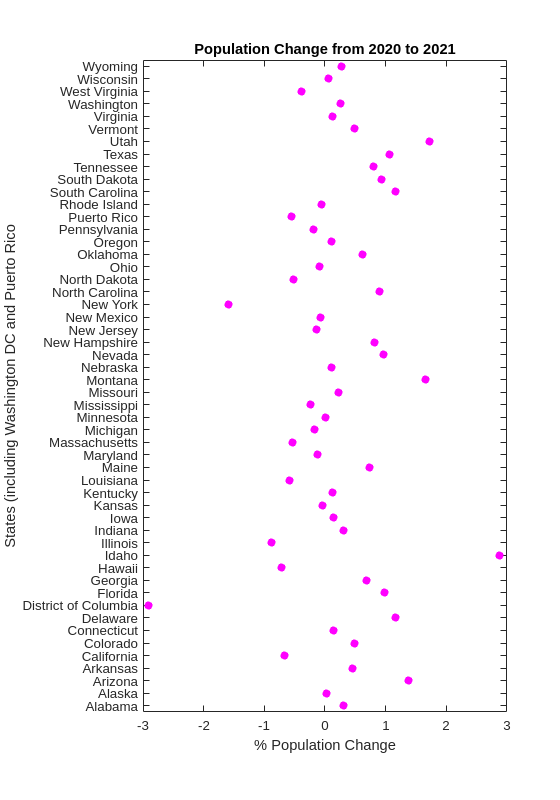

<!--- sectionauthor
Vincent F. Scalfani | vfscalfani@ua.edu>
-->

# ...in Matlab

## U.S. Census Data API in Matlab

by Anastasia Ramig

**U.S. Census API documentation:**
<https://www.census.gov/data/developers/about.html>

**U.S. Census Data Discovery Tool:** <https://api.census.gov/data.html>

These recipe examples were tested on December 12, 2022 in MATLAB R2022b.

See also the U.S. [Census API Terms of
Service](https://www.census.gov/data/developers/about/terms-of-service.html)

**Attribution:** This tutorial uses the Census Bureau Data API but is
not endorsed or certified by the Census Bureau.

### API Key Information

While an API key is not required to use the U.S. Census Data API, you
may consider registering for an API key as the API is limited to 500
calls a day without a key. Sign up can be found here:
<https://api.census.gov/data/key_signup.html>

If you want to add in your API Key, save the API key to a text file
named \"apiKey\" and import it using the following code:

``` matlab
%%key = importdata("apiKey.txt");
```

This tutorial does not use an API key:

``` matlab
key = "";
```

### 1. Get population estimates of countries by state

Note: includes Washington, D.C. and Puerto Rico

``` matlab
%% define root Census API
api = "https://api.census.gov/data/";

%% define api url for the state ids
%% we will use the population estimates from the 2019 dataset
%% https://api.census.gov/data/2019/pep/population/examples.html
stateIds = api + "2019/pep/population?get=NAME&for=state:*" + key;

%% read the url to get the data and find the length
stateIds = webread(stateIds);

length(stateIds)
```

**Output:**

``` matlab
ans = 53
```

``` matlab
%% preallocate arrays for states and their id number
stateList = {ones(length(stateIds), 1)};
numberList = {ones(length(stateIds), 1)};

%% create a list of each state and its id
for i = 1:length(stateIds)
    stateList{i, 1} = stateIds{i, 1}{1, 1};
   numberList{i, 1} = stateIds{i, 1}{2, 1};
end
stateIdsArray = horzcat(stateList, numberList);
stateIdsArray(1, :) = []
```

**Output:**

``` matlab
stateIdsArray = 52x2 cell
'Alabama'             '01'        
'Alaska'              '02'        
'Arizona'             '04'        
'Arkansas'            '05'        
'California'          '06'        
'Colorado'            '08'        
'Delaware'            '10'        
'District of Columbia''11'        
'Connecticut'         '09'        
'Florida'             '12'
.
.
.
```

``` matlab
%% find a list of counties and their populations for each state and put it into a structure
state = struct;
for k = 1:length(stateIdsArray)
    stateName = strrep(stateIdsArray{k, 1}, " ", "");
   stateNumber = stateIdsArray{k, 2};
   stateData{k} = webread(api + "2019/pep/population?get=NAME,POP&for=county:*&in=state:" + stateNumber + key);
   pause(1)

   countiesList = {ones(length(stateData{1, k}), 1)};
   popList = {ones(length(stateData{1, k}), 1)};
    for i = 1:length(stateData{1, k})
       countiesList{i, 1} = stateData{1, k}{i, 1}{1, 1};
       popList{i, 1} = stateData{1, k}{i, 1}{2, 1};
    end
   stateArray = horzcat(countiesList, popList);
   state.(stateName) = stateArray;
end
state.Alabama
```

**Output:**

``` matlab
ans = 68x2 cell
'NAME'                      'POP'       
'St. Clair County, Alabama' '89512'     
'Cullman County, Alabama'   '83768'     
'Houston County, Alabama'   '105882'    
'Tuscaloosa County, Alabama''209355'    
'Coffee County, Alabama'    '52342'     
'Chilton County, Alabama'   '44428'     
'Coosa County, Alabama'     '10663'     
'Etowah County, Alabama'    '102268'    
'Lamar County, Alabama'     '13805' 
```

### 2. Get population estimates over a range of years

We can use similar code as before, but now loop through different
population estimate datasets by year. Here are the specific APIs used:

Vintage 2015 Population Estimates:
<https://api.census.gov/data/2015/pep/population/examples.html>

Vintage 2016 Population Estimates:
<https://api.census.gov/data/2016/pep/population/examples.html>

Vintage 2017 Population Estimates:
<https://api.census.gov/data/2017/pep/population/examples.html>

``` matlab
%% create a structure of county and population data from 2015-2017
stateYears = struct;
for k = 1:length(stateData)
   for y = 2015:2017
      stateName = strrep(stateIdsArray{k, 1}, " ", "");
      stateNumber = stateIdsArray{k, 2};
      stateData{k} = webread(api + string(y) + "/pep/population?get=GEONAME,POP&for=county:*&in=state:" + stateNumber + key);
      pause(1)

      stateArray = {ones(length(stateData{1, k}), 1)};
      for i = 1:length(stateData{1, k})
            stateArray{i, 1} = stateData{1, k}{i, 1}{1, 1};
            stateArray{i, 2} = stateData{1, k}{i, 1}{2, 1};
      end
      year = "y" + string(y);
      stateYears.(stateName).(year) = stateArray;
   end
end
stateYears.Alabama.y2015
```

**Output:**

``` matlab
ans = 68×2 cell
'GEONAME'                                                           'POP'       
'Baldwin County, Alabama, East South Central, South, United States' '203709'    
'Barbour County, Alabama, East South Central, South, United States' '26489'     
'Bibb County, Alabama, East South Central, South, United States'    '22583'     
'Blount County, Alabama, East South Central, South, United States'  '57673'     
'Bullock County, Alabama, East South Central, South, United States' '10696'     
'Butler County, Alabama, East South Central, South, United States'  '20154'     
'Calhoun County, Alabama, East South Central, South, United States' '115620'    
'Chambers County, Alabama, East South Central, South, United States''34123'     
'Cherokee County, Alabama, East South Central, South, United States''25859'
.
.
.
```

``` matlab
stateYears.Alabama.y2016
```

**Output:**

``` matlab
'GEONAME'                 'POP'       
'Baldwin County, Alabama' '208563'    
'Barbour County, Alabama' '25965'     
'Bibb County, Alabama'    '22643'     
'Blount County, Alabama'  '57704'     
'Bullock County, Alabama' '10362'     
'Butler County, Alabama'  '19998'     
'Calhoun County, Alabama' '114611'    
'Chambers County, Alabama''33843'     
'Cherokee County, Alabama''25725'
.
.
.
```

``` matlab
stateYears.Alabama.y2017

'GEONAME'                  'POP'       
'Conecuh County, Alabama'  '12469'     
'Coosa County, Alabama'    '10754'     
'Covington County, Alabama''37092'     
'Crenshaw County, Alabama' '13871'     
'Cullman County, Alabama'  '82755'     
'Dale County, Alabama'     '49226'     
'Dallas County, Alabama'   '39215'     
'Autauga County, Alabama'  '55504'     
'Baldwin County, Alabama'  '212628'
.
.
.   
```

### 3. Plot Population Change

This data is based off the 2021 Population Estimates dataset:

<https://api.census.gov/data/2021/pep/population/variables.html>

The percentage change in population is from July 1, 2020 to July 1, 2021
for states (includes Washington, D.C. and Puerto Rico)

``` matlab
%% find the percentage population change for each state between 2020 and 2021
request = webread(api + "2021/pep/population?get=NAME,POP_2021,PPOPCHG_2021&for=state:*" + key);
request;
for i = 1:length(request)
   for k = 1:length(request{1, 1})
      popChange{i, k} = request{i, 1}{k, 1};
   end
end
popChange(1, :) = []
```

**Output:**

``` matlab
popChange = 52x4 cell
'Oklahoma'            '3986639'   '0.6210955947' '40'        
'Nebraska'            '1963692'   '0.1140479899' '31'        
'Hawaii'              '1441553'   '-0.7134046100''15'        
'South Dakota'        '895376'    '0.9330412953' '46'        
'Tennessee'           '6975218'   '0.7962146316' '47'        
'Nevada'              '3143991'   '0.9608001873' '32'        
'New Mexico'          '2115877'   '-0.0797613860''35'        
'Iowa'                '3193079'   '0.1383022195' '19'        
'Kansas'              '2934582'   '-0.0442116160''20'        
'District of Columbia''670050'    '-2.9043911470''11'
.
.
.    
```

``` matlab
%% create two datasets and make a scatter plot of the population change for each state
clear x
clear y
for i = 1:length(popChange)
   x{i, 1} = str2num(popChange{i, 3});
   y{i, 1} = popChange{i, 1};
end
f = figure;
plot(cell2mat(x), categorical(y), 'o','MarkerFaceColor','magenta','MarkerEdgeColor','none');
title("Population Change from 2020 to 2021");
xlabel("% Population Change");
ylabel("States (including Washington DC and Puerto Rico");
f.Position = [680, 558, 560, 800];
```

**Output:**


