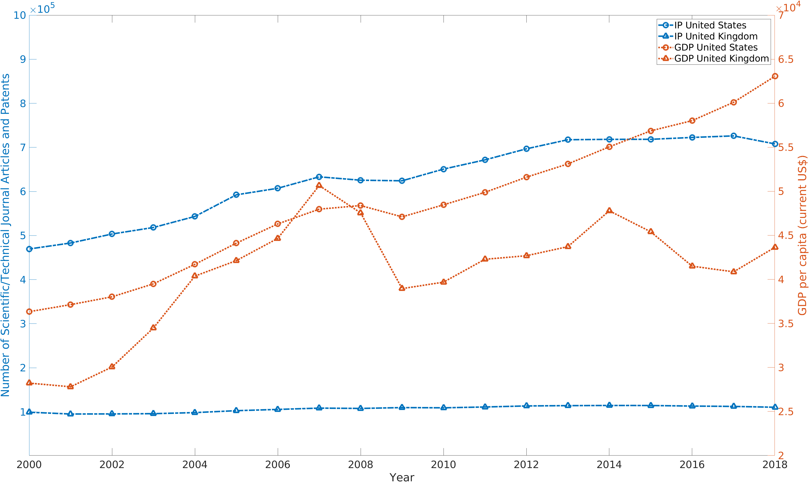

World Bank API in Matlab
%%%%%%%%%%%%%%%%%%%%%%%%%%%%%%%%%%

.. sectionauthor:: Vincent F. Scalfani <vfscalfani@ua.edu>

by Vincent F. Scalfani

See the `World Bank API documentation`_

.. _World Bank API documentation: https://datahelpdesk.worldbank.org/knowledgebase/articles/889392-about-the-indicators-api-documentation

These recipe examples were tested on February 12, 2022

1. Get list of country iso2Codes and names
==============================================

For obtaining data from the World Bank API, it is helpful to first obtain a list of country codes and names.

.. code-block:: matlab

   % define root WorldBank API
   api = 'https://api.worldbank.org/v2/';

   % define api url for getting couuntry code data
   country_url = [api 'country/?format=json&per_page=500'];

   % read the url and import data to Matlab as JSON data
   country_data = webread(country_url);

   % Extract out iso2code from countries data
   country_iso2Code = extractfield(country_data{2,1}, 'iso2Code');

   % Transform data
   country_iso2Code = country_iso2Code';

   % length of data
   length(country_iso2Code)
      ans = 299
 
.. code-block:: matlab

   % display first 10
   disp(country_iso2Code(1:10,:))
      {'AW'}
      {'ZH'}
      {'AF'}
      {'A9'}
      {'ZI'}
      {'AO'}
      {'AL'}
      {'AD'}
      {'1A'}
      {'AE'}

.. code-block:: matlab

   % Extract out country names
   country_name = extractfield(country_data{2,1}, 'name');

   % Transform data
   country_name = country_name';

   % length of data
   length(country_name)
      ans = 299

.. code-block:: matlab

   % display first 10
   disp(country_name(1:10,:))
       {'Aruba'                      }
       {'Africa Eastern and Southern'}
       {'Afghanistan'                }
       {'Africa'                     }
       {'Africa Western and Central' }
       {'Angola'                     }
       {'Albania'                    }
       {'Andorra'                    }
       {'Arab World'                 }
       {'United Arab Emirates'       }

.. code-block:: matlab

   % now combine country_iso2Code and country name
   country_iso2code_name = [country_iso2Code country_name];
   disp(country_iso2code_name(1:10,:))
       {'AW'}    {'Aruba'                      }
       {'ZH'}    {'Africa Eastern and Southern'}
       {'AF'}    {'Afghanistan'                }
       {'A9'}    {'Africa'                     }
       {'ZI'}    {'Africa Western and Central' }
       {'AO'}    {'Angola'                     }
       {'AL'}    {'Albania'                    }
       {'AD'}    {'Andorra'                    }
       {'1A'}    {'Arab World'                 }
       {'AE'}    {'United Arab Emirates'       }

Now we know the country iso2Codes which we can use to pull specific indicator data for countries.

2. Compile a Custom Indicator Dataset
=========================================

There are many availabe indicators: https://data.worldbank.org/indicator

We wll select three indicators for this example:

1. Scientific and Technical Journal Article Data = `IP.JRN.ARTC.SC`_
2. Patent Applications, residents = `IP.PAT.RESD`_
3. GDP per capita (current US$) Code = `NY.GDP.PCAP.CD`_

Note that these three selected indictaors have a `CC-BY 4.0 license`_
We will compile this indicator data for the United States (US) and United Kingdom (GB) 

.. _IP.JRN.ARTC.SC: https://data.worldbank.org/indicator/IP.JRN.ARTC.SC?view=chart
.. _IP.PAT.RESD: https://data.worldbank.org/indicator/IP.PAT.RESD?view=chart
.. _NY.GDP.PCAP.CD: https://data.worldbank.org/indicator/NY.GDP.PCAP.CD?view=chart
.. _CC-BY 4.0 license: https://datacatalog.worldbank.org/public-licenses#cc-by

.. code-block:: matlab

   % define indicators
   indicators = {'IP.JRN.ARTC.SC','IP.PAT.RESD','NY.GDP.PCAP.CD'};

   % generate the web API urls we need for U.S.
   for j = 1:length(indicators)    
       US_api_URL{j} = [api 'country/US/indicator/' indicators{j} '/?format=json&per_page=500'];      
   end

   % retrieve data
   for i = 1:length(US_api_URL)    
       try
           US_indicator_data{i} = webread(char(US_api_URL(i)));
        
           % be kind to World Bank Servers, add a 1 second pause
           n = 1;
           pause(n)        
       catch ME
           disp('not found')
       end      
   end

   % generate web API urls we need for the UK (GB)
   for j = 1:length(indicators)   
       UK_api_URL{j} = [api 'country/GB/indicator/' indicators{j} '/?format=json&per_page=500'];      
   end

   % retrieve data

   for i = 1:length(UK_api_URL)   
       try
           UK_indicator_data{i} = webread(char(UK_api_URL(i)));
        
           % be kind to World Bank Servers, add a 1 second pause
           n = 1;
           pause(n)        
       catch ME
           disp('not found')
       end
      
   end

   % Extract the data and compile
   % N.B. we can not use the Matlab extractfield function here because of the non empty cells

   % US Data compilation
   for k = 1:length(US_indicator_data{1,1}{2,1})
    
       % Scientific and Technical Journal Article Data Indicator Code = IP.JRN.ARTC.SC
       US_IPja_date{k} = US_indicator_data{1,1}{2,1}(k).date;
       US_IPja_value{k} = US_indicator_data{1,1}{2,1}(k).value;
    
       % Patent Applications, residents = IP.PAT.RESD
       US_IPpat_date{k} = US_indicator_data{1,2}{2,1}(k).date;
       US_IPpat_value{k} = US_indicator_data{1,2}{2,1}(k).value;
    
       % GDP per capita (current US$) Code = NY.GDP.PCAP.CD
       US_NYGDP_date{k} = US_indicator_data{1,3}{2,1}(k).date;
       US_NYGDP_value{k} = US_indicator_data{1,3}{2,1}(k).value;
    
   end

   % compile
   US_data = [US_IPja_date; US_IPja_value; US_IPpat_date; US_IPpat_value;...
       US_NYGDP_date; US_NYGDP_value];

   % transform
   US_data = US_data';

   % length of data
   length(US_data)
      ans = 61

.. code-block:: matlab

   % display first 10 rows
   disp(US_data(1:10,:))
       {'2020'}    {0×0 double  }    {'2020'}    {0×0 double}    {'2020'}    {[6.3414e+04]}
       {'2019'}    {0×0 double  }    {'2019'}    {[  285113]}    {'2019'}    {[6.5280e+04]}
       {'2018'}    {[4.2281e+05]}    {'2018'}    {[  285095]}    {'2018'}    {[6.3064e+04]}
       {'2017'}    {[4.3222e+05]}    {'2017'}    {[  293904]}    {'2017'}    {[6.0110e+04]}
       {'2016'}    {[4.2726e+05]}    {'2016'}    {[  295327]}    {'2016'}    {[5.8021e+04]}
       {'2015'}    {[4.2999e+05]}    {'2015'}    {[  288335]}    {'2015'}    {[5.6863e+04]}
       {'2014'}    {[4.3319e+05]}    {'2014'}    {[  285096]}    {'2014'}    {[5.5050e+04]}
       {'2013'}    {[4.2957e+05]}    {'2013'}    {[  287831]}    {'2013'}    {[5.3107e+04]}
       {'2012'}    {[4.2800e+05]}    {'2012'}    {[  268782]}    {'2012'}    {[5.1603e+04]}
       {'2011'}    {[4.2396e+05]}    {'2011'}    {[  247750]}    {'2011'}    {[4.9883e+04]}
  
.. code-block:: matlab

   % Convert the year data to numbers for plotting
   USyears = cellfun(@str2num, US_data(:,1),'UniformOutput', false);

   % since other year columns are the same, we can simplify this matrix
   US_data = [USyears US_data(:,2) US_data(:,4) US_data(:,6)];

   % display first 10 rows
   disp(US_data(1:10,:))
       {[2020]}    {0×0 double  }    {0×0 double}    {[6.3414e+04]}
       {[2019]}    {0×0 double  }    {[  285113]}    {[6.5280e+04]}
       {[2018]}    {[4.2281e+05]}    {[  285095]}    {[6.3064e+04]}
       {[2017]}    {[4.3222e+05]}    {[  293904]}    {[6.0110e+04]}
       {[2016]}    {[4.2726e+05]}    {[  295327]}    {[5.8021e+04]}
       {[2015]}    {[4.2999e+05]}    {[  288335]}    {[5.6863e+04]}
       {[2014]}    {[4.3319e+05]}    {[  285096]}    {[5.5050e+04]}
       {[2013]}    {[4.2957e+05]}    {[  287831]}    {[5.3107e+04]}
       {[2012]}    {[4.2800e+05]}    {[  268782]}    {[5.1603e+04]}
       {[2011]}    {[4.2396e+05]}    {[  247750]}    {[4.9883e+04]}

.. code-block:: matlab

   % convert empty cells [] to NaN (this is required for plotting)
   empties = cellfun('isempty',US_data);
   US_data(empties) = {NaN};
   US_data = cell2mat(US_data);

   % display first 10 rows
   % column 1: year
   % column 2: Scientific and Technical Journal Article Data = IP.JRN.ARTC.SC
   % column 3: Patent Applications, residents = IP.PAT.RESD
   % column 4: GDP per capita (current US$) Code = NY.GDP.PCAP.CD

   disp(US_data(1:10,:))
      1.0e+05 *

       0.0202       NaN       NaN    0.6341
       0.0202       NaN    2.8511    0.6528
       0.0202    4.2281    2.8510    0.6306
       0.0202    4.3222    2.9390    0.6011
       0.0202    4.2726    2.9533    0.5802
       0.0202    4.2999    2.8834    0.5686
       0.0201    4.3319    2.8510    0.5505
       0.0201    4.2957    2.8783    0.5311
       0.0201    4.2800    2.6878    0.5160
       0.0201    4.2396    2.4775    0.4988

.. code-block:: matlab

   % UK Data Compilation (same workflow as above)
   for k = 1:length(UK_indicator_data{1, 1}{2, 1})
    
       % Scientific and Technical Journal Article Data = IP.JRN.ARTC.SC
       UK_IPja_date{k} = UK_indicator_data{1, 1}{2, 1}(k).date;
       UK_IPja_value{k} = UK_indicator_data{1, 1}{2, 1}(k).value;
    
       % Patent Applications, residents = IP.PAT.RESD
       UK_IPpat_date{k} = UK_indicator_data{1, 2}{2, 1}(k).date;
       UK_IPpat_value{k} = UK_indicator_data{1, 2}{2, 1}(k).value;
    
       % GDP per capita (current US$) Code = NY.GDP.PCAP.CD
       UK_NYGDP_date{k} = UK_indicator_data{1, 3}{2, 1}(k).date;
       UK_NYGDP_value{k} = UK_indicator_data{1, 3}{2, 1}(k).value;
    
   end

   UK_data = [UK_IPja_date; UK_IPja_value; UK_IPpat_date; UK_IPpat_value;...
       UK_NYGDP_date; UK_NYGDP_value];

   UK_data = UK_data';

   % length of data
   length(UK_data)
      ans = 61

.. code-block:: matlab

   % we need to convert the year data to numbers for plotting
   UKyears = cellfun(@str2num, UK_data(:,1),'UniformOutput', false);

   % since other year columns are the same, we can simplify this matrix
   UK_data = [UKyears UK_data(:,2) UK_data(:,4) UK_data(:,6)];

   % convert empty cells [] to NaN (this is required for plotting) 
   empties = cellfun('isempty',UK_data);
   UK_data(empties) = {NaN};
   UK_data = cell2mat(UK_data);

   % display first 10 rows
   % column 1: year
   % column 2: Scientific and Technical Journal Article Data = IP.JRN.ARTC.SC
   % column 3: Patent Applications, residents = IP.PAT.RESD
   % column 4: GDP per capita (current US$) Code = NY.GDP.PCAP.CD
   disp(UK_data(1:10,:))
      1.0e+04 *

       0.2020       NaN       NaN    4.1125
       0.2019       NaN    1.2061    4.3070
       0.2018    9.7681    1.2865    4.3647
       0.2017    9.9129    1.3301    4.0858
       0.2016    9.9366    1.3876    4.1500
       0.2015    9.9616    1.4867    4.5405
       0.2014    9.9385    1.5196    4.7787
       0.2013    9.9228    1.4972    4.3714
       0.2012    9.8145    1.5370    4.2687
       0.2011    9.5820    1.5343    4.2285

3. Plot Indicator data
=========================

Create a line plot of US/UK Number of Scientific and Technical Journal Articles and Patents by year

.. code-block:: matlab

   % US/UK Number of Scientific and Technical Journal Articles and Patents (yleft)
   % GDP per capita (current US$) Code = NY.GDP.PCAP.CD (yright)

   figure
   box on
   hold on
   xlabel('Year')
   xlim([2000 2018])
   ylim([1e+03 1e+06])
   ylabel('Number of Scientific/Technical Journal Articles and Patents')
   yyaxis left
   plot(US_data(:,1),(US_data(:,2)+US_data(:,3)),'-.o',UK_data(:,1), (UK_data(:,2)+UK_data(:,3)),...
       '-.^','LineWidth', 3,'MarkerSize', 10)

   yyaxis right
   ylim([2e+04 7e+04])
   ylabel('GDP per capita (current US$)')
   plot(US_data(:,1),US_data(:,4),':o',UK_data(:,1), UK_data(:,4),...
       ':^','LineWidth', 3,'MarkerSize', 10)

   legend('IP United States', 'IP United Kingdom', 'GDP United States','GDP United Kingdom')
   hold off

   % make figure wider
   set(gcf, 'Units', 'Normalized', 'OuterPosition', [0 0 1 1]);
   set(gca,'FontSize',20)

