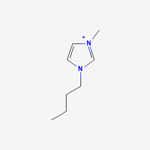

PubChem API in Unix Shell
%%%%%%%%%%%%%%%%%%%%%%%%%%%%%%%%%%

.. sectionauthor:: Vincent F. Scalfani <vfscalfani@ua.edu>

by Avery Fernandez and Vincent Scalfani

These recipe examples were tested on August 4, 2022 using GNOME Terminal (with Bash 4.4.20) in Ubuntu 18.04.

**PubChem API Documentation**: https://pubchemdocs.ncbi.nlm.nih.gov/programmatic-access

**Attribution:** This tutorial was adapted from supporting information in:

**Scalfani, V. F.**; Ralph, S. C. Alshaikh, A. A.; Bara, J. E. Programmatic Compilation of Chemical Data and Literature From PubChem Using Matlab. *Chemical Engineering Education*, **2020**, *54*, 230. https://doi.org/10.18260/2-1-370.660-115508 and https://github.com/vfscalfani/MATLAB-cheminformatics)

.. note::
  
   This tutorial uses ``curl`` and ``jq`` for interacting with the PubChem API. You may also be interested in using the `NCBI EDirect command line program <https://www.ncbi.nlm.nih.gov/books/NBK179288/>`_. We have several tutorials for EDirect in our `EDirectChemInfo repository <https://github.com/ualibweb/EDirectChemInfo>`_.

Program requirements
=======================

In order to run this code, you will need to first install `curl`_, and `jq`_. curl is used to request the data from the API, and jq is used to parse the JSON data. In addition, if you want to be able to print the molecules as ASCII characters in your terminal, you will need to install `RDKit`_ and download the `print_mols`_ Python script.

.. _curl: https://github.com/curl/curl
.. _jq: https://stedolan.github.io/jq/
.. _RDKit: https://www.rdkit.org/
.. _print_mols: https://github.com/vfscalfani/teletype_mols

1. Setup
============================================

Define the PubChem PUG-REST API base URL:

.. code-block:: shell

   api="https://pubchem.ncbi.nlm.nih.gov/rest/pug/compound/"

2. PubChem Similarity
==========================

Get Compound Image
---------------------

We can search for a compound and display an image, for example: 1-Butyl-3-methyl-imidazolium; CID = 2734162

.. code-block:: shell

   compoundID="2734162"
   curl -s "$api"$"cid/""$compoundID"$"/PNG" -o CID_2734162.png

.. note::

   The silent option ``(-s)`` for curl was used to hide the progress outputs.

If you want to open the PNG file in an image viewer program from your terminal, try ``xdg-open``:

.. code-block:: shell

   xdg-open CID_2734162.png

**Output:**

Retrieve InChI and SMILES
----------------------------

.. code-block:: shell

   request=$(curl -s "$api""cid/""$compoundID""/property/inchi,IsomericSMILES/JSON")
   echo "$request" | jq '.'

**Output:**

.. code-block:: shell

   {
     "PropertyTable": {
       "Properties": [
         {
           "CID": 2734162,
           "IsomericSMILES": "CCCCN1C=C[N+](=C1)C",
           "InChI": "InChI=1S/C8H15N2/c1-3-4-5-10-7-6-9(2)8-10/h6-8H,3-5H2,1-2H3/q+1"
         }
       ]
     }
   }

Now, extract out the InChI:

.. code-block:: shell

   echo "$request" | jq '.["PropertyTable"]["Properties"][0]["InChI"]'

**Output:**

.. code-block:: shell

   "InChI=1S/C8H15N2/c1-3-4-5-10-7-6-9(2)8-10/h6-8H,3-5H2,1-2H3/q+1"

And the IsomericSMILES:

.. code-block:: shell

   echo "$request" | jq '.["PropertyTable"]["Properties"][0]["IsomericSMILES"]'

**Output:**

.. code-block:: shell

   "CCCCN1C=C[N+](=C1)C"

Display Molecule as ASCII Drawing
--------------------------------------

We can use the extracted SMILES to generate an ASCII drawing within our terminal. First, we will extract the SMILES using ``jq``, and then pipe the SMILES to a `print_mols`_ Python script, which uses the cheminformatics program RDKit to parse the SMILES, compute drawing coordinates, and then print the molecule as ASCII characters:

.. code-block:: shell

   echo "$request" | jq '.["PropertyTable"]["Properties"][0]["IsomericSMILES"]' | tr -d '"' | python3 print_mols.py -

**Output:**

.. code-block:: shell

                                                                            
                                                                            
                                               C                            
                                           *                                
                                       C         *                          
                                                                            
                                     *             N                        
                                                         *                  
   C               C               N             *             C            
       *       *                         *                                  
           C           *       *               C                            
                                                                            
                           C                                                
                                                                            

.. note::

   ``tr -d '"'`` removes the quotes around the extracted SMILES; ``python3 print_mols.py -`` prints the molecule.

Perform a Similarity Search
-----------------------------

We will use the PubChem API to perform a Fingerprint Tanimoto Similarity Search.

(2D Tanimoto threshold 95% to 1-Butyl-3-methyl-imidazolium; CID = 2734162)

.. code-block:: shell

   request=$(curl -s "$api"$"fastsimilarity_2d/cid/""$compoundID"$"/cids/JSON?Threshold=95")

In the above request value, you can adjust to the desired Tanimoto threshold (e.g., 97, 90, etc.)

Let's find the number of CID values returned and display the first 10 CIDs:

.. code-block:: shell

   length=$(echo "$request" | jq '.["IdentifierList"]["CID"] | length')
   echo "$length"

**Output:**

.. code-block:: shell

   283

.. code-block:: shell

   echo "$request" | jq ".IdentifierList.CID[0:10]"

**Output:**

.. code-block:: shell

   [
     2734161,
     61347,
     529334,
     304622,
     118785,
     12971008,
     11448496,
     11424151,
     11171745,
     11160028
   ]

.. note::

   Here is another approach to displaying the first 10 lines: ``echo "$request" | jq '.["IdentifierList"]["CID"]' | head -n10``

Next, we will convert the CID identifier values into an array:

.. code-block:: shell

   declare -a idList
   for (( i = 0 ; i < length ; i++));
   do
     idList+=(" $(echo "$request" | jq ".IdentifierList.CID[$i]") ")
   done

Display the first 10:

.. code-block:: shell

   echo "${idList[@]:0:10}"

**Output:**

.. code-block:: shell

    2734161   61347   529334   304622   118785   12971008   11448496   11424151   11171745   11160028 

Retrieve Identifier and Property Data
------------------------------------------

Get the following data for the retrieved CIDs (idList): InChI, Isomeric SMILES, MW, Heavy Atom Count, Rotable Bond Count, and Charge. As a test, we will only get data for the first 5 CIDs:

.. code-block:: shell

   for id in "${idList[@]:0:5}"
   do
     compound=$(echo "$id" | sed 's/ //g')
     request=$(curl -s "$api"$"cid/""$compound"$"/property/InChI,IsomericSMILES,MolecularWeight,HeavyAtomCount,RotatableBondCount,Charge/JSON")
     echo "$request" | jq '.["PropertyTable"]["Properties"][0]'
     sleep 1
   done

**Output:**

.. code-block:: shell

   {
     "CID": 2734161,
     "MolecularWeight": "174.67",
     "IsomericSMILES": "CCCCN1C=C[N+](=C1)C.[Cl-]",
     "InChI": "InChI=1S/C8H15N2.ClH/c1-3-4-5-10-7-6-9(2)8-10;/h6-8H,3-5H2,1-2H3;1H/q+1;/p-1",
     "Charge": 0,
     "RotatableBondCount": 3,
     "HeavyAtomCount": 11
   }
   {
     "CID": 61347,
     "MolecularWeight": "124.18",
     "IsomericSMILES": "CCCCN1C=CN=C1",
     "InChI": "InChI=1S/C7H12N2/c1-2-3-5-9-6-4-8-7-9/h4,6-7H,2-3,5H2,1H3",
     "Charge": 0,
     "RotatableBondCount": 3,
    "HeavyAtomCount": 9
   }
   {
     "CID": 529334,
     "MolecularWeight": "138.21",
     "IsomericSMILES": "CCCCCN1C=CN=C1",
     "InChI": "InChI=1S/C8H14N2/c1-2-3-4-6-10-7-5-9-8-10/h5,7-8H,2-4,6H2,1H3",
     "Charge": 0,
     "RotatableBondCount": 4,
     "HeavyAtomCount": 10
   }
   {
     "CID": 304622,
     "MolecularWeight": "138.21",
     "IsomericSMILES": "CCCCN1C=CN=C1C",
     "InChI": "InChI=1S/C8H14N2/c1-3-4-6-10-7-5-9-8(10)2/h5,7H,3-4,6H2,1-2H3",
     "Charge": 0,
     "RotatableBondCount": 3,
     "HeavyAtomCount": 10
   }
   {
     "CID": 118785,
     "MolecularWeight": "110.16",
     "IsomericSMILES": "CCCN1C=CN=C1",
     "InChI": "InChI=1S/C6H10N2/c1-2-4-8-5-3-7-6-8/h3,5-6H,2,4H2,1H3",
     "Charge": 0,
     "RotatableBondCount": 2,
     "HeavyAtomCount": 8
   }

.. note::

  ``sed 's/ //g'`` removes the extra space before the CID values. ``tr -d ' '`` should also work to remove the extra space.

We can modify the ``jq`` line to extract out specific data values such as the MolecularWeight:

.. code-block:: shell

   for id in "${idList[@]:0:5}"
   do
     compound=$(echo "$id" | sed 's/ //g')
     request=$(curl -s "$api"$"cid/""$compound"$"/property/InChI,IsomericSMILES,MolecularWeight,HeavyAtomCount,RotatableBondCount,Charge/JSON")
     echo "$request" | jq '.["PropertyTable"]["Properties"][0]["MolecularWeight"]'
     sleep 1
   done

**Output:**

.. code-block:: shell

   "174.67"
   "124.18"
   "138.21"
   "138.21"
   "110.16"

Retrieve Images of CID Compounds from Similarity Search
--------------------------------------------------------

We will get and save the PNG images for the first 5 compounds:

.. code-block:: shell

   for id in "${idList[@]:0:5}"
   do
     compound=$(echo "$id" | sed 's/ //g')
     request=$(curl -s "$api"$"cid/""$compound"$"/PNG" -o "$compound"$".png")
     sleep 1
   done

.. code-block:: shell

   ls

**Output:**

.. code-block:: shell

   118785.png  2734161.png  304622.png  529334.png  61347.png

Finally, we can also visualize the compounds as ASCII drawings using the `print_mols`_ Python script demonstrated above.

.. code-block:: shell

   for id in "${idList[@]:0:5}"
   do
     compound=$(echo "$id" | sed 's/ //g')
     request=$(curl -s "$api"$"cid/""$compound"$"/property/IsomericSMILES/JSON")
     echo "$request" | jq '.["PropertyTable"]["Properties"][0]["IsomericSMILES"]' |
     tr -d '"' |
     python3 print_mols.py -
     sleep 1
   done

**Output:**

.. code-block:: shell

                                                                            
                                                                            
                                                               Cl            
                                                                            
                                   C     *     C                            
                                                                            
                                                 *                          
                                   *                                        
                                                   N     *     C            
                                                                            
   C               C               N           *                            
       *       *       *       *       *                                    
           C               C               C                                
                                                                            
   
                                                                        
                                                                        
                                       C   *   N                        
                                                                        
                                                   *                    
                                       *                                
                                                       C                
                                                                        
   C               C                   N           *                    
       *       *         *         *       *                            
           C                   C               C                        
                                                                        
         
                                                                            
                                                                            
                                               C     *     N                
                                                                            
                                                             *              
                                               *                            
                                                               C            
                                                                            
           C               C                   N           *                
       *       *       *         *         *       *                        
   C               C                   C               C                    
                                                                            
                                                                            
   
                                                                    
                                               C                    
                                                                    
                                                                    
                                               *                    
           C               C                                        
                                                                    
       *       *       *         *             C                    
                                           *     *                  
   C               C                   N           N                
                                                                    
                                       *                            
                                                 *                  
                                       C                            
                                           *                        
                                               C                    
                                                                    
   
                                                                    
                                                                    
                               C   *   N                            
                                                                    
                                           *                        
                               *                                    
                                               C                    
                                                                    
           C                   N           *                        
       *       *         *         *                                
   C               C                   C                            
                                                                 

3. PubChem SMARTS Search
============================

Search for chemical structures from a SMARTS substructure query.

Define SMARTS queries
-----------------------

View pattern syntax at: https://smartsview.zbh.uni-hamburg.de/

Note: These are vinyl imidazolium substructure searches

.. code-block:: shell

   declare -a smartsQ=("[CR0H2][n+]1[cH1][cH1]n([CR0H1]=[CR0H2])[cH1]1" "[CR0H2][n+]1[cH1][cH1]n([CR0H2][CR0H1]=[CR0H2])[cH1]1" "[CR0H2][n+]1[cH1][cH1]n([CR0H2][CR0H2][CR0H1]=[CR0H2])[cH1]1")

Add your own SMARTS queries to customize. You can add as many as desired within an array.

Perform a SMARTS query search
--------------------------------

We will combine all data into a single array:

.. code-block:: shell

   declare -a combinedA
   for smarts in "${smartsQ[@]}"
   do
     request=$(curl -s -g "$api"$"fastsubstructure/smarts/""$smarts"$"/cids/JSON")
     sleep 1
     length=$(echo "$request" | jq '.["IdentifierList"]["CID"] | length')
     echo "$length"
     for (( i = 0 ; i < length ; i++));
     do
       combinedA+=(" $(echo "$request" | jq ".IdentifierList.CID[$i]" ) ")
     done
   done

**Output:**

.. code-block:: shell

   605
   225
   7

.. note::

   The ``-g`` option with curl prevents curl from interpreting the ``[]`` characters in the SMARTS patterns.

Get length of array:

.. code-block:: shell

   echo "${#combinedA[@]}"

**Output:**

.. code-block:: shell

   837

Show the first 5 results:

.. code-block:: shell

   echo "${combinedA[@]:0:5}"

**Output:**

.. code-block:: shell

    121235111   86657882   46178576   24766550   139254006 

Retrieve Identifier and Property Data
-----------------------------------------

We will retrieve some property data for the first 5 CIDs:

.. code-block:: shell

   for id in "${combinedA[@]:0:5}"
   do
     compound=$(echo "$id" | tr -d ' ')
     request=$(curl -s "$api"$"cid/""$compound"$"/property/InChI,CanonicalSMILES,MolecularWeight,IUPACName,HeavyAtomCount,CovalentUnitCount,Charge/JSON")
     echo "$request" | jq '.["PropertyTable"]["Properties"][0]'
     sleep 1
   done

**Output:**

.. code-block:: shell

   {
     "CID": 121235111,
     "MolecularWeight": "403.3",
     "CanonicalSMILES": "CC[N+]1=CN(C=C1)C=C.C(F)(F)(F)S(=O)(=O)[N-]S(=O)(=O)C(F)(F)F",
     "InChI": "InChI=1S/C7H11N2.C2F6NO4S2/c1-3-8-5-6-9(4-2)7-8;3-1(4,5)14(10,11)9-15(12,13)2(6,7)8/h3,5-7H,1,4H2,2H3;/q+1;-1",
     "IUPACName": "bis(trifluoromethylsulfonyl)azanide;1-ethenyl-3-ethylimidazol-3-ium",
     "Charge": 0,
     "HeavyAtomCount": 24,
     "CovalentUnitCount": 2
   }
   {
     "CID": 86657882,
     "MolecularWeight": "287.24",
     "CanonicalSMILES": "CCCCCCCC[N+]1=CN(C=C1)C=C.[Br-]",
     "InChI": "InChI=1S/C13H23N2.BrH/c1-3-5-6-7-8-9-10-15-12-11-14(4-2)13-15;/h4,11-13H,2-3,5-10H2,1H3;1H/q+1;/p-1",
     "IUPACName": "1-ethenyl-3-octylimidazol-3-ium;bromide",
     "Charge": 0,
     "HeavyAtomCount": 16,
     "CovalentUnitCount": 2
   }
   {
     "CID": 46178576,
     "MolecularWeight": "399.5",
     "CanonicalSMILES": "CCCCCCCCCCCCCCCC[N+]1=CN(C=C1)C=C.[Br-]",
     "InChI": "InChI=1S/C21H39N2.BrH/c1-3-5-6-7-8-9-10-11-12-13-14-15-16-17-18-23-20-19-22(4-2)21-23;/h4,19-21H,2-3,5-18H2,1H3;1H/q+1;/p-1",
     "IUPACName": "1-ethenyl-3-hexadecylimidazol-3-ium;bromide",
     "Charge": 0,
     "HeavyAtomCount": 24,
     "CovalentUnitCount": 2
   }
   {
     "CID": 24766550,
     "MolecularWeight": "431.4",
     "CanonicalSMILES": "CCCC[N+]1=CN(C=C1)C=C.C(F)(F)(F)S(=O)(=O)[N-]S(=O)(=O)C(F)(F)F",
     "InChI": "InChI=1S/C9H15N2.C2F6NO4S2/c1-3-5-6-11-8-7-10(4-2)9-11;3-1(4,5)14(10,11)9-15(12,13)2(6,7)8/h4,7-9H,2-3,5-6H2,1H3;/q+1;-1",
     "IUPACName": "bis(trifluoromethylsulfonyl)azanide;1-butyl-3-ethenylimidazol-1-ium",
     "Charge": 0,
     "HeavyAtomCount": 26,
     "CovalentUnitCount": 2
   }
   {
     "CID": 139254006,
     "MolecularWeight": "278.13",
     "CanonicalSMILES": "CCCC[N+]1=CN(C=C1)C=C.[I-]",
     "InChI": "InChI=1S/C9H15N2.HI/c1-3-5-6-11-8-7-10(4-2)9-11;/h4,7-9H,2-3,5-6H2,1H3;1H/q+1;/p-1",
     "IUPACName": "1-butyl-3-ethenylimidazol-1-ium;iodide",
     "Charge": 0,
     "HeavyAtomCount": 12,
     "CovalentUnitCount": 2
   }

Get only the InChIs:

.. code-block:: shell

   for id in "${combinedA[@]:0:5}"
   do
     compound=$(echo "$id" | tr -d ' ')
     request=$(curl -s "$api"$"cid/""$compound"$"/property/InChI/JSON")
     echo "$request" | jq '.["PropertyTable"]["Properties"][0]["InChI"]' | tr -d '"'
     sleep 1
   done

**Output:**

.. code-block:: shell

   InChI=1S/C7H11N2.C2F6NO4S2/c1-3-8-5-6-9(4-2)7-8;3-1(4,5)14(10,11)9-15(12,13)2(6,7)8/h3,5-7H,1,4H2,2H3;/q+1;-1
   InChI=1S/C13H23N2.BrH/c1-3-5-6-7-8-9-10-15-12-11-14(4-2)13-15;/h4,11-13H,2-3,5-10H2,1H3;1H/q+1;/p-1
   InChI=1S/C21H39N2.BrH/c1-3-5-6-7-8-9-10-11-12-13-14-15-16-17-18-23-20-19-22(4-2)21-23;/h4,19-21H,2-3,5-18H2,1H3;1H/q+1;/p-1
   InChI=1S/C9H15N2.C2F6NO4S2/c1-3-5-6-11-8-7-10(4-2)9-11;3-1(4,5)14(10,11)9-15(12,13)2(6,7)8/h4,7-9H,2-3,5-6H2,1H3;/q+1;-1
   InChI=1S/C9H15N2.HI/c1-3-5-6-11-8-7-10(4-2)9-11;/h4,7-9H,2-3,5-6H2,1H3;1H/q+1;/p-1

