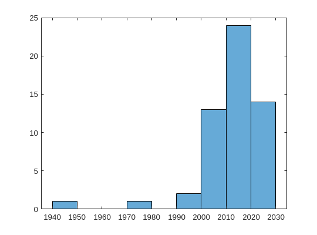

PubMed API in Matlab
%%%%%%%%%%%%%%%%%%%%%%%%%%%%%%%%%%

.. sectionauthor:: Vincent F. Scalfani <vfscalfani@ua.edu>

by Anastasia Ramig

These recipe examples were tested on November 23, 2022 in MATLAB R2022b.

**NCBI Entrez Programming Utilities Documentation:**
https://www.ncbi.nlm.nih.gov/books/NBK25501/

**Please see NCBI's Data Usage Policies and Disclaimers:**
https://www.ncbi.nlm.nih.gov/home/about/policies/

1. Basic PubMed API call
============================

For calling individual articles and publications, we will need to use this API URL:

.. code-block:: matlab

   %% set up the API parameters
   summary = "https://eutils.ncbi.nlm.nih.gov/entrez/eutils/esummary.fcgi?db=pubmed&";

The article we are requesting has PubMed ID: 27933103.

**retmode** in the web API URL specifies the file format. In this example, we will use JSON.

.. code-block:: matlab

   %% pull specific article data using its ID
   url = summary + "id=27933103&retmode=json";
   data_call = webread(url);

.. code-block:: matlab

   %% index to where the authors are stored
   index = data_call.result.x27933103.authors;
   disp(index)

**Output:**

.. code-block:: matlab

   8×1 struct array with fields:

    name
    authtype
    clusterid

.. code-block:: matlab

   %% index to pull out the list of author names
   names = {index(:).name};
   disp(names)

**Output:**

.. code-block:: matlab

   Columns 1 through 5

    {'Scalfani VF'}    {'Williams AJ'}    {'Tkachenko V'}    {'Karapetyan K'}    {'Pshenichnov A'}

   Columns 6 through 8

    {'Hanson RM'}    {'Liddie JM'}    {'Bara JE'}

2. Request Data using a Loop
================================

First, create a list of PubMed IDs:

.. code-block:: matlab

   %% create a list of PubMed IDs
   idList = [34813985, 34813932, 34813684, 34813661, 34813372, 34813140, 34813072];

We will use map containers to store IDs and associated data. MATLAB map containers work by storing
a value and associating it with a specific key. We can establish a map container using:

.. code-block:: matlab

   %% create an empty map container
   map = containers.Map;
   map

**Output:**

.. code-block:: matlab

   map = 
   Map with properties:

         Count: 0
       KeyType: char
     ValueType: any

.. code-block:: matlab

   %% create two structures and add each id and its corresponding search
   multiPapersKeys = {ones(length(idList), 1)};
   multiPapersValues = {ones(length(idList), 1)};
   for i=1:length(idList)
       url = summary + "id=" + string(idList(i)) + "&retmode=json";
       multiPapersKeys{i} = idList(i);
       multiPapersValues{i} = webread(url);
       pause(1)
   end

.. code-block:: matlab

   %% create a container of the search results and index to a specific article
   multiPapers = containers.Map(multiPapersKeys, multiPapersValues);
   multiPapers(34813985)

**Output:**

.. code-block:: matlab

   ans = struct with fields:
     header: [1×1 struct]
     result: [1×1 struct]

.. code-block:: matlab

   %% create a new set of ids that are formatted with "x" for indexing
   xiSet = {ones(length(idList),1)};
   for i=1:length(idList)
       xiSet{i} = "x" + idList(i);
   end
 
   %% get the title for each journal
   for i=1:length(idList)
       id = idList(i);
       displayResult = multiPapers(id).result.(xiSet{i}).source
   end

**Output:**

.. code-block:: matlab

   displayResult = 'Cell Calcium'
   displayResult = 'Methods'
   displayResult = 'FEBS J'
   displayResult = 'Dev Growth Differ'
   displayResult = 'CRISPR J'
   displayResult = 'Chembiochem'
   displayResult = 'Methods Mol Biol'

3. PubMed API Calls with Requests and Parameters
===================================================

For searching for articles using search term(s), we will need to use this API URL:

.. code-block:: matlab

   %% set the search url for the API
   search = "https://eutils.ncbi.nlm.nih.gov/entrez/eutils/esearch.fcgi?db=pubmed&";

When searching through articles, we are given a few ways of filtering the data.
A list of all the available parameters for these requests can be found in the official NCBI documentation:

https://www.ncbi.nlm.nih.gov/books/NBK25499/

We can specify the database by putting **db=<database>** into the URL. We will be using the PubMed database. 
We can also use term to search data by adding **term=<searchQuery>**. Just be sure to replace spaces with
a + instead. We can, for example, use a query to search PubMed, such as "neuroscience intervention learning":

.. code-block:: matlab

   %% search the API
   url = search + "term=neuroscience+intervention+learning&retmode=json";
   data = webread(url);

The number of returned IDs can be adjusted with the **retmax** parameter:

.. code-block:: matlab

   %% limit the search to 25 articles and pull the list of ids
   url = search + "term=neuroscience+intervention+learning&retmax=25&retmode=json";
   data = webread(url);
   disp(data.esearchresult.idlist)

**Output:**

.. code-block:: matlab

    {'36416175'}
    {'36415971'}
    {'36414247'}
    {'36414012'}
    {'36411719'}
    {'36411683'}
    {'36411673'}
    {'36409100'}
    {'36409046'}
    {'36408530'}
    {'36408399'}
    {'36408106'}
    {'36408061'}
    {'36405490'}
    {'36405191'}
    {'36405080'}
    {'36404677'}
    {'36404570'}
    {'36402843'}
    {'36402815'}
    {'36402739'}
    {'36402496'}
    {'36401545'}
    {'36399451'}
    {'36398842'}

.. code-block:: matlab

   length(data.esearchresult.idlist)

**Output:**

.. code-block:: matlab

   ans = 25

We can also use the query to search for an author. Add **[au]** after the name to specify it is an author.

.. code-block:: matlab

   %% search articles by author name
   url = search+"term=Darwin[au]&retmode=json";
   data = webread(url); 
   data.esearchresult.count

**Output:**

.. code-block:: matlab

   ans = '603'

We can also sort results using **usehistory=y**. This allows us to store the data for it to be sorted in the same API call.
The addition of **sort=pub+date** will sort IDs by the publishing date.

.. code-block:: matlab

   %% perform a search that is sorted by publication date
   url = search+"term=Coral+Reefs&retmode=json&usehistory=y&sort=pub+date";
   data = webread(url);
   disp(data.esearchresult.idlist)

**Output:**

.. code-block:: matlab

    {'35341677'}
    {'36252668'}
    {'36183766'}
    {'36181819'}
    {'36055494'}
    {'35995149'}
    {'36409983'}
    {'36265239'}
    {'36179999'}
    {'36172974'}
    {'36168958'}
    {'36152066'}
    {'36150619'}
    {'36129389'}
    {'36106689'}
    {'36064010'}
    {'36054745'}
    {'35998799'}
    {'35980514'}
    {'35718641'}

.. code-block:: matlab

   %% compare to unsorted
   url = search+"term=Coral+Reefs&retmode=json";
   data = webread(url);
   disp(data.esearchresult.idlist)

**Output:**

.. code-block:: matlab

    {'36416762'}
    {'36415309'}
    {'36413112'}
    {'36409983'}
    {'36406938'}
    {'36405638'}
    {'36401956'}
    {'36401815'}
    {'36399057'}
    {'36395713'}
    {'36395226'}
    {'36389413'}
    {'36385270'}
    {'36383546'}
    {'36382375'}
    {'36379970'}
    {'36379169'}
    {'36372339'}
    {'36371949'}
    {'36371558'}

We can also search based on publication type by adding **AND** into the search in the term: **term=<searchQuery>+AND+filter[filterType]**. 

**[pt]** specifies that the filter type is the publication type. More filters can be found at: https://pubmed.ncbi.nlm.nih.gov/help/.

.. code-block:: matlab

   %% search based on publication type
   url = search+"term=stem+cells+AND+clinical+trial[pt]&retmode=json";
   data = webread(url)

**Output:**

.. code-block:: matlab

   data = struct with fields:
           header: [1×1 struct]
    esearchresult: [1×1 struct]

4. PubMed API Metadata Visualization
===========================================

Frequency of Topic sortpubdate field
----------------------------------------

Extracting the sortpubdate field for a "hydrogel drug" search results, limited to publication type clinical trials:

.. code-block:: matlab

   %% perform a search using the term "hydrogel drug" and print the list of ids
   url = search+"term=hydrogel+drug+AND+clinical+trial[pt]&sort=pub+date&retmax=500&retmode=json";
   data = webread(url);
   ids = data.esearchresult.idlist;
   length(ids)

**Output:**

.. code-block:: matlab

   ans = 299

.. code-block:: matlab

   %% create a list of publication dates
   pubDates = {ones(length(ids), 1)};
   for i=1:length(ids)
       url = summary+"id="+string(ids{i})+"&retmode=json";
       request = webread(url);
       pause(1)
       idNew = "x" + ids{i};
       pubDates{i} = request.result.(idNew).sortpubdate;
   end
   pubDates{1:10}

**Output:**

.. code-block:: matlab

   ans = '2022/12/01 00:00'
   ans = '2022/10/19 00:00'
   ans = '2022/10/01 00:00'
   ans = '2022/10/01 00:00'
   ans = '2022/08/01 00:00'
   ans = '2022/06/01 00:00'
   ans = '2022/05/01 00:00'
   ans = '2022/04/01 00:00'
   ans = '2022/03/01 00:00'
   ans = '2022/01/21 00:00'

.. code-block:: matlab

   length(pubDates)

**Output:**

.. code-block:: matlab

   ans = 299

.. code-block:: matlab

   %% pull the year from each publication date
   datesList = {ones(length(pubDates), 1)};
   for i = 1:length(pubDates)
       datesList{i} = str2double(pubDates{i}(1:4));
   end
   disp(datesList(1:20)) %% show first 20

**Output:**

.. code-block:: matlab

   Columns 1 through 8

    {[2022]}    {[2022]}    {[2022]}    {[2022]}    {[2022]}    {[2022]}    {[2022]}    {[2022]}

   Columns 9 through 16

    {[2022]}    {[2022]}    {[2022]}    {[2022]}    {[2022]}    {[2021]}    {[2021]}    {[2021]}

   Columns 17 through 20

    {[2021]}    {[2021]}    {[2021]}    {[2021]}

.. code-block:: matlab

   %% plot a histogram of the publications according to the decade in which they were published
   x = cell2mat(datesList);
 
   f = figure;
   f.Position = [100 100 540 400];
   f(1);
   edges = [1980 1985 1990 1995 2000 2005 2010 2015 2020];
   histogram(x)

**Output:**

.. image:: imgs/matlab_pm_im0.png

Frequency of Publication for an Author Search
-------------------------------------------------

.. code-block:: matlab

   %% search all of the articles written by a certain author sorted by publication date
   url = search+"term=Reed+LK[au]&sort=pub+date&retmax=500&retmode=json";
   data = webread(url);
   ids = data.esearchresult.idlist;
   length(ids)

**Output:**

.. code-block:: matlab

   ans = 55

.. code-block:: matlab

   %% create a list of publication dates
   pubDates = {ones(length(ids), 1)};
   for i=1:length(ids)
       url = summary+"id="+string(ids{i})+"&retmode=json";
       request = webread(url);
       pause(1)
       idNew = "x" + ids{i};
       pubDates{i} = request.result.(idNew).sortpubdate;
   end

.. code-block:: matlab

   %% pull the year from each publication date
   datesList = {ones(length(pubDates), 1)};
   for i = 1:length(pubDates)
       datesList{i} = str2double(pubDates{i}(1:4));
   end
   disp(datesList(1:20))

**Output:**

.. code-block:: matlab

   Columns 1 through 8

    {[2022]}    {[2022]}    {[2022]}    {[2022]}    {[2021]}    {[2021]}    {[2021]}    {[2021]}

   Columns 9 through 16

    {[2021]}    {[2020]}    {[2020]}    {[2020]}    {[2020]}    {[2020]}    {[2019]}    {[2019]}

   Columns 17 through 20

    {[2019]}    {[2018]}    {[2018]}    {[2018]}

.. code-block:: matlab

   %% plot a histogram of the articles according to the decade in which they were published
   x = cell2mat(datesList);
 
   f = figure;
   f.Position = [100 100 540 400];
   xticks = ([1950 1960 1970 1980 1990 2000 2010 2020]);
   histogram(x)

**Output:**

