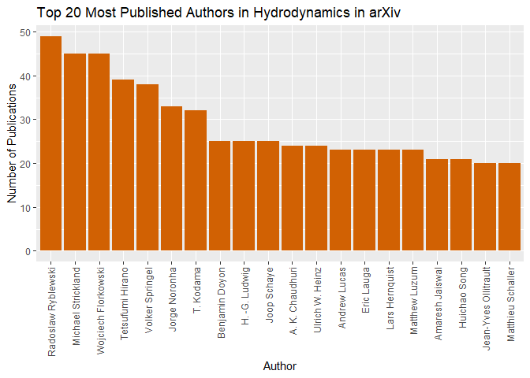
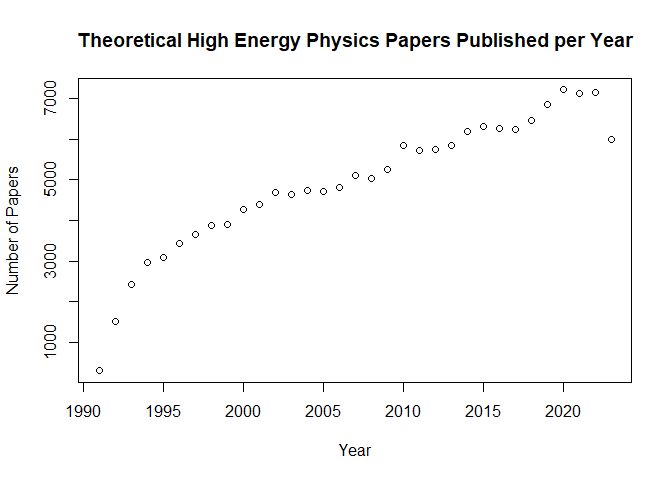

# arXiv API in R

by Adam M. Nguyen

These recipe examples were tested on December 1, 2023.

**Documentation:** 

**arXiv:** https://arxiv.org/

**arXi API Access Information:** https://info.arxiv.org/help/api/index.html

**arXiv Terms of Use:** https://info.arxiv.org/help/api/tou.html

**aRxiv: R Interface to the arXiv API:** https://cran.r-project.org/web/packages/aRxiv/index.html

*Acknowledgment: Thank you to arXiv for use of its open access interoperability*

See the bottom of the document for information on R and package versions.

Hosted and maintained by Cornell University, arXiv is an open-access and free distribution service containing nearly 2.5 million scholarly articles in fields including physics, mathematics, computer science, quantitative biology, quantitative finance, statistics, electrical engineering and systems science and economics at the time of writing. In this tutorial we will introduce how to use the API with some examples, but for larger bulk downloads of data from arXiv, we recommend [Kaggle's arxiv Dataset](https://www.kaggle.com/datasets/Cornell-University/arxiv/data), which is updated monthly with the full arXiv data set and metadata.

## Setup

### Load Library

Run the following lines of code to load the library ‘aRxiv’. If you have not done so already, additionally, before the ‘library()’ functions, run ‘install.packages('aRxiv')’. aRxiv is the package we will use to interface with the arXiv API.

```r
# Load necessary libraries
library(aRxiv)
```

### Retrieving Categories

Before we get started, a useful function provided by the aRxiv package is 'arxiv_cats'. This returns arXiv subject classification's abbreviation and corresponding description. Categories are especially important in forming queries to the API so we mention them here first.

```r
# Here are the first 10 categories to showcase the function
head(arxiv_cats,n=10)
```

```
##    abbreviation                                  description
## 1       stat.AP                    Statistics - Applications
## 2       stat.CO                     Statistics - Computation
## 3       stat.ML                Statistics - Machine Learning
## 4       stat.ME                     Statistics - Methodology
## 5       stat.TH                          Statistics - Theory
## 6      q-bio.BM          Quantitative Biology - Biomolecules
## 7      q-bio.CB         Quantitative Biology - Cell Behavior
## 8      q-bio.GN              Quantitative Biology - Genomics
## 9      q-bio.MN    Quantitative Biology - Molecular Networks
## 10     q-bio.NC Quantitative Biology - Neurons and Cognition
```

## 1. Basic Search

Possibly the function of most utility in the package is 'arxiv_search()'. The search allows for the programmatic searching of the arXiv repository returning 15 columns of information including 'id','title','summary', and more. We will showcase the use of this function by searching for papers with the term 'Hydrodynamics' in the title and then extract authors and see who is has the most publications.

```r
# Search for Hydrodynamics papers
hydrodynamic_search <- arxiv_search('ti:Hydrodynamics', batchsize =410, limit=10000, force = TRUE)
```

```
## retrieved batch 1
```

```
## retrieved batch 2
```

```
## retrieved batch 3
```

```
## retrieved batch 4
```

```
## retrieved batch 5
```

```
## retrieved batch 6
```

```
## retrieved batch 7
```

```
## retrieved batch 8
```

```
## retrieved batch 9
```

```
## retrieved batch 10
```

```r
# Extract out the authors
authors <- hydrodynamic_search[, c('title', 'authors')]

# Show first few entries
head(authors)
```

```
##                                                                                                 title
## 1                                               A finite model of two-dimensional ideal hydrodynamics
## 2              Hydrodynamic Stability Analysis of Burning Bubbles in Electroweak Theory\n  and in QCD
## 3                                                             Hydrodynamics of Relativistic Fireballs
## 4 Comparison of Spectral Method and Lattice Boltzmann Simulations of\n  Two-Dimensional Hydrodynamics
## 5                Classical differential geometry and integrability of systems of\n  hydrodynamic type
## 6                       Hydrodynamic Spinodal Decomposition: Growth Kinetics and Scaling\n  Functions
##                                                   authors
## 1                                  J. S. Dowker|A. Wolski
## 2  P. Huet|K. Kajantie|R. G. Leigh|B. -H. Liu|L. McLerran
## 3                   Tsvi Piran|Amotz Shemi|Ramesh Narayan
## 4 D. O. Martinez|W. H. Matthaeus|S. Chen|D. C. Montgomery
## 5                                            S. P. Tsarev
## 6                    F. J. Alexander|S. Chen|D. W. Grunau
```

```r
# Split the 'authors' column in a list of individuals
author_lists <- strsplit(authors[,'authors'], split = "|", fixed = TRUE)

# List Frequency of Author Occurrences 
co_freq <- table(unlist(author_lists))

# Order and Format as Data frame
ordered_cofreq <- as.data.frame(co_freq[order(co_freq, decreasing = TRUE)])

# Here are the first highest publishers in Hydrodynamics as available by the arXiv repository
head(ordered_cofreq)
```

```
##                  Var1 Freq
## 1  Radoslaw Ryblewski   31
## 2    Tetsufumi Hirano   31
## 3 Wojciech Florkowski   30
## 4     Volker Springel   29
## 5  Michael Strickland   28
## 6           T. Kodama   28
```

### Visualization

Additionally, we can create a visualization using the 'ggplot2' library. See the following code to see how to do so and what is produced.


```r
library(ggplot2)
# Visualize the top 20 highest publishers
ggplot(head(ordered_cofreq,n=20), aes(x = Var1, y = Freq)) +
  geom_bar(stat = "identity", fill = "#D16103") +
  labs(x = "Author", y = "Number of Publications", title = "Top 20 Most Published Authors in Hydrodynamics in arXiv") +
  theme(axis.text.x = element_text(angle = 90, hjust = 1, vjust = .5))  # Rotate x-axis labels for readability
```

<!-- -->

## 2. Retrieving Number of Query Results

Using the aRxiv package you can also retrieve counts of papers given some query. For example, we can see how many papers our previous 'Hydrodynamics' query returns.


```r
# How many papers titles contain hydroynamics?

arxiv_count('ti:"hydrodynamics"')
```

```
## [1] 6385
```
We can also see how many HEP-th papers there are. 


```r
# How many papers fall under the HEP-th category?

arxiv_count("cat: HEP-th")
```

```
## [1] 162439
```
And finally we can see how many HEP-th papers have been published throughout the years.


```r
# Create a vector of years we are interested in, 1990:2023
years <- 1991:2023

# Create empty vector to append annual counts to
arxiv_counts <- c()

# Loop through years to create list of counts per year
for(year in years){
  arxiv_counts <- c(arxiv_counts, arxiv_count(paste0('cat:HEP-th AND submittedDate:[',year,' TO ',year+1,']')))
}
arxiv_counts_df <- as.data.frame(cbind(1991:2023,arxiv_counts))
# Simple base R plot of the data
plot(arxiv_counts_df, main = 'Theoretical High Energy Physics Papers Published per Year', xlab = 'Year', ylab='Number of Papers')
```

<!-- -->

## 3. Proportion of Preprints in Hydrodynamics Papers

arXiv's repository contains both electronic preprints and and links to post print (e.g. version of record DOI). We will explore the proportion of preprints in the previous 'Hydrodynamics' query. This is possible as the 'doi' column returned in the query is empty for those articles that do not have doi, i.e. preprints.

```r
# Count the number of preprints by looking for empty 'doi' columns
hydrodynamic_preprint_count <- sum(hydrodynamic_search$doi == "")

# Calculate a percentage of preprints
percentage_preprints <- (hydrodynamic_preprint_count / nrow(hydrodynamic_search)) * 100

paste0('The percentage of preprints is ',round(percentage_preprints, digits = 2),'%.')
```

```
## [1] "The percentage of preprints is 23.98%."
```

## R Session Info


```r
sessionInfo()
```

```
## R version 4.3.1 (2023-06-16 ucrt)
## Platform: x86_64-w64-mingw32/x64 (64-bit)
## Running under: Windows 10 x64 (build 19045)
## 
## Matrix products: default
## 
## 
## locale:
## [1] LC_COLLATE=English_United States.utf8 
## [2] LC_CTYPE=English_United States.utf8   
## [3] LC_MONETARY=English_United States.utf8
## [4] LC_NUMERIC=C                          
## [5] LC_TIME=English_United States.utf8    
## 
## time zone: America/Chicago
## tzcode source: internal
## 
## attached base packages:
## [1] stats     graphics  grDevices utils     datasets  methods   base     
## 
## other attached packages:
## [1] ggplot2_3.4.4 aRxiv_0.6    
## 
## loaded via a namespace (and not attached):
##  [1] vctrs_0.6.3       httr_1.4.7        cli_3.6.1         knitr_1.44       
##  [5] rlang_1.1.1       xfun_0.40         generics_0.1.3    jsonlite_1.8.7   
##  [9] labeling_0.4.2    glue_1.6.2        colorspace_2.1-0  htmltools_0.5.6.1
## [13] XML_3.99-0.14     sass_0.4.7        fansi_1.0.4       scales_1.2.1     
## [17] rmarkdown_2.25    grid_4.3.1        tibble_3.2.1      evaluate_0.22    
## [21] munsell_0.5.0     jquerylib_0.1.4   fastmap_1.1.1     yaml_2.3.7       
## [25] lifecycle_1.0.3   compiler_4.3.1    dplyr_1.1.3       pkgconfig_2.0.3  
## [29] rstudioapi_0.15.0 farver_2.1.1      digest_0.6.33     R6_2.5.1         
## [33] tidyselect_1.2.0  utf8_1.2.3        pillar_1.9.0      curl_5.1.0       
## [37] magrittr_2.0.3    bslib_0.5.1       withr_2.5.0       tools_4.3.1      
## [41] gtable_0.3.4      cachem_1.0.8
```
