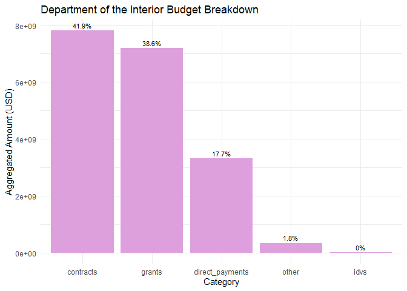

# USA Spending API in R

by Adam M. Nguyen

These recipe examples were tested on December 1, 2023.

**Documentation:** 

**USA Spending Website:** https://www.usaspending.gov/

**USA Spending API:** https://api.usaspending.gov/

See the bottom of the document for information on R and package versions.

## Setup

Run the following lines of code to load the libraries ‘httr’ and ‘jsonlite’. If you have not done so already, additionally, before the ‘library()’ functions, run ‘install.packages(c(‘httr’,’jsonlite’))’.

```r
library(httr)
library(jsonlite)
```
## 1. Get Agency Names and Toptier Codes  

To obtain data from the API, it'll be useful to have an object we can reference agency names and their toptier codes, the latter of which will be used to access subagency data.

```r
# Set base url for API
base_url <- 'https://api.usaspending.gov'

# Define URL to obtain agency names and codes
toptier_agencies_url <- paste0(base_url,'/api/v2/references/toptier_agencies/')

# Query API using prepared URL and grab the results
toptier_data <- fromJSON(rawToChar(GET(toptier_agencies_url)$content))$results

# Let's check the first entry
head(toptier_data, n=1)
```

```
##   agency_id toptier_code abbreviation  agency_name
## 1      1146          310         USAB Access Board
##   congressional_justification_url active_fy active_fq outlay_amount
## 1 https://www.access-board.gov/cj      2023         4       9232761
##   obligated_amount budget_authority_amount
## 1          8863661                11366459
##   current_total_budget_authority_amount percentage_of_total_budget_authority
## 1                          1.188986e+13                         9.559789e-07
##    agency_slug
## 1 access-board
```

```r
# Show total number agencies in data
nrow(toptier_data)
```

```
## [1] 108
```
Now we can create a reference for agencies and their toptier codes, we call 'toptier_codes'.

```r
toptier_codes <- toptier_data[c("agency_name", "toptier_code")]
# Let's see the first 10 agencies and their toptier codes
head(toptier_codes,n=10)
```

```
##                                                           agency_name
## 1                                                        Access Board
## 2                               Administrative Conference of the U.S.
## 3                           Advisory Council on Historic Preservation
## 4                                      African Development Foundation
## 5                                Agency for International Development
## 6                                American Battle Monuments Commission
## 7                                     Appalachian Regional Commission
## 8                                        Armed Forces Retirement Home
## 9  Barry Goldwater Scholarship and Excellence In Education Foundation
## 10       Commission for the Preservation of America's Heritage Abroad
##    toptier_code
## 1           310
## 2           302
## 3           306
## 4           166
## 5           072
## 6           074
## 7           309
## 8           084
## 9           313
## 10          321
```
Finally, let's test the data frame, 'toptier_codes', by obtaining the toptier code of an agency.


```r
# Look up toptier code of specific agency, in this case Department of Transportation
toptier_codes$toptier_code[toptier_codes$agency_name == "Department of Transportation"]
```

```
## [1] "069"
```
With these codes we can access subagency data.


## 2. Retrieving Data from Subagencies

The 'toptier_codes' data frame we created contains every agency name in the USA Spending API. For this example we'll look at the total obligations of each subagency of the Department of Defense.


```r
# Designate Desired Agency
desired_agency_name <- 'Department of Defense'

# Find toptier code
desired_toptier_code <- toptier_codes$toptier_code[toptier_codes$agency_name == desired_agency_name]

# Create URL to Query
subagency_url <- paste0(base_url, '/api/v2/agency/', desired_toptier_code, '/sub_agency/?fiscal_year=2023')

# Query API and grab Results
subagency_data <- fromJSON(rawToChar(GET(subagency_url)$content))$results
```
### Visualization: Pie Chart
Let's try making a pie chart to visualize our data. Additionally, we will group the last four sub agencies to relieve clutter. 


```r
# Select Categories we'd like to collect into 'Other'
last_four_rows <- tail(subagency_data, 4)

# R is funny so we create a "better" as numeric function
as_numeric_with_na <- function(x) {
  as.numeric(as.character(x))
}

# Convert last four rows to numeric
last_four_rows[, -1] <- lapply(last_four_rows[, -1], as_numeric_with_na)

# Sum last four rows
summed_values <- colSums(last_four_rows[, -1], na.rm = TRUE)

# Collect summed values into "other_row"
other_row <- c("other", as.character(summed_values))

# Remove last four rows
subagency_data_removed <- head(subagency_data, -4)

# Attach new "other_row" and rename it to 'Other'
subagency_data_other <- rbind(subagency_data_removed,other_row)
subagency_data_other$name[7] <- 'Other'

# Make more fancy Colors
custom_colors <- rainbow(length(subagency_data_other$total_obligations))

# Make new and improved pie chart
pie(as.numeric(subagency_data_other$total_obligations), labels = paste0(subagency_data_other$abbreviation," (",round(100*as.numeric(subagency_data_other$total_obligations)/sum(as.numeric(subagency_data_other$total_obligations)),digits = 3),"%)"), main = "Subagency Obligations of the Department of Defense", col = custom_colors)

# Make new and improved legend
legend("topright", legend = subagency_data_other$abbreviation, fill = custom_colors)
```

<!-- -->


## 3. Acessing Fiscal Data Per Year

Using the USA Spending API, we can also examine the annual budget of an agency 2017 and onward.

```r
# Specify Agency
desired_agency_name <- "Department of Health and Human Services"

# Store toptier code of specified agency using 'toptier_codes' df
desired_toptier_code <- toptier_codes$toptier_code[toptier_codes$agency_name == desired_agency_name]

# Create URL for accessing budgetary resources of specified agency
budgetary_resources_url <- paste0(base_url,'/api/v2/agency/',desired_toptier_code,'/budgetary_resources/')

# Query API
budgetary_resources_data <- fromJSON(rawToChar(GET(budgetary_resources_url)$content))$agency_data_by_year

# Format Collected data into a dataframe containing the Fiscal Year and Total Obligated
budget_by_year <- as.data.frame(cbind('Year'=tail(budgetary_resources_data, n=6)$fiscal_year,'Total_Obligated'=tail(budgetary_resources_data, n=6)$agency_total_obligated)) # We use the tail function to select only the last 6 years in the dataframe, because 2023 does not contain the entire annual budget as of the time of writing
```

We can now use ggplot2 to create a bar chart for the collected budgetary data.


```r
# Load ggplot2 library
library(ggplot2)

# Create Barplot of Total Budgetary Resources by Fiscal Year
p <- ggplot(data = budget_by_year, aes(x = Year, y = Total_Obligated))
p + geom_bar(stat = "identity", fill = "plum") +
  labs(title = "Department of Health and Human Services Budgetary Resources", x = "Fiscal Year", y = "Total Budgetary Resources") +
  theme_minimal()
```

<!-- -->

## 4. Breaking Down Budget Categories

The API can also be used to view the spending breakdown of a specific agency

```r
# Specify Agency
desired_agency_name <- "Department of the Interior"

# Store toptier code of specified agency
desired_toptier_code <- toptier_codes$toptier_code[toptier_codes$agency_name == desired_agency_name]

# Store URL to view agency's spending breakdown
obligations_by_category_url <- paste0(base_url,"/api/v2/agency/",desired_toptier_code, "/obligations_by_award_category/?fiscal_year=2023")

# Query API
obligations_by_category_data <- fromJSON(rawToChar(GET(obligations_by_category_url)$content))

# Select the total aggregated obligations for this particular agency
total_aggregated_amount <- obligations_by_category_data$total_aggregated_amount

# Store results of query
obligations_by_category_data <- obligations_by_category_data$results
obligations_by_category_data
```

```
##          category aggregated_amount
## 1       contracts        7811857503
## 2 direct_payments        3311940758
## 3          grants        7198549492
## 4            idvs           3580836
## 5           loans                 0
## 6           other         335594193
```

```r
# Let's  remove the categories where 'aggregated_amount' = 0
budget_breakdown <-obligations_by_category_data[obligations_by_category_data$aggregated_amount>0,]
budget_breakdown
```

```
##          category aggregated_amount
## 1       contracts        7811857503
## 2 direct_payments        3311940758
## 3          grants        7198549492
## 4            idvs           3580836
## 6           other         335594193
```
Similar to the previous example, let's create a bar chart to visualize this data.

```r
# Sort 'budget_breakdown' from greatest to least 'aggregated_amount'
budget_breakdown_sorted <- budget_breakdown[order(-budget_breakdown$aggregated_amount), ]

# Create bar chart using ggplot2
ggplot(data = budget_breakdown_sorted, aes(x = reorder(category, -aggregated_amount), y = aggregated_amount)) +
  geom_bar(stat = "identity", fill = "plum") +
  labs(title = "Department of the Interior Budget Breakdown",
       x = "Category",
       y = "Aggregated Amount (USD)") +
  theme_minimal() +
  geom_text(aes(label = paste0(round(aggregated_amount / sum(budget_breakdown_sorted$aggregated_amount) * 100, 1), "%"), vjust = -0.5), size = 3)
```

<!-- -->

## R Session Info


```r
sessionInfo()
```

```
## R version 4.3.1 (2023-06-16 ucrt)
## Platform: x86_64-w64-mingw32/x64 (64-bit)
## Running under: Windows 10 x64 (build 19045)
## 
## Matrix products: default
## 
## 
## locale:
## [1] LC_COLLATE=English_United States.utf8 
## [2] LC_CTYPE=English_United States.utf8   
## [3] LC_MONETARY=English_United States.utf8
## [4] LC_NUMERIC=C                          
## [5] LC_TIME=English_United States.utf8    
## 
## time zone: America/Chicago
## tzcode source: internal
## 
## attached base packages:
## [1] stats     graphics  grDevices utils     datasets  methods   base     
## 
## other attached packages:
## [1] ggplot2_3.4.4  jsonlite_1.8.7 httr_1.4.7    
## 
## loaded via a namespace (and not attached):
##  [1] vctrs_0.6.3       cli_3.6.1         knitr_1.44        rlang_1.1.1      
##  [5] xfun_0.40         generics_0.1.3    labeling_0.4.2    glue_1.6.2       
##  [9] colorspace_2.1-0  htmltools_0.5.6.1 sass_0.4.7        fansi_1.0.4      
## [13] scales_1.2.1      rmarkdown_2.25    grid_4.3.1        evaluate_0.22    
## [17] munsell_0.5.0     jquerylib_0.1.4   tibble_3.2.1      fastmap_1.1.1    
## [21] yaml_2.3.7        lifecycle_1.0.3   compiler_4.3.1    dplyr_1.1.3      
## [25] pkgconfig_2.0.3   rstudioapi_0.15.0 farver_2.1.1      digest_0.6.33    
## [29] R6_2.5.1          tidyselect_1.2.0  utf8_1.2.3        pillar_1.9.0     
## [33] curl_5.1.0        magrittr_2.0.3    bslib_0.5.1       withr_2.5.0      
## [37] tools_4.3.1       gtable_0.3.4      cachem_1.0.8
```
